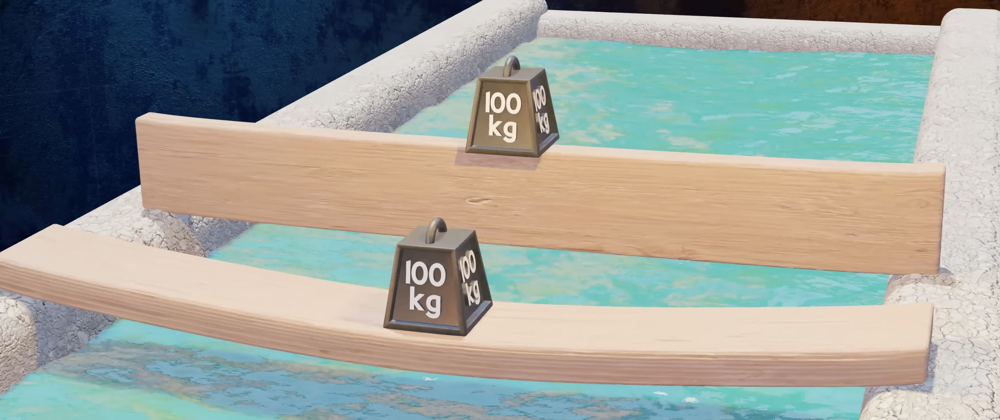
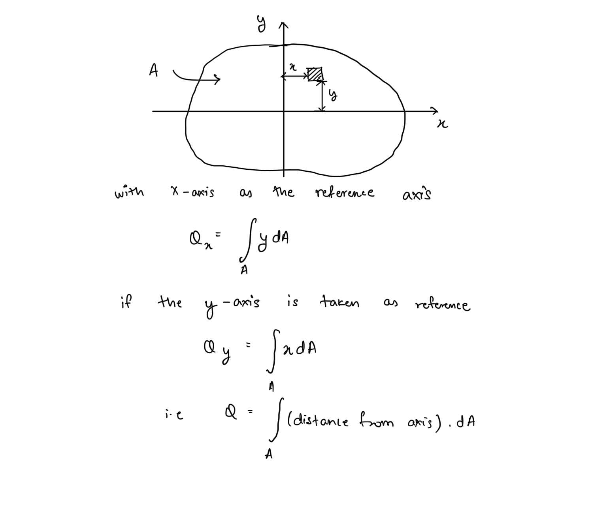
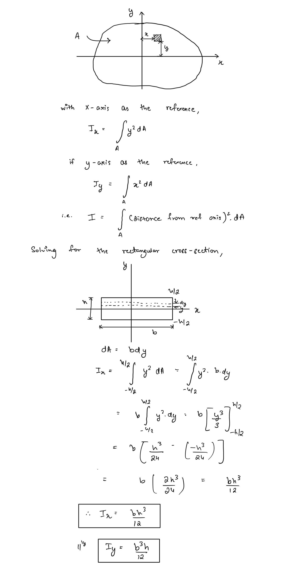
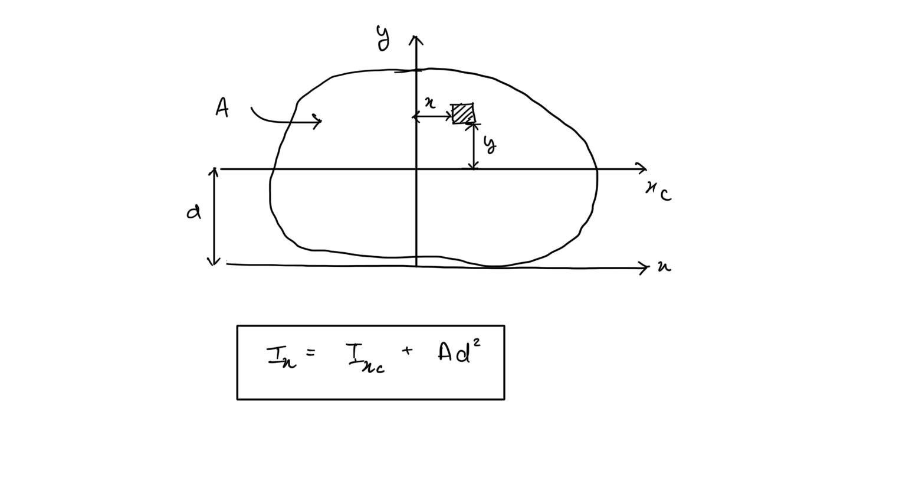
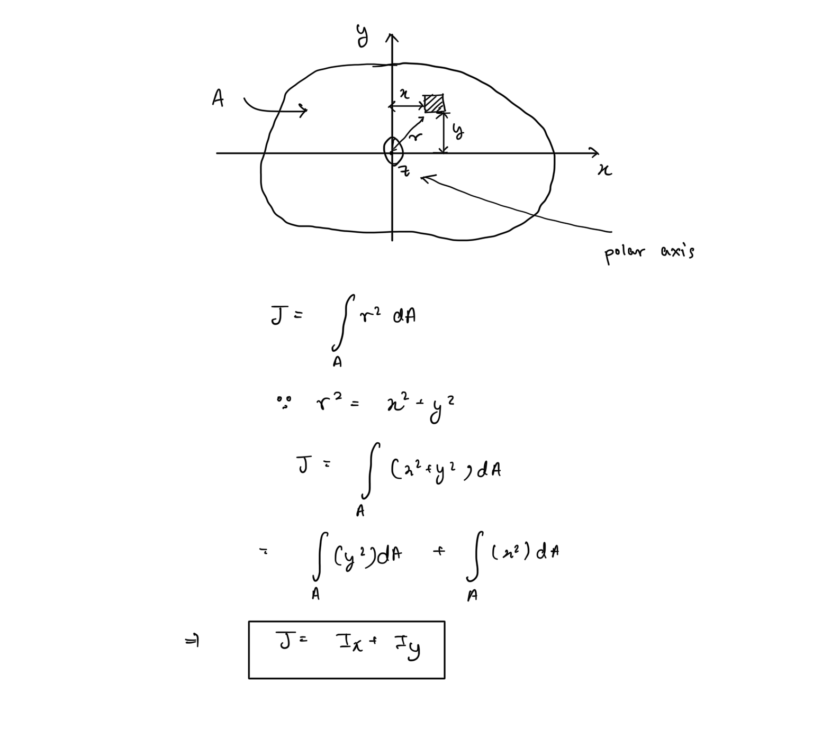
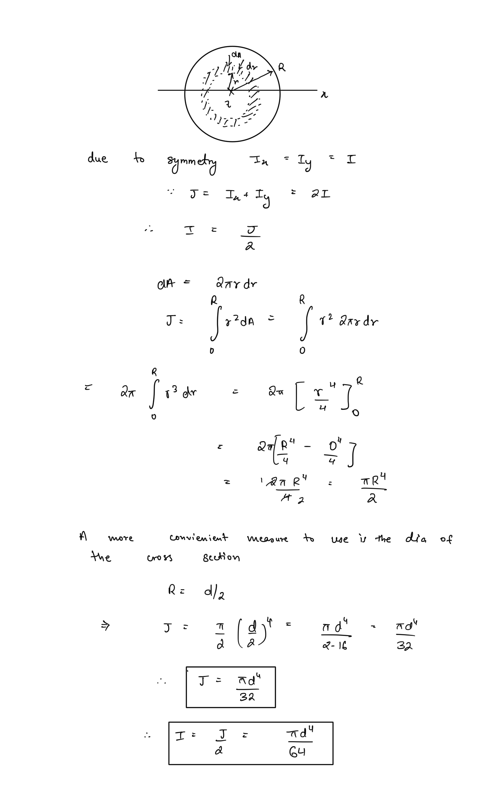

# Area Moment of Inertia  
  
As seen in case of axial loading the effect of the load applied on a material is dependent upon the area over which it acts. Axial loading forms the most simplest case of a load that a member can experience, hence the effect is determined just be the cross-sectional area since the deformations observed are mostly longitudinal and hence the cross-sectional area isn’t much deformed. Effect of poisson ration can be ignored in most cases since it’s usually quite small.  
  
In case of more complex loadings though like bending, torsion, transverse, or combined the deformation is quite complex and hence the resistance to these loads in dependent on the distribution of cross-sectional area of the member around some axis along which the load acts.   
  
Example - A beam will resist bending bender when the load is supported by the longer cross section i.e. material is spread much further from the axis than the configuration when it’s supported by the wider cross section even though the net area is same.  
  
  
  
This distribution of area around an axis is quantised using a quantity called **Area Moment of Inertia**. Much similar to mass moment of inertia used in study of rotational dynamics.  
  
## 1st Moment of Area   
##   
##   
## 2nd Moment of Area (Area Moment of Inertial)   
##   
##   
## Parallel Axis Theorem  
The area moment of inertial for any centroidal axis is the simplest to calculate due to symmetries of the cross-section. Once the area moment of inertial for some axis is obtained, it is also quite easy to obtain it for any axis parallel to it using the parallel axis theorem.   
  
  
## Polar Moment Of Inertia  
While the Area moments of inertia determine the resistance to bending of a member, twisting moments are generally applied on the axis passing through the cross section conventionally taken as the z-axis.  
  
The quantity that defines distribution of area along this polar axis is termed the polar moment of inertia.   
  
  
The relation between polar moment and the two area moments is known as the **Perpendicular Axis Theorem.**  
  
## Area Moments for Circular Cross Sections  
Circular cross sections are the most widely used in mechanical constructions hence it is really important to remember the moments of inertia for these.   
  
  
## Combining Area moments  
Since the moments of area are computed from a linear operator they can be added or subtracted to find net area moment for complex cross sections composed of simpler shapes.  
