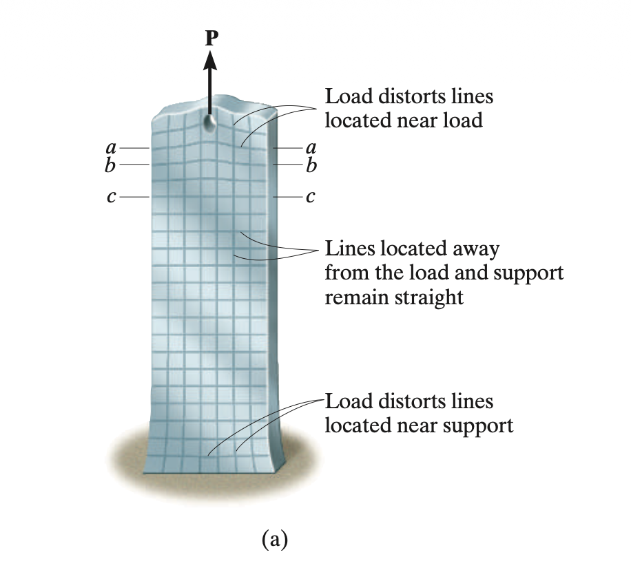
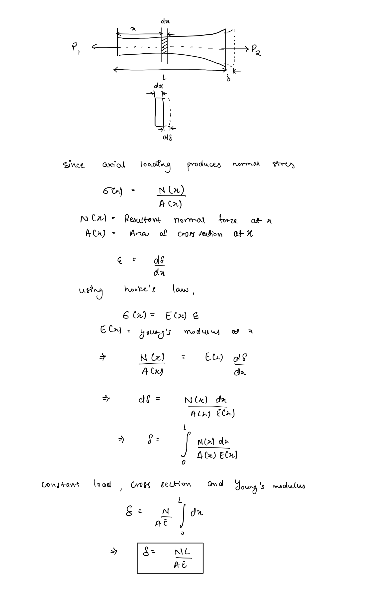
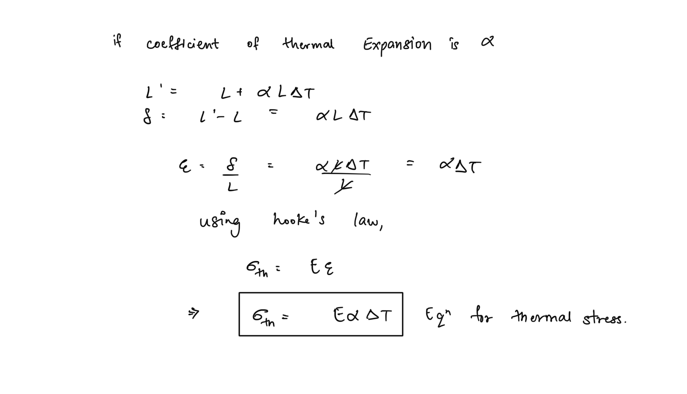

# Axial Loading  
When a force is applied along the axis of a member it is termed axially loaded. Axial loadings are perpendicular to the cross section of the and hence result in a normal stress condition.  
  
## Saint-Venant’s Principle  
Saint-venant’s principle states that, while at the section immediate to a localised load there exists a concentrated stress distribution, at a sufficient distance from the point of application the stress distribution is uniform and is indistinguishable from one formed by application of a uniformly distributed load that is statically equivalent to the localized load.  
  
Saint-venant’s principle allows us to carry out much simple analysis of axially loaded members since it allows us the avoid the effect of stress concentrations, since in most practical cases members are long and uniform enough that stress distribution becomes uniform in accordance with the principle.  
  
##   
## Average Normal Stress  
Axial loading of members produces normal stresses,  if the loading and cross sectional area is uniform, the expression for the average normal stress produced by the expression -  
  
  
  
## Elastic Deformation of an Axially Loaded Member  
Using Hooke’s Law we can develop the following expression for the general deformation of an axially loaded member, loaded under elastic constraints -  
  
If a member is subjected to multiple loads axial loads along its segments the net resultant displacement can be calculated by an algebraic sum of the displacements caused by each load.  
  
For the determination of any form of deformation only the internal load experienced by that section is to be considered. Equilibrium can be used to determine the internal loadings.  
  
## Sign Convention  
Tensile loads are considered positive, while compressive loads are termed negative  
  
## Superposition Principle  
The net deformation or net stress of a complicatedly loaded member can be computed by taking the algebraic sum of the deformations or stresses produced by each component of the load, as load, stress, and deformation are linearly related and the load doesn’t significantly deform the geometry of the member.  
  
## Thermal Stresses  
When a material is heated it begins to expand, if constrained from expanding internal resistances will develop resulting in development of stresses termed thermal stresses.   
  
