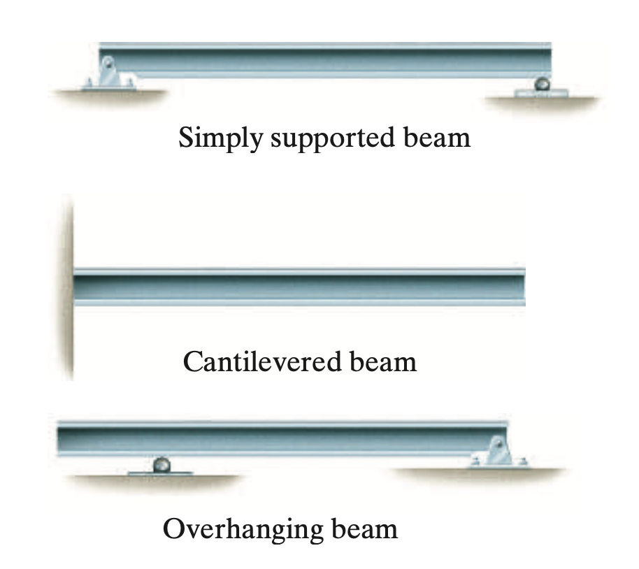
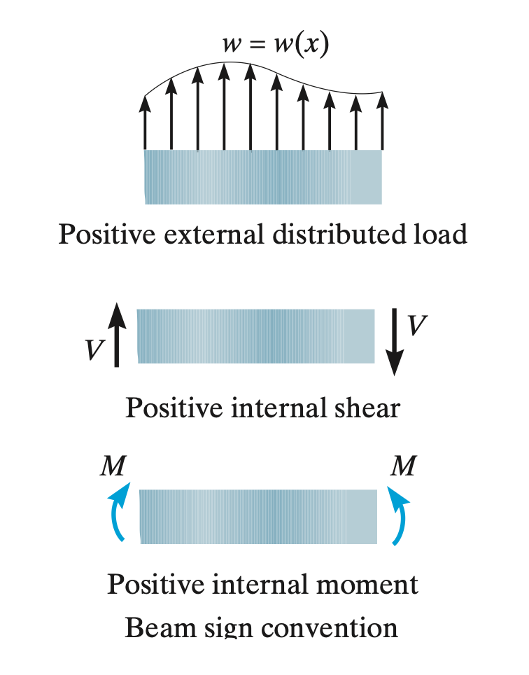
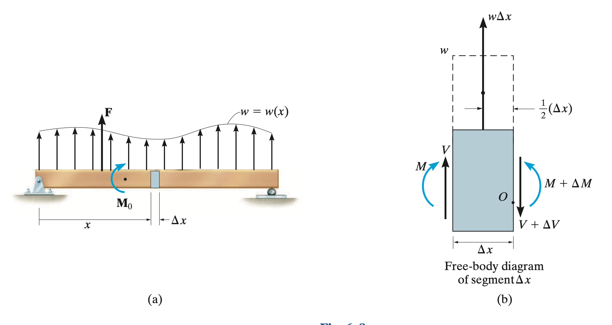
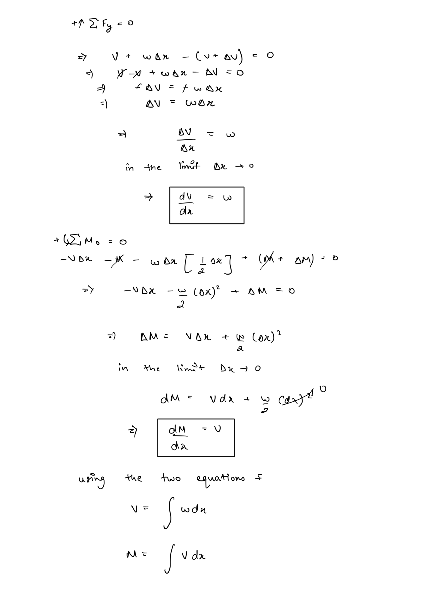
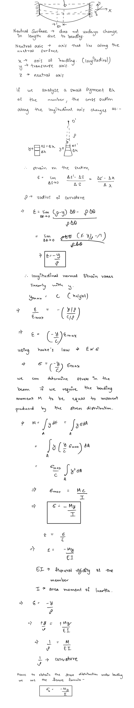
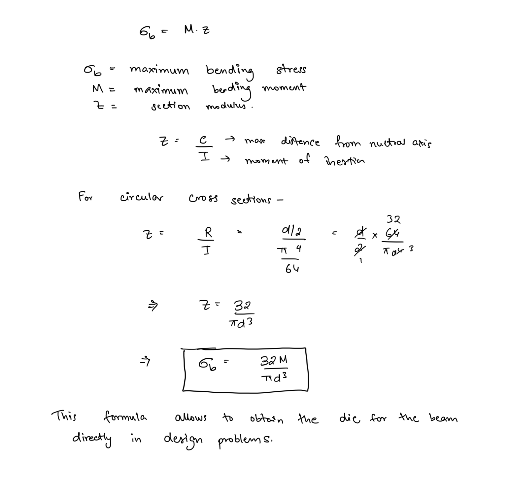

# Bending  
  
Long and slender member that support loading perpendicular to their longitudinal axis (i.e. the transverse axis) are called **beams**.  
  
Many members in a mechanical system actually are beams since they fit the description of the loading described above, for example the pin of a knuckle joint also behaves like a beam.  
  
A beam can be supported in the following ways -   
  
The type of support affects the response of the beam to loading.  
  
Due to the action of the transverse loading, beams experience bending which can be described as deflection of the beam sections from its longitudinal axis in the transverse direction.  
  
During bending an internal shear force and a bending moment is developed in the beam, and in turn stresses are developed to counteract these loads. In order to properly design the beams we need to obtain the maximum shear force and bending moment experienced by the beam along it’s length and that is done with the help of **Shear Force Diagrams (SFD) and Bending Moment Diagrams (BMD)**, which plot these loads along the length.  
  
## Sectioning of Beams & Sign Convention  
  
The fundamental principle of mechanics of materials is to theoretically section mechanical members in order to find the internal loadings to determine material response. Beams are one of the most common case of mechanical members.   
  
Whenever a beam is sectioned along any point we must assume that a Normal Force, a Transverse Force, and a Moment exists there.  
  
The values of these loads can be determined using equilibrium constraints and either of the components may be zero at a point but the for general case we must assume all three exist before proving so otherwise.  
  
### Sign Convention for Beam Loads  
The standard sign convention followed in engineering practice is that the distributed load acts upwards on the beam. The shear forces act in a direction causing clockwise rotation of the beam. The internal moment causes compression in the top fibers and tension in the bottom fibers  
  
  
  
## Constructing Shear Force & Bending Moment Diagrams Graphically  
  
In order to develop a method for constructing SFDs and BMDs let’s consider a beam subjected to an arbitrary loading and consider the free body diagram of a small segment -  
  
  
  
  
  
Hence provided the loading state we can, obtain the SFD and BMD by first solving for equilibrium to obtain reactions and then the SFD is just the area under the loading curve, BMD is the area under SFD curve.  
  
Since area is just integrals, points become straight lines, straight lines become linear curves, linear curves become parabolic. Hence, all we need to do is just carry out basic polynomic integrations.  
  
## Flexure Formula (Bending Formula)  
Similar to torsion, under bending load too the member experiences a distribution of stress along it’s cross-sectional area. The stresses in bending are compressive on one end of the material, while tensile on the other. The stress distribution given by the flexure formula -  
  
  
## Section Modulus  
Similar to case of torsion the bending formula is sometimes written in a simplified form to resemble the other loading equations using a quantity known as the section modulus. This allows us to directly obtain the maximum bending stress for a member which is often the quantity of concern in design problems.  
  
  
