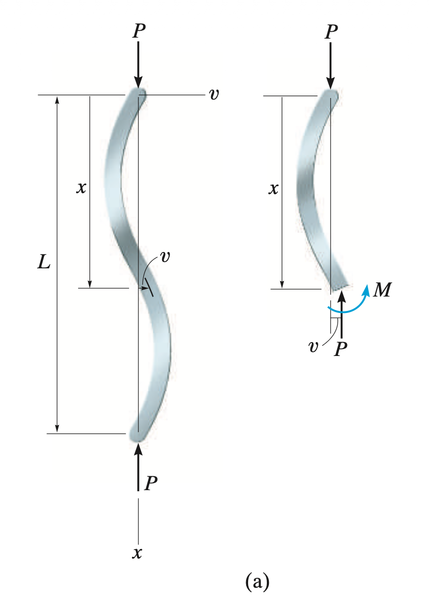
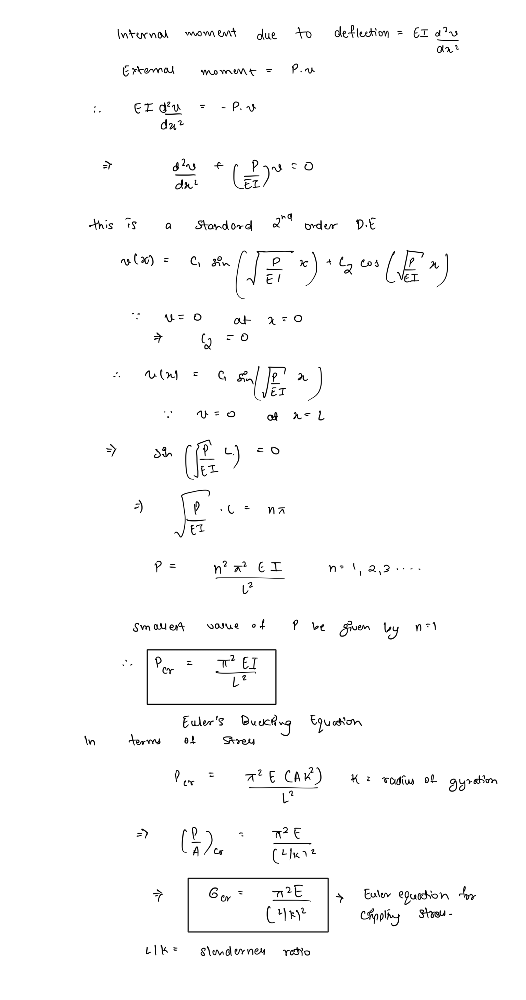
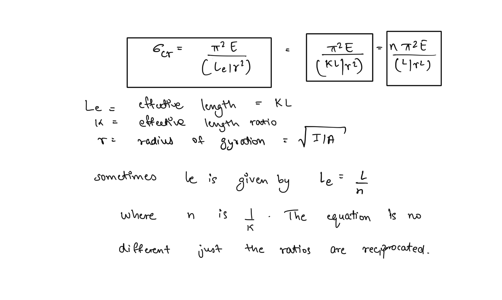
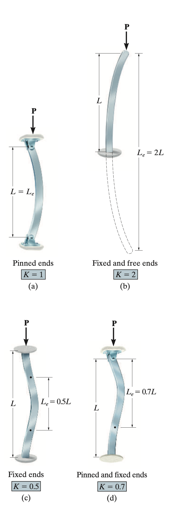
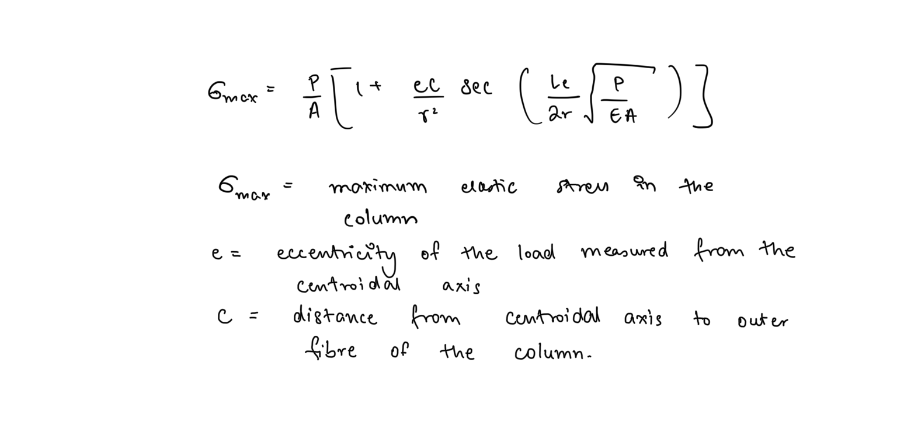
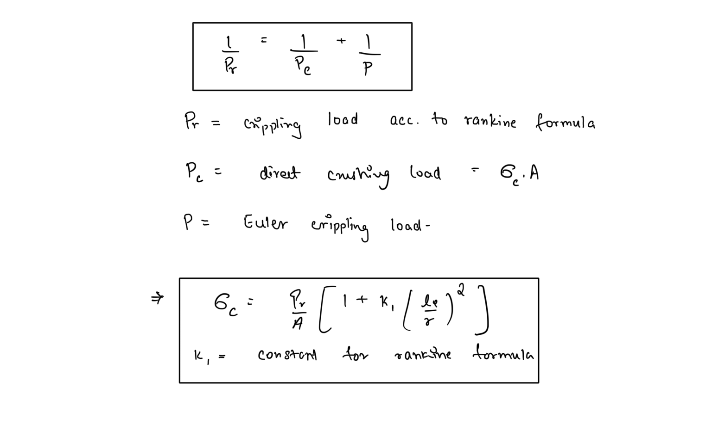
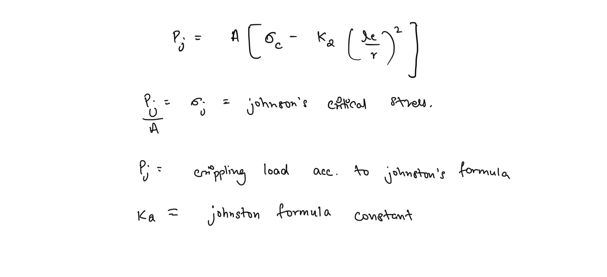
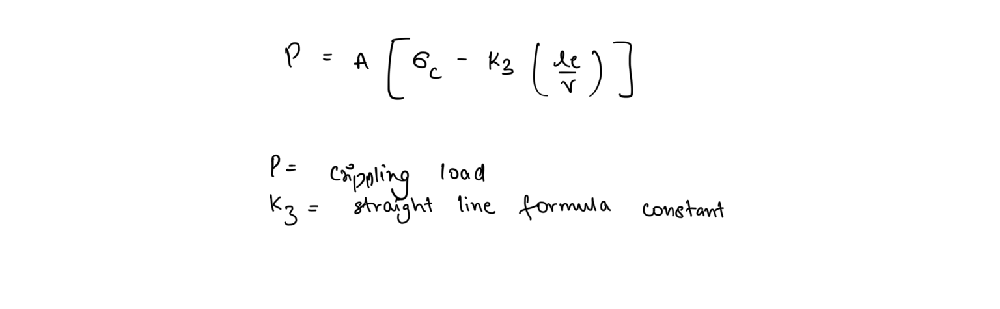

# Buckling of Columns  
Long and slender members supporting compressive loads are called **columns, **they tend do deflect sideways under the action of the compressive load and this phenomenon is known as **buckling.**  
  
Column members need to be designed to resist buckling in order to have **stability.**  
  
## Critical Load  
The maximum compressive load a column can withstand without buckling is known as the critical load  
  
## Euler’s Buckling Equation  
Here we analyse a pin supported ideal column (linearly elastic) for critical buckling load.  
  
At the critical load a small lateral force will cause the column to remain in the deflected position when the load is removed. The ability of a column to remain stable or unstable when deflected depends on its ability to resist bending. Hence we analyse the column using bending deflection equation -  
  
  
This is the free body diagram for a general column under buckling load. The internal moment will act in a way to reflect the deflection.   
  
Critical stress under buckling is also known as crippling stress  
  
## Euler Formula for various supports  
The above expression for euler’s formula is only valid for columns supported at both ends by pins and hence are free to rotate. For more general cases of supports Euler’s formula is modified by introducing effective length for columns which determined by an effective length ratio that based on the type of support. Hence the general Euler buckling equation is -  
  
  
  
Euler’s formula for buckling presented above is only valid for when the load is applied along the centroidal axis of the column. In many real world scenarios, that is not the case and hence Euler’s formula is not valid. While the analysis of eccentric loading is not covered here, one formula often used for the case is the secant formula presented below -  
  
There is also a Ritter’s formula used for this case often found in design handbooks.  
  
## Empirical Relations for buckling  
Euler’s formula also has a limitation that it is only valid for columns with a high slenderness ratio. For which the critical stress is determined closely by the Euler formula using modulus of elasticity but not the yield strength. Failure of short columns is dependent usually on the yield strength, and a combination of yield strength and E for medium columns.  
  
Hence many empirical formulae, based on the experimental study of columns have been developed, to analyse these cases  
  
### Rankine-Gordon Formula  
Equally valid for short and long columns   
  
  
### Johnston’s Parabolic Formula   
###   
### Straight line formula  
  
  
