# Compound Stresses (Plane Stress)  
As discussed earlier the general state of stress at a point is given by a stress tensor consisting 3 unique axial stresses and 3 unique shear stress components. It is mathematically represented using a 3x3 matrix for 3D space. Most mechanical systems of our concern however are coplanar, hence our complexity of analysis can be reduced by having to only analyse the general stress along one plane, called **plane stress.**  
  
The configuration of plane stress at a point A is given diagrammatically and mathematically as follows -  
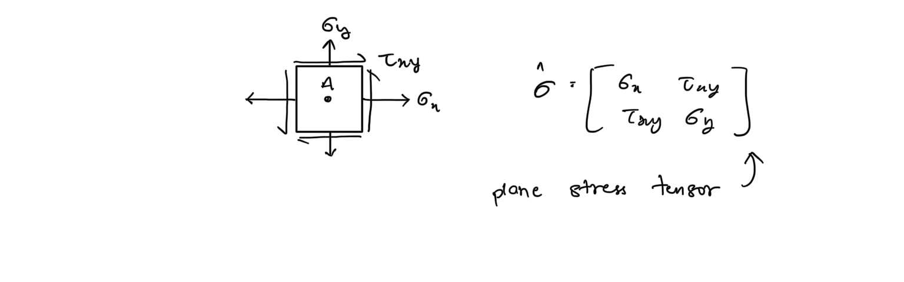  
## Sign convention  
For axial stresses - tensile stress are taken as positive, compressive stresses are taken as negative.  
For shear stresses - taken as positive when the tend to rotate the element clockwise.  
  
## Stress Transformations  
The value of stresses for a plane stress configuration depend upon the orientation of the plane chosen, and hence changes upon rotation of plane. Upon rotation by some angle the stresses transformations are given by -  
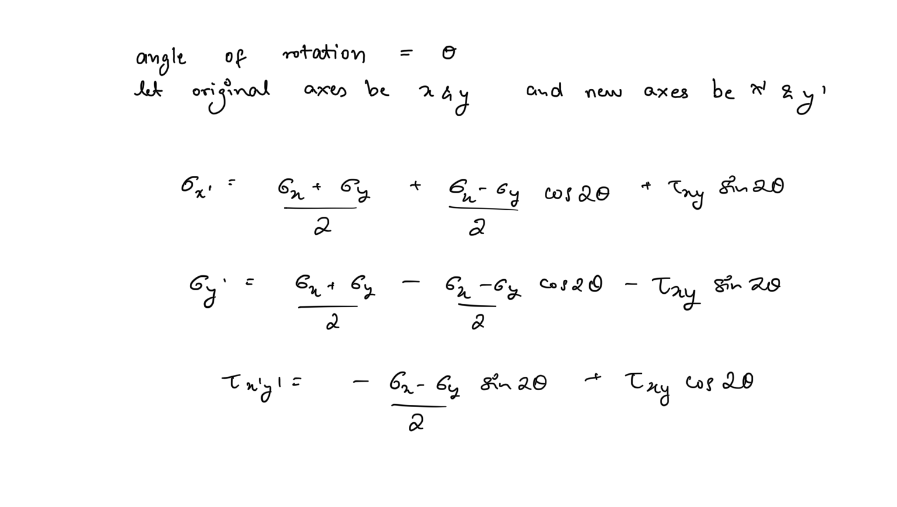  
## Matrix Notation for Stress Transformation  
Since Mathematically stress tensors are depicted using matrices, stress transformations can be views as coordinate transformations of the linear space associated with stress matrices. Hence the new state of stress can be obtained by using the rotation matrix -  
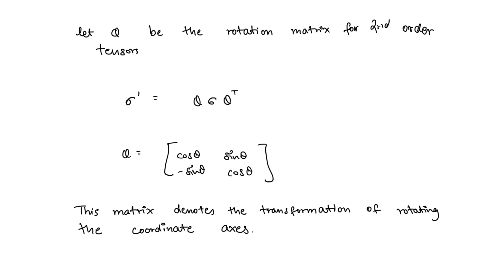  
## Principle Stresses and Maximum Shear Stresses  
As the magnitude of stresses depend upon the orientation of the plane, in engineering practice it is often important to determine the maximum magnitudes for a stress configuration in order to design systems for it. The values of maximum and minimum normal stresses are called principle stresses, and for shear stress it’s called maximum shear stress.   
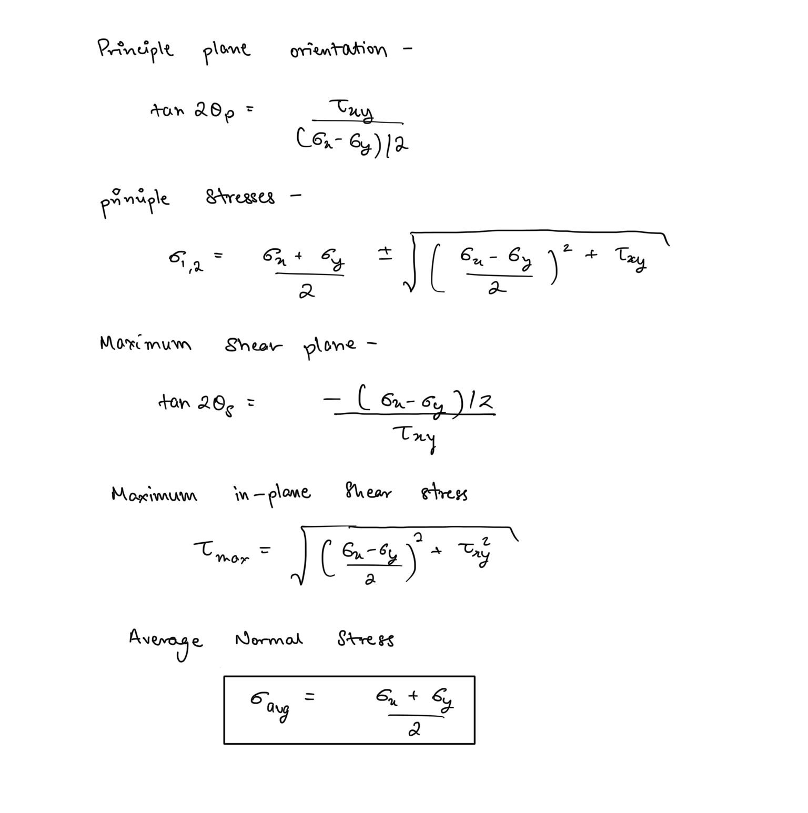  
In the principle plane the shear strain is 0, while in maximum shear plane the normal stresses are equal to the average normal stress.  
##   
## Mohr’s Circle  
Plane stress transformations can be very easily visualised using a graphical tool known as the Mohr’s Circle. It allows us the plot our stress state a circle on 2D plane space with the x-axis depicting normal stresses and y-axis depicting shear stresses.   
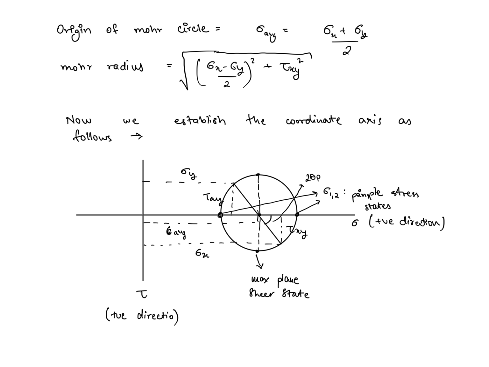  
Any rotation of the plane stress results in twice that rotation on the Mohr’s circle in the same direction  
  
By just plotting the origin and the two stress coordinates the circle can be drawn easily and hence the principle stresses and maximum shear stresses can be directly obtained from the Mohr’s circle.  
  
## Absolute Maximum Shear stress  
Since the strength of ductile materials depends upon its ability to resist shear stress, it becomes important to find the absolute maximum shear stress in a material when subjected to loading.  
  
Absolute maximum shear stress is obtained by considering the stress affects of a plane stress loading in all three principle plane, i.e. it is obtained for the general 3D stress unlike maximum in plane shear stress which is only for one plane.  
  
The magnitude of absolute maximum shear stress can be obtained by drawing mohr circles for all three principle planes under the plane stress loading.  
  
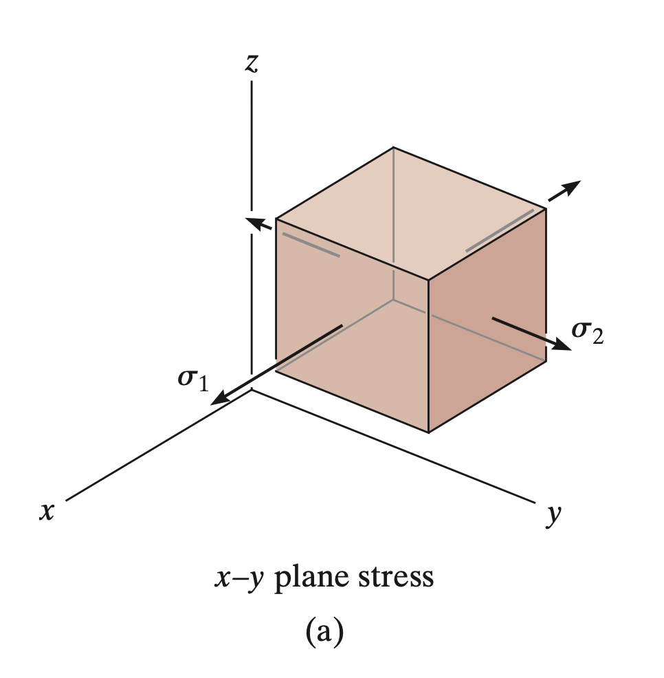  
  
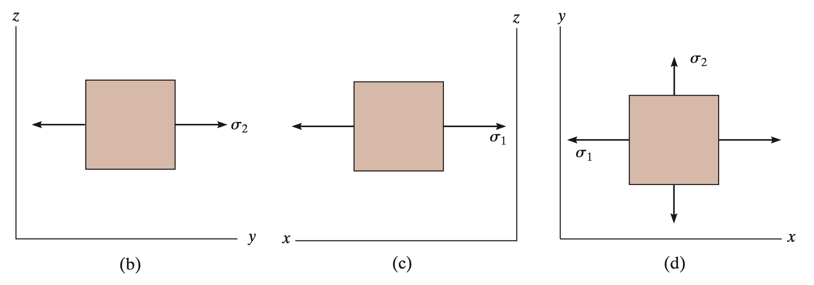  
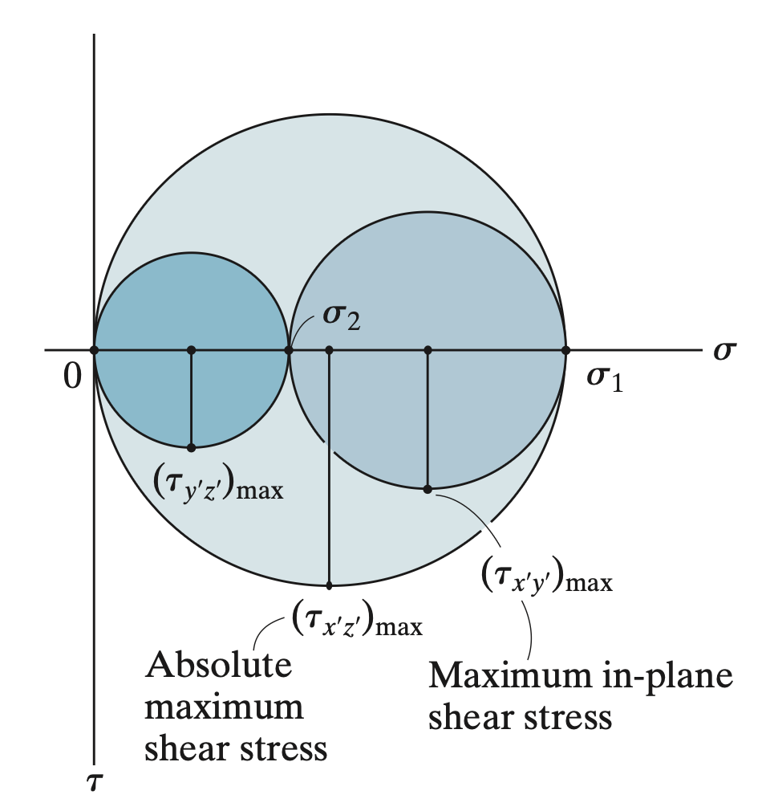  
  
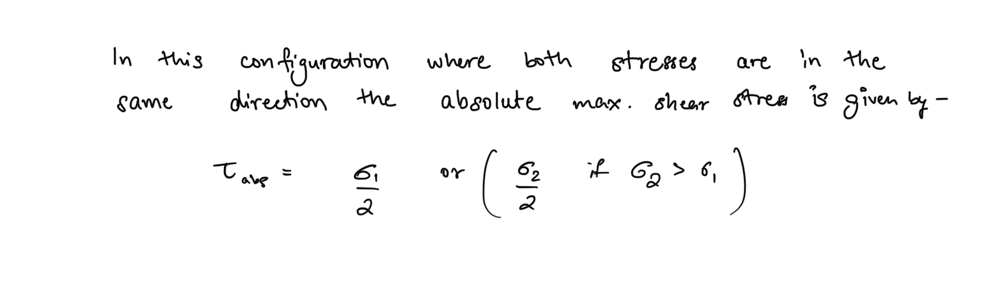  
For the configuration where both the stresses will be of opposite signs, the mohr circles looks like -  
  
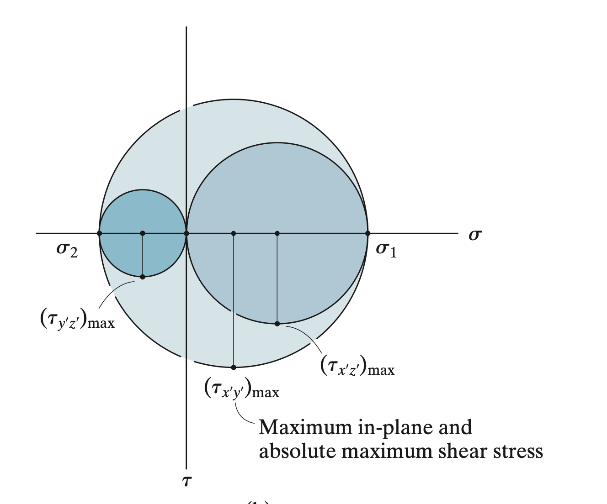  
  
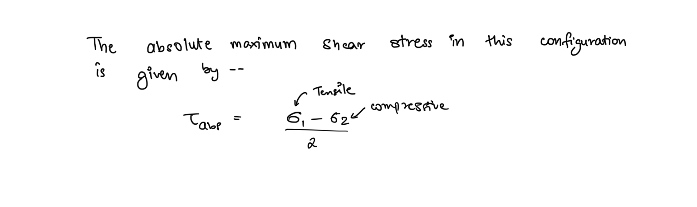  
## Combined Loading  
When a member is subjected to a loading state that is a combination of multiple kinds of loads, the analysis of the material response at any point on the member involves firstly determining all the different normal and shear stresses that arise at that point due to the loads.  
  
Then we employ the method of superposition to determine that net state of plane stress at that point by doing an algebraic sum of the different kinds of stresses - the normal stresses in x-direction, the normal stresses in y-direction, and the shear stresses.  
  
Strength of the material is then analysed for principle stresses and the maximum shear stress for the obtained plane stress.   
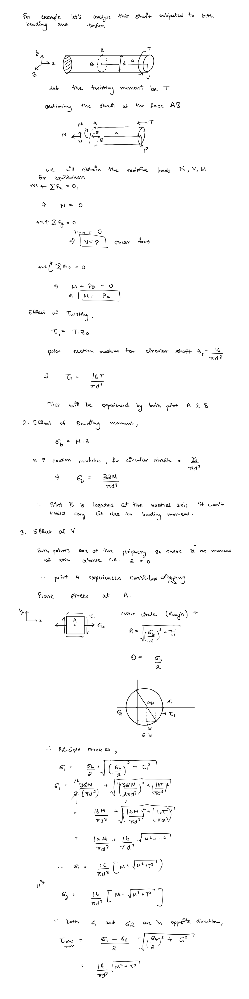  
