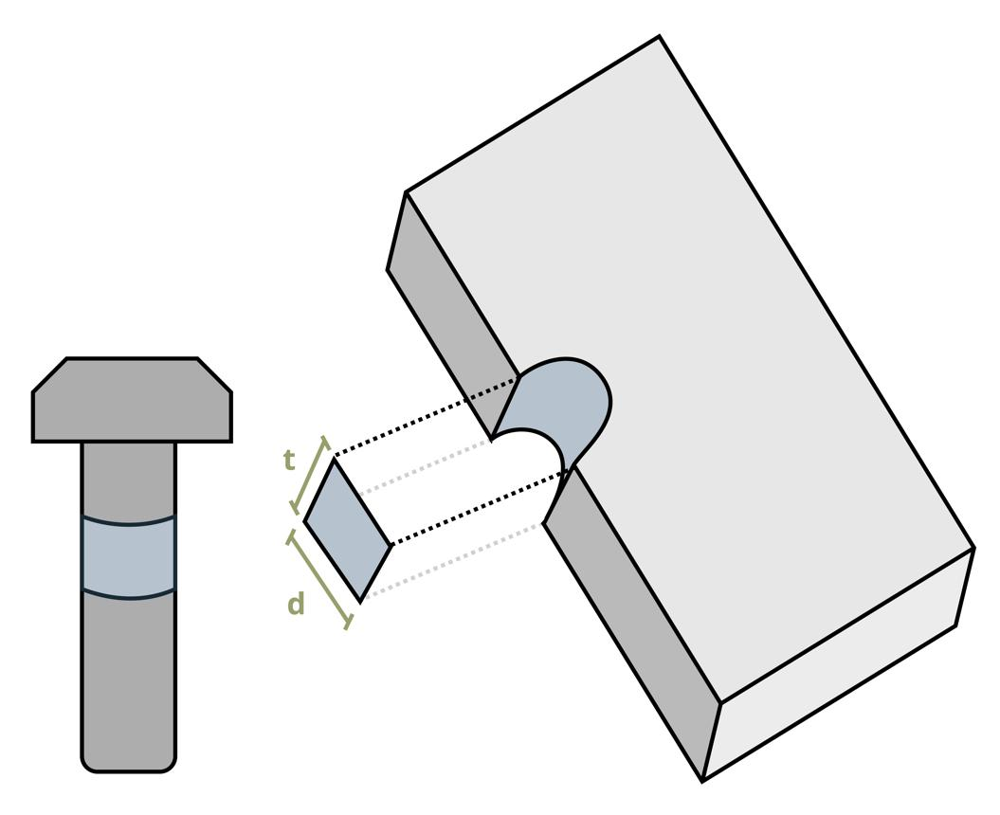
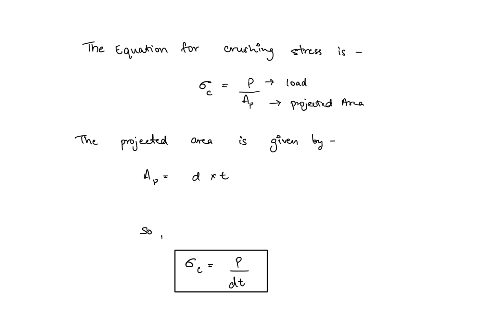

# Crushing (Bearing) Stress  
  
Crushing (bearing) stress is the compressive stress developed at the contact interface between two members, typically where a pin/bolt/rivet presses against the wall of a hole.  
* It is not distributed over the full curved contact surface  
* We use an idealized projected area to define it  
  
  
  
  
