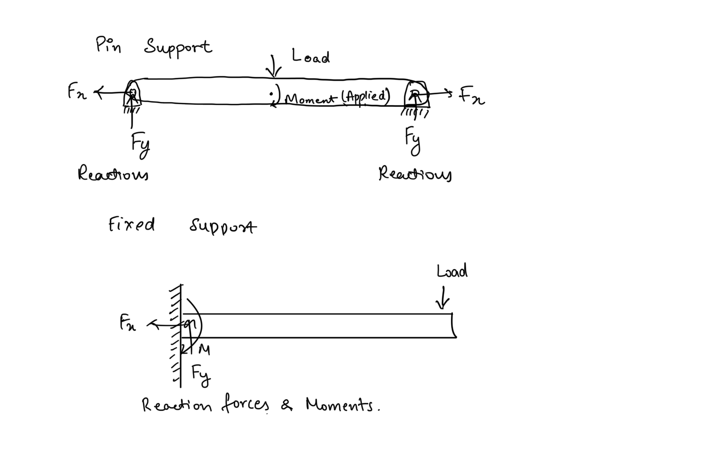
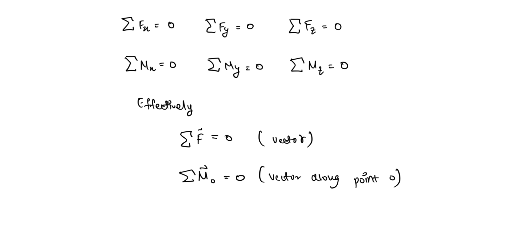
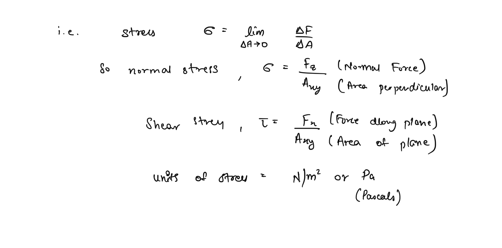
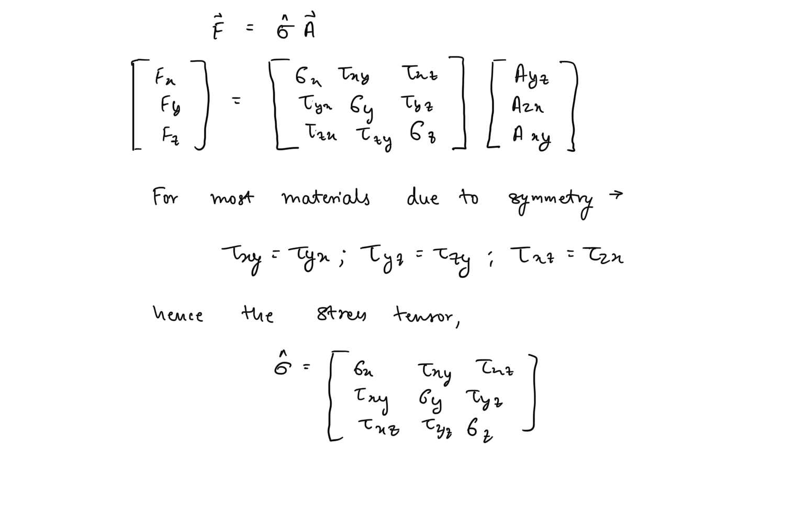
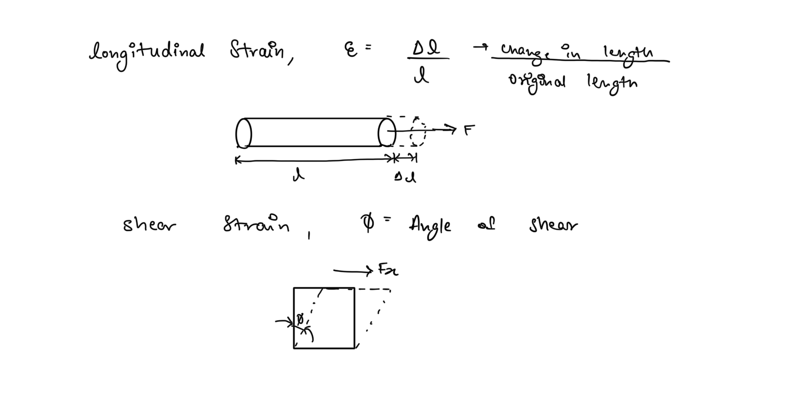

# Fundamentals of Mechanics of Materials  
The subject of mechanics of materials, known by various names such as strength of materials, mechanics of solids, etc., primarily deals with the study of of response of materials when subjected to various kinds of loadings. It builds a whole branch of engineering analysis, whose techniques are extensively employed in design of mechanical and structural systems.  
  
## Domains of Mechanical Analysis  
The primary function of any mechanical system (simply called **machines**) is to convert the action of applied mechanical forces into useful work by achieving a desired form of motion.  
  
It is empirical from this definition that to construct any such system analysis of the three forms would be required -  
1. **Analysis of the motion of the various mechanical members** - this is termed as kinematic analysis and deals with how the various members are moving i.e. their positions, velocities, accelerations, angular velocities, and angular accelerations.  
2. **Analysis of the forces causing the motion **- motion is imparted onto the mechanical components through actions of various external forces or loads. These can be simple forces or torques (turning moments). This is known as dynamic analysis.  
3. **Analysis of Material Response of members **- there is no perfect material and hence every material deforms when subjected to loads. Therefore when designing mechanical systems along with making sure that the necessary motions are achieved through the forces, we also need to make sure that the materials of the components will not fail or deform drastically under the effect of the said loads.   
  
Only when the response of system under all three forms of analysis are known, the design of a machine can be said to be complete.  
  
To perform all three forms of the analysis together would create a problem too complicated to be solved using any systematic approach hence they are done separately with appropriate assumptions that allow us to use their results safely together. Kinematic and Dynamic analysis are topics covered under subjects such as **Theory of Machines**, and are not of concern to us here.   
  
What we do care about is that these analyses are performed under the assumption that the members are perfectly rigid, hence on application of forces there is no mechanical deformation of their structure and the only response is the motion observed.  
  
While this assumption allows us to obtain the required motion response from our machines, it is a perfect case assumption that must be countered during our third analysis in order to obtain a design that is sound from materials point of view too. Thus during our strength analysis, we work under the assumption that our members are completely static and hence the entire load on them causes the maximum possible deformation which the members must resist.  
  
Notice how both the assumptions are extreme cases, therefore if the analyses are perform correctly the effect of taking these assumptions should effectively cancel out and we achieve a sound design.  
  
## Static Equilibrium  
Due to our assumption of static state, the third form of analysis is also sometimes refer to as **static analysis **but the formal study of static analysis is only limited to determination of the state of static equilibrium and hence only forms a component of the study of Material Mechanics.  
  
Static equilibrium is defined as the state of the mechanical system of concern, where all the external loads are perfectly balanced by internal responses or reactions, and hence the system is static.  
  
### Reactions Due to Structural Constraint  
  
  
### Equations of Equilibrium  
The goal of static analysis is the determine the state of equilibrium i.e. the values of the reactions when a loading state is provided. This is done by solving the following equations of equilibrium -  
  
## Internal Resultant Loadings  
The primarily goal of Mechanics of Materials is to use statics to determine the effect of applied loads to internal sections of the members to study the material response, i.e. to determine the internal loadings produced along various sections due to subject to external loadings. While the exact distribution of internal loads is tough to determine their resultants can be determined and the material response is primarily dependent on the resultant.  
  
### Types of Internal Loadings  
1. **Normal Force - **this force acts perpendicular to the area of the segment causing pulling or pushing.  
2. **Shear Force - **this force acts in the plane of the area and is developed when external loads cause sliding of two segments  
3. **Bending Moment -** this moment is caused by external forces trying to bend the body about an axis lying within the plane of the area.  
4. **Torsional Moment - **This is developed when an applied torque tries to twist the body.  
  
A mechanical member subjected to a loading may experience any one or a combination of these loadings and hence the full representation of the internal load is rather complex, while representing any one form of loading can be done using rather simple algebraic equations.  
  
## Stress  
The fundamental quantity that we deal with in study of material mechanics is called **stress** and it directly corresponds to a materials strength.  
  
**Stress **is defined as the intensity of the internal response of an infinitesimal section body along a specified plane passing through a point, when subjected to some load.  
  
As there are many forms of internal loads that can be developed when a body is subjected to some loading. A load can cause multiple forms of stress to be developed at any particular section of the body. In simple mathematical terms though stress is the force experienced per unit area of the infinitesimal section.   
  
## General State of Stress  
This above equations are rather simple mathematical relations that provide the expression of a particular form (component) of stress developed due to a component of the load. In general 3D space, there are three principle planes of area and also loads can be deconstructed into 3 components acting along the 3 principle axes. Hence the general 3D state of stress at a particular point in a body is given by a **stress tensor**. Which is mathematically represented by 3x3 matrix i.e. it contains all the internal loadings caused by the 3 components of the load along the 3 principle planes.  
  
Generally a tensor is a quantity that relates two multicomponent quantities where each component of quantity contributes to each component of the other i.e the quantities are not just simple scalings of each other  
  
Since each component of force causes a different form of stress along each principle place the general stress with all its components is a tensor quantity.   
  
Since most mechanical systems we generally deal with our planar, we can simplify our analysis by just studying the stress along one plane. Choosing xy plane to denote our plane of concern we can simplify the equations to -  
  
  
## Strain  
Strain is the mechanical quantity that directly relates to the deformation of the material. Strain is defined as the unit deformation of material under some load i.e. deformation of a dimension per unit original dimension.  
  
Similar to stress, the strain under various forms of loadings has different expressions.   
  
## Stress Strain Diagrams  
These diagrams plot the relationship between stress and strain observed in a material subjected to some form of loading. Stress is plotted along the y-axis and strain along the x-axis. These diagrams form the fundamental basis of study of material response and help us analyse and compare materials in terms of their strengths.  
  
## Hooke’s Law  
The primary goal of materials of mechanics is to find the relationship between deformation of a component to the subjected loadings i.e. to find relationships between the stresses and strains in various mechanical components. One such relationship is Hooke’s law which defines the stress-strain relationship for elastic materials.   
  
Where E is the modulus of elasticity and is a quantity dependent on the material.  
  
No material is perfectly elastic but many materials do exhibit elasticity up to a certain limiting stress known as the **elastic limit.**  
