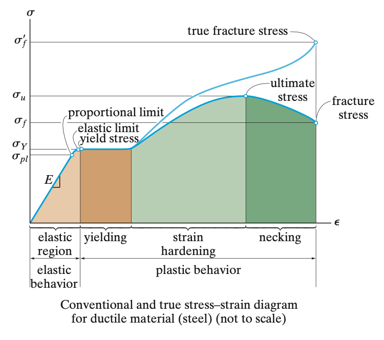
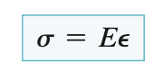
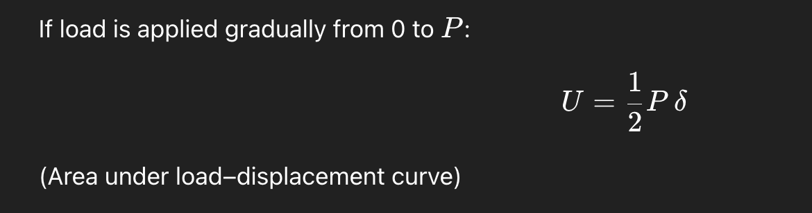
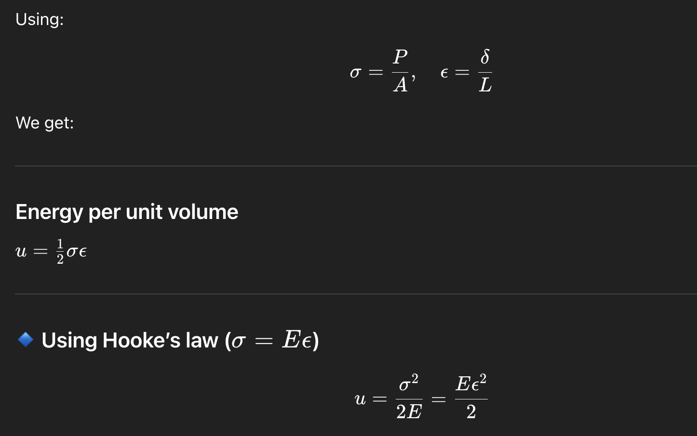
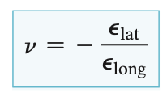
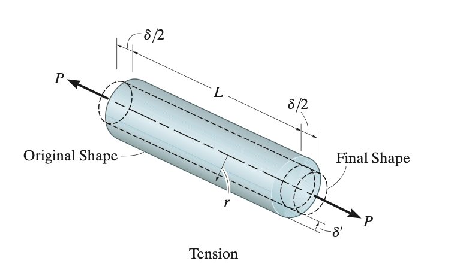
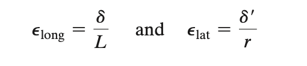
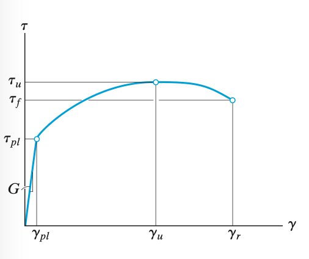
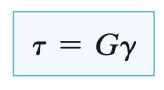
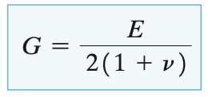

# Mechanical Properties of Materials  
  
The utility of this subject on mechanics of material deformation is only when it is combined with understanding of material properties that define how different materials behave under load in terms of deformation response or failure.  
  
Knowledge of material mechanics allows us to find effect load on the material in terms of the quantity known as stress. Knowing how a material behaves under stress allows to make powerful predictions regarding failure of material and hence allows safe mechanical design.  
  
## Stress-Strain Diagram  
Stress and strain data collected from performing tests on material specimens help us plot a curve known as the stress-strain diagram. This curve forms the basis of all our study of mechanical properties of materials.  
  
**The conventional stress strain diagram **plots engineering stress vs engineering strain which are quantities based upon the original cross-sectional area and original length of the specimen. These are the most widely used.  
  
**The true stress strain diagram **plot true stress vs true strain which are quantities based on the instantaneous area and lengths of the specimen for given load.  
  
## Stress Diagram for Ductile Materials  
  
  
  
The initial region of the curve is referred to as	the **Elastic Region**. Here the curve is a straight line and hence material obey’s Hooke’s Law upto a point where the stress reaches the **proportionality limit**.  
  
Any deformation in the material in this region will be completely restored upon removal of load. Hooke’s law for axial loading is expressed as -  
  
  
  
Here E is known as the **modulus of elasticity** or **Young’s Modulus **and is defined as the slope of the curve in the elastic region.  
  
### Yielding  
Any slight increase in stress above the material’s elastic limit will result in a breakdown of the material and cause it deform permanently this phenomenon is known as yielding and is indicated by the yield stress or yield point on the curve. The deformation that occurs is known as plastic deformation.  
  
### Strain Hardening  
When yielding has ended, any load causing an increase in stress will be supported by the specimen, resulting in a curve that rises continuously but becomes flatter until it reaches a maximum stress referred to as the **ultimate stress**.  
  
The rise in the curve in this manner is called** strain hardening.**  
  
The ultimate stress also called the ultimate strength of the material is the maximum stress it can endure before catastrophic failure, although for ductile materials failure is characterised by yielding.  
  
Beyond ultimate stress, the cross-sectional area of the specimen start reducing forming a neck. This phenomenon is known as **Necking**, and the specimen breaks at **fracture stress**.  
  
## Brittle Materials  
Material that exhibit little or no yielding are known as brittle materials. They can endure large stresses without deforming. Their strength is denoted by the ultimate stress on the stress-strain diagram.  
  
## Strain Energy  
As a material is deformed by a load, the load performs external work that is stored in the material as internal energy. This internal energy due to deformation under load in known as **strain energy**.  
  
  
  
  
  
## Poisson’s Ratio  
It is the property of the material that defines the ration of lateral strain developed in the material in response to longitudinal strain. The lateral strain is always opposite in direction to longitudinal hence -  
  
  
  
  
  
## Shear Stress Strain Diagram  
Similar to tension/compression, an stress-strain curve for shear loading can also be plotted for materials to study properties under shear.   
  
  
  
It provides with similar quantities such as shear proportionality limit, and ultimate shear stress. Although no yielding is observed in this case.   
  
### Hooke’s Law for Shearing  
Since there is also a linear elastic region observed in shear, Hooke’s law for shear can be written as -  
  
  
  
Here G is known as the modulus of rigidity, and is related to E and poisson’s ratio as -  
  
  
  
  
