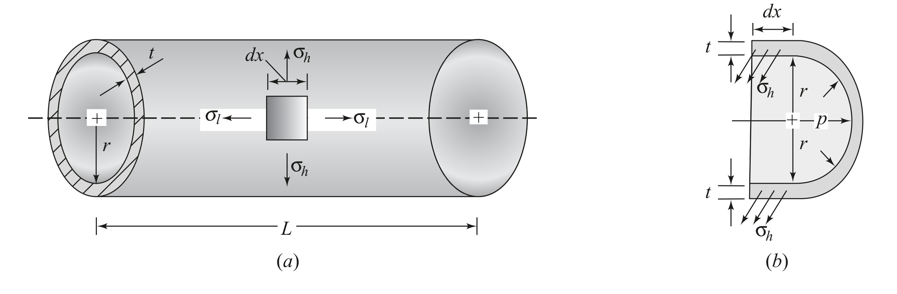
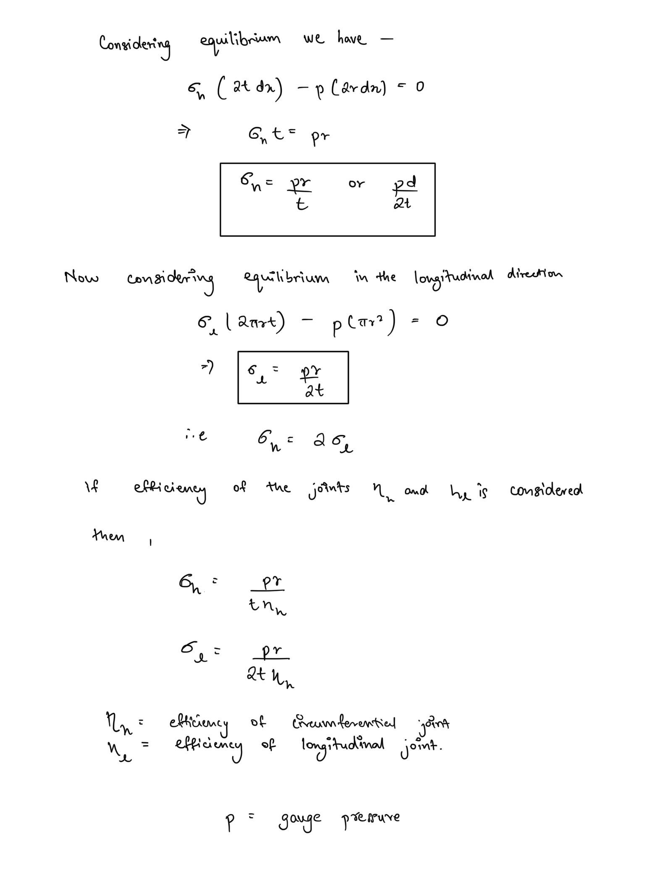
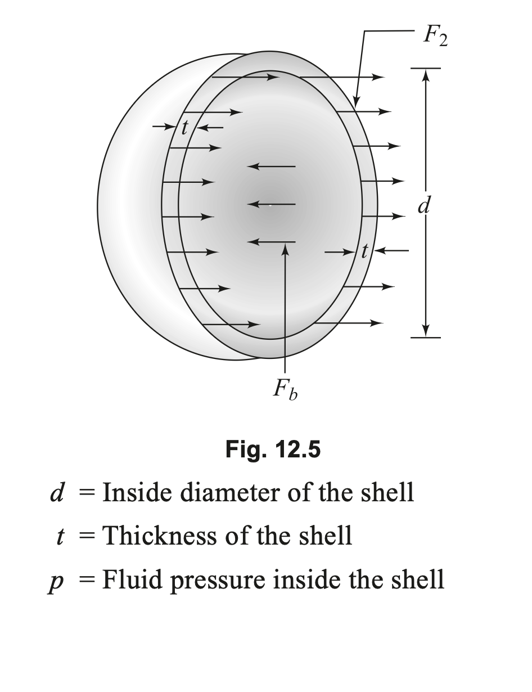
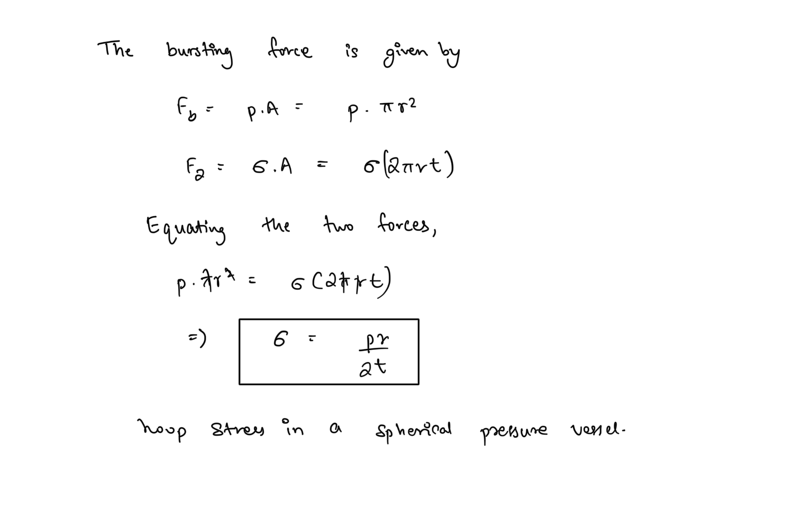

# Pressure Vessels  
Pressure vessels are used store fluids at some pressure. The pressure of the fluid inside exerts a load on the vessel material and hence stresses are developed inside the vessel material in response to the pressure load. Namely two types of stresses are observed in pressure vessels -  
  
1. **Hoop Stress -** acts along the circumference of the vessel  
2. **Longitudinal stress -** acts along the longitudinal axis of the vessel.  
  
### Thin and Thick walled pressure vessels  
Thin and thick walled pressure vessels are classified on the basis of their diameter to thickness ratio. In Thin walled pressure vessels this ratio is greater than 20. This distinction is made since in thin walled pressure vessels the stresses are nearly constant along the thickness.  
  
## Stresses in a Thin Cylindrical Shell  
  
Consider a small element on the wall of the vessel -  
  
  
## Stresses in Thin Spherical Shell  
Due to symmetry along the axes in a spherical shell the hoop stress and longitudinal stresses are the same.  
  
  
  
