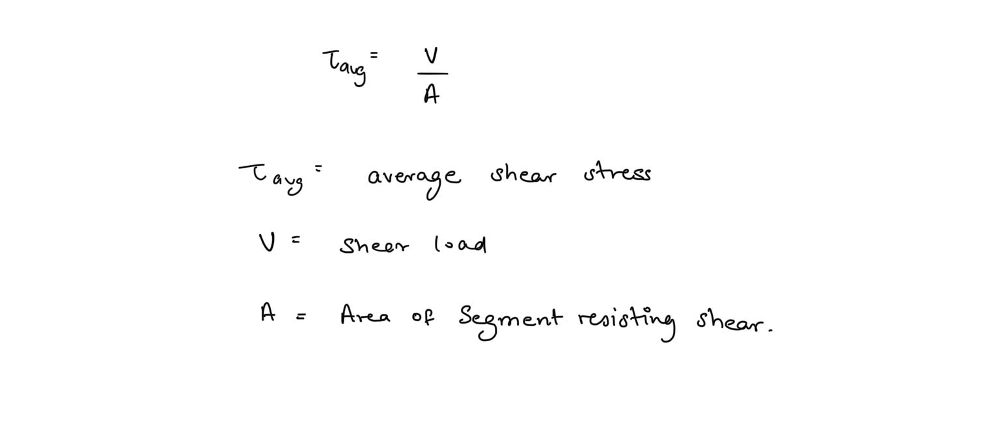
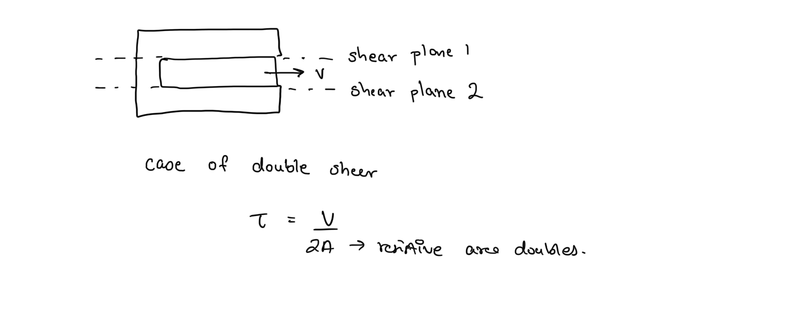
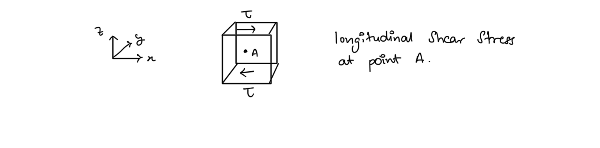
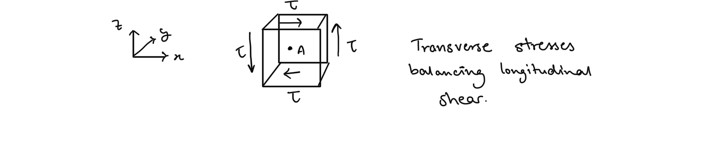
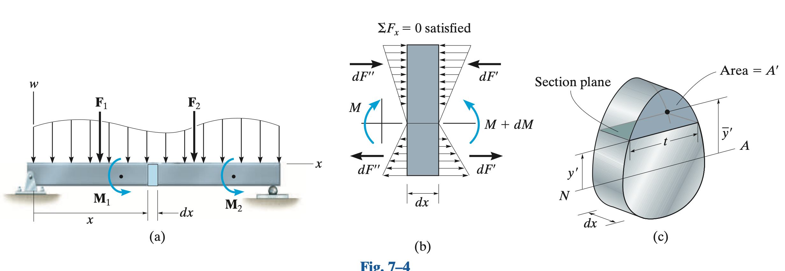
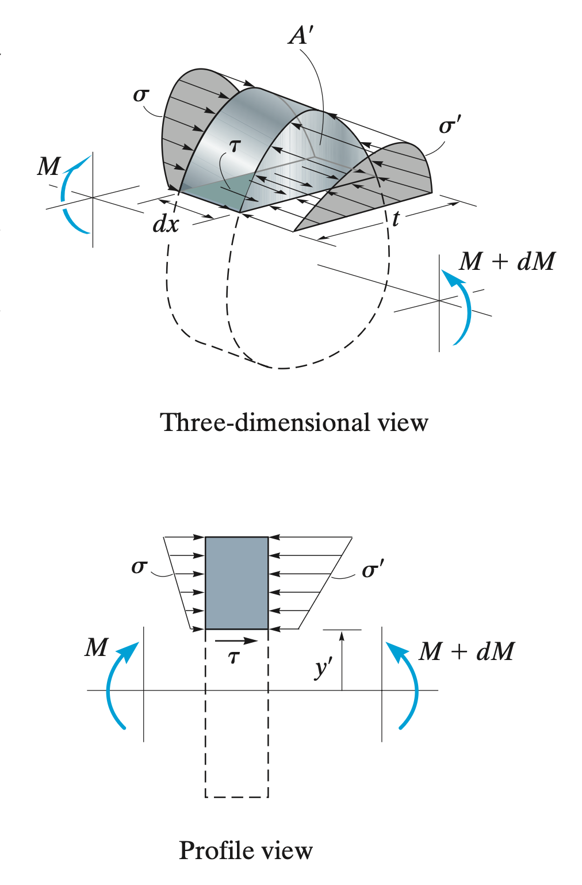
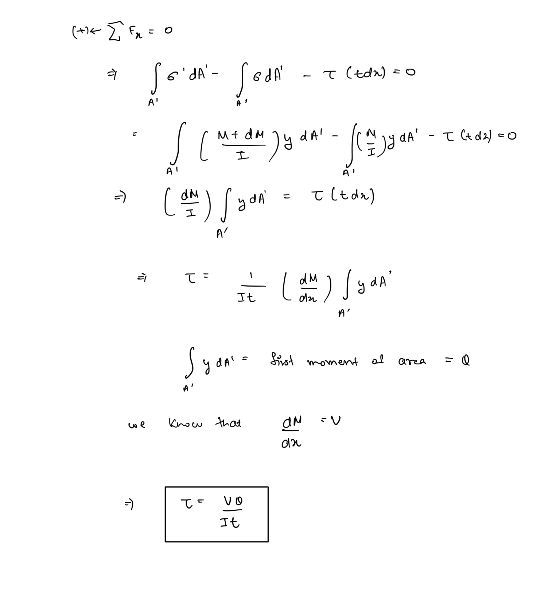
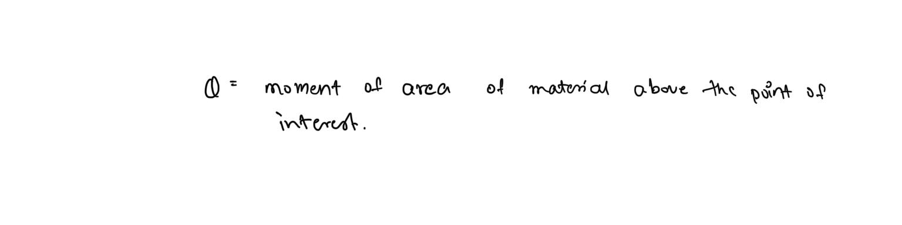

# Shear Loading  
As covered in the introductory section a shear load is one that causes adjacent planes of the material to slide over each other. It acts parallel to the plane it deforms.  
  
## Average Shear Stress  
The simplest analysis of shear stress is one where the shear load is considered to act over the entire are of the plane resisting the load. The distribution of shear stress over the plane is considered to be uniform and thus an average of value of shear stress is obtained using the simple formula -  
  
  
Although the formula may look simple it sees extensive use in design and strength analysis of mechanical components whenever subjected to direct shear like rivets and bolts.  
  
## Single Shear and Double Shear  
Depending on how to component is supported the same shear load may be resisted by multiple shear plane, in which case are formula needs to be modified -  
  
  
Though the average shear formulae have wide applicability, it is still sometimes necessary to evaluate the shear stress distribution to obtain the shear stress at a point especially in cases of compound loading.  
  
## Shear Balance  
The general state of shear along one direction on an infinitesimal element of material can be depicted as follows -  
  
  
The state is depicted by two equal and opposite forces since the condition of equilibrium requires the net force in x-direction to be zero. Equilibrium also requires the net moment about point A to be zero but the longitudinal stresses will apply a moment about A. Hence to be in state of complete equilibrium these longitudinal stresses need to be balanced by transverse shear forces of same magnitude as depicted  
  
  
  
This is known as shear balance which requires transverse and longitudinal shear stresses of equal magnitude to appear together if either one is applied.  
  
## Transverse Shear (General Shear Equation)  
When a beam is subjected to bending, internal transverse shear forces are developed in the beam in response to the loading. This shear forces result in a distribution of shear stresses along the cross-section of the beam.  
  
Due to shear balance the transverse shear stresses will also be accompanied by equal longitudinal shear about each point.  
  
The shear distribution is obtained using the shear formula -  
  
  
  
Consider this small section of an arbitrarily loaded beam. Since the moment at the two ends differ the stress distribution on both the faces will different thus to obtain equilibrium the need to balanced by a longitudinal shear force.  
  
  
  
  
This is the generalised formula to obtain the longitudinal shear stress distribution at a point on a beam. Due to shear balance this equation also gives the transverse shear distribution.   
  
