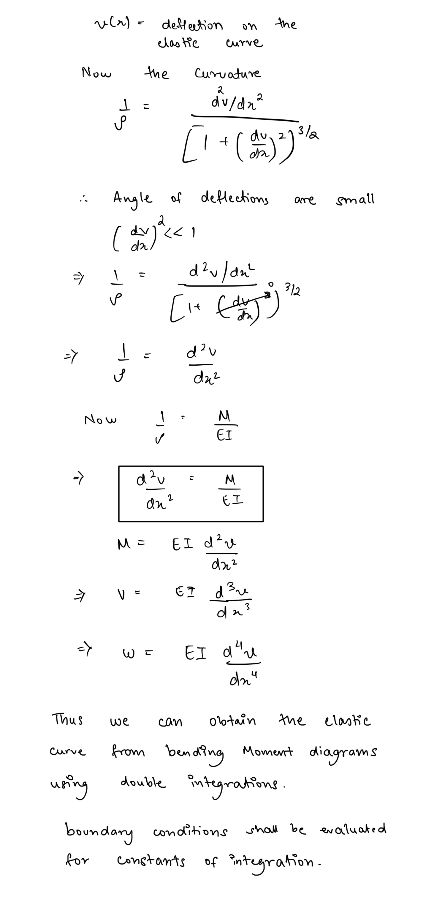
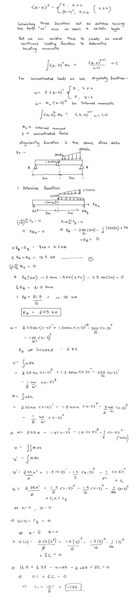
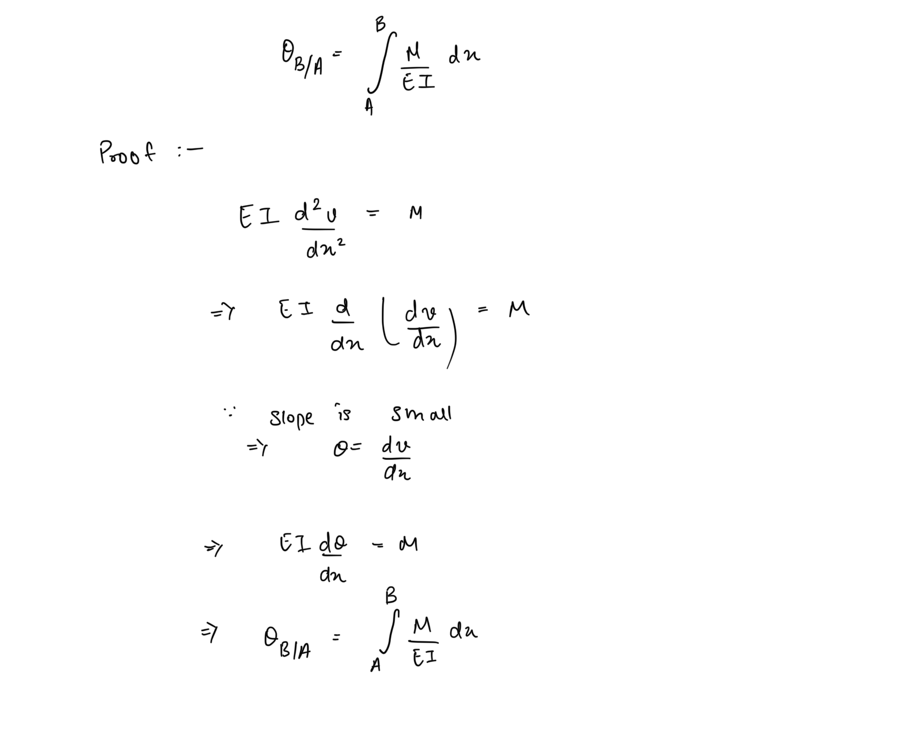
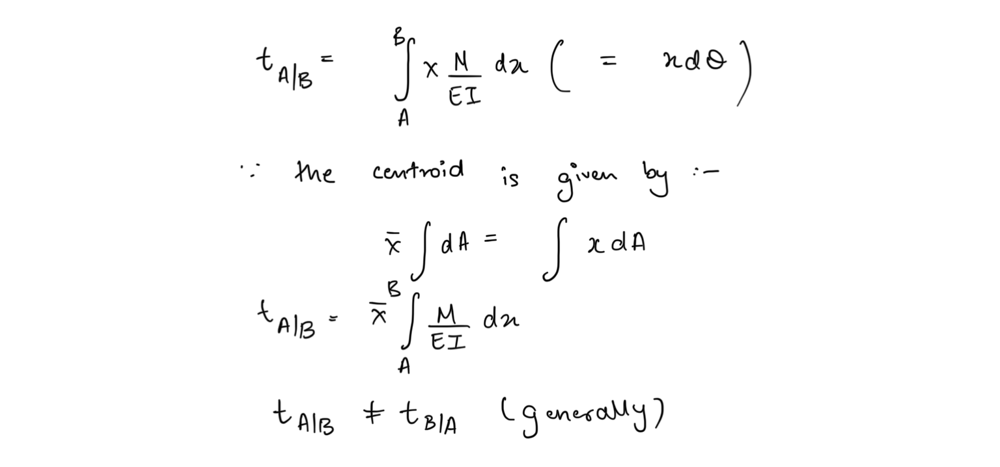
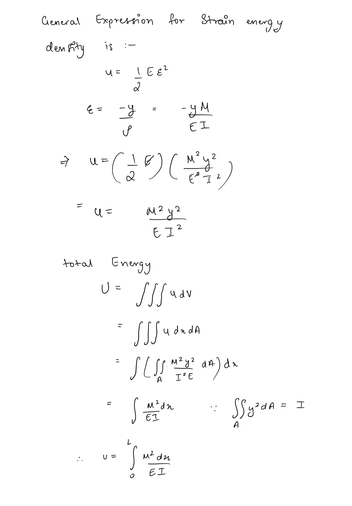
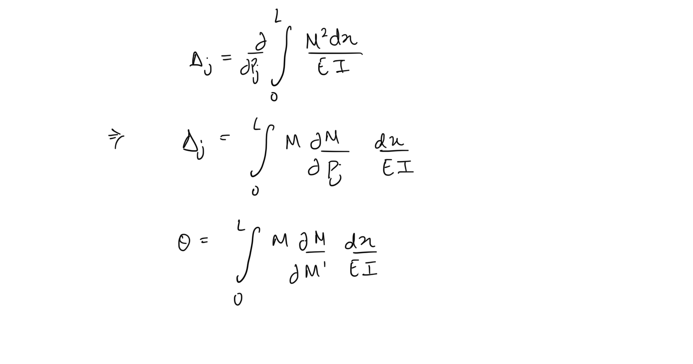

## Slope & Deflection  
Bending results in deflection of beams away from their mean position (configuration). This deflection is plotted on a graph known as the elastic curve of the material which depicts the displacement of each component of the material along the bending axis.  
  
The deflection of a material under bending has the following relation with bending moment and shear force -  
  
  
## Macaulay’s Method  
While the method of double integration provides a neat mathematical method of determining the deflection curve, it can be tedious to solve when the member has complex loading with multiple components.  
  
We analyse a member for bending by taking into account individual loads and internal moments as they appear along the length of the member. Macaulay’s method provides a simpler framework to model these discontinuous loads using discontinuous functions represented by Macaulay brackets.   
  
  
## Moment-Area Method  
### 1st Moment Area Theorem  
The angle (slope) for the tangent at point B measured relative to the tangent at another point A is given by -  
  
### 2nd Moment Area Theorem  
The relative vertical displacement of tangent at point A to tangent at point B is given by -  
  
  
## Method of Superposition  
Effect of each loading can be separated and individually analyzed if the deflections are small enough and the net result can be added.  
  
## Strain Energy   
##   
## Castigliano’s Theorems  
  
The displacement at any point in a body is equal to the partial derivative of strain energy with respect to the load at that point  
  
Similarly the slope is partial derivative of strain energy with respect to the moment at that point  
  
  
