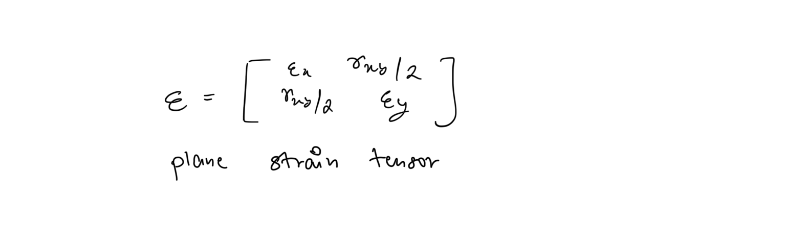
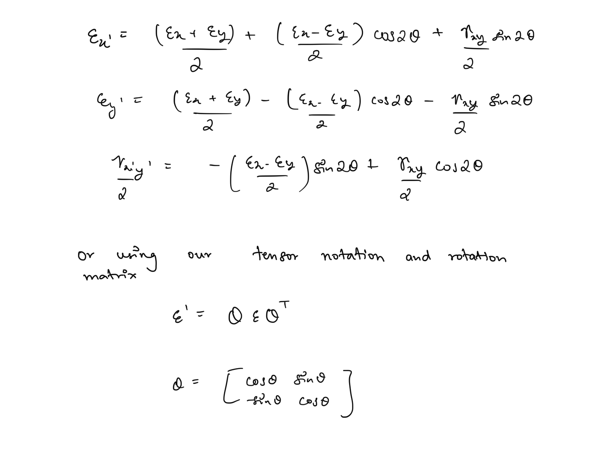
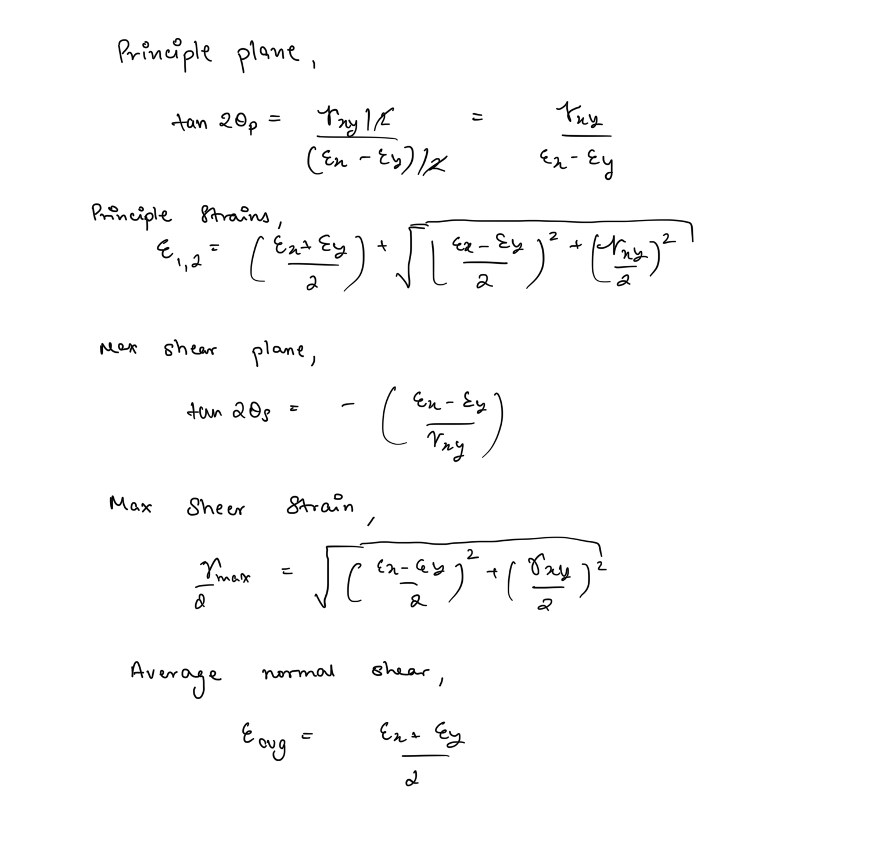

# Strain Transformations  
Similar to general 3D stress, the full state of generalised strain is also given by a 3D strain tensor, as Hooke’s law required the rank of both the quantities to be same. Also since for most mechanical analysis we only require to analyse plane stresses we also only need to assess the plane strain condition due to a load.  
  
The plane strain tensor is given so -  
  
The two shear stress components of the plane stress each result in half of the net shear strain observed on the material  
  
Also just like plane stress, the magnitude of plane strain components depend on the orientation of the plane and hence changing the orientation results in strain transformations   
  
## Principle Strains and Maximum Shear Strain  
Similar to plane stresses we can obtain maximum and minimum principle strains and maximum shear stress as follows -  
  
We can also construct mohr circle to determine these quantities similar to stresses. And in a similar manner obtain absolute maximum shear strains.  
