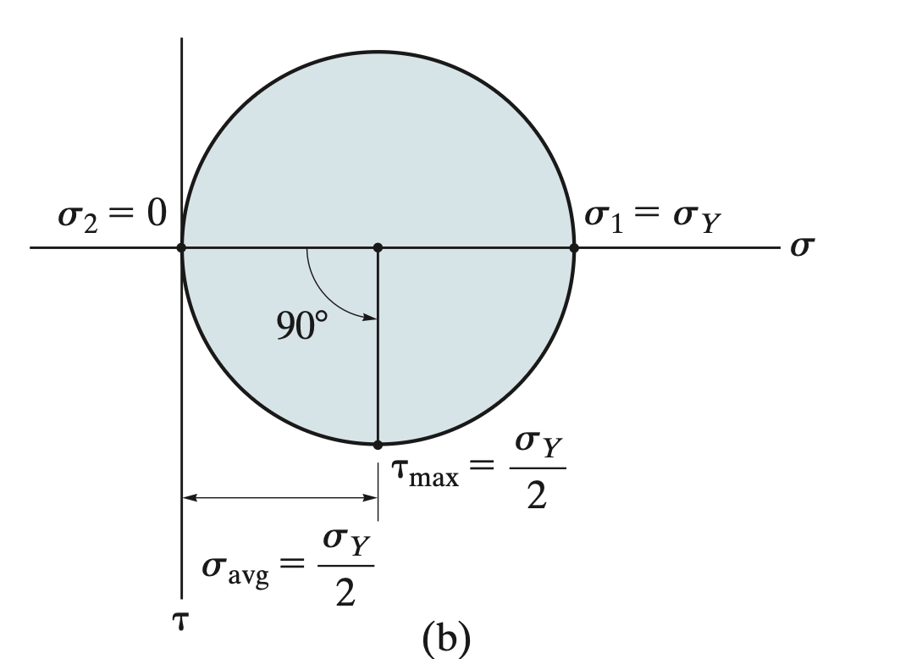
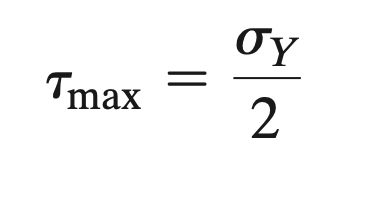
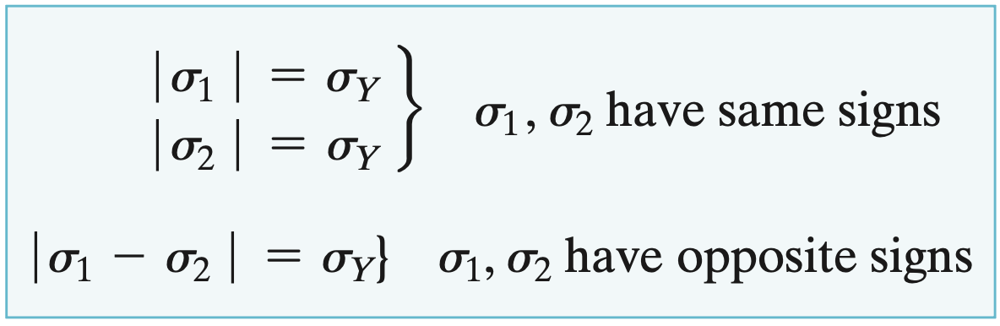
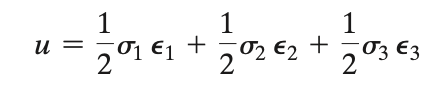
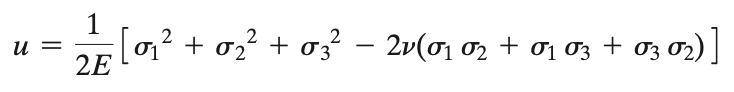
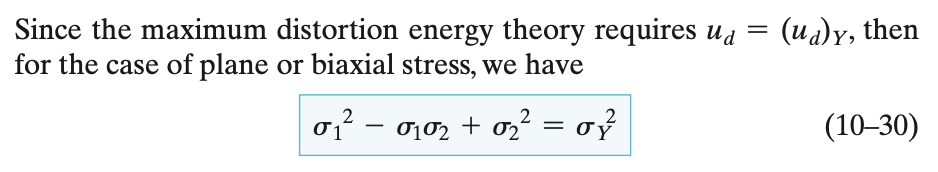
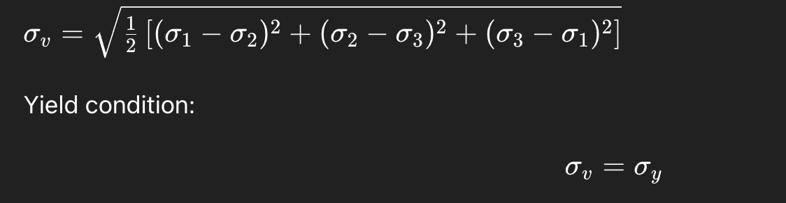
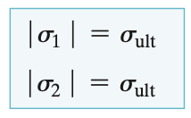
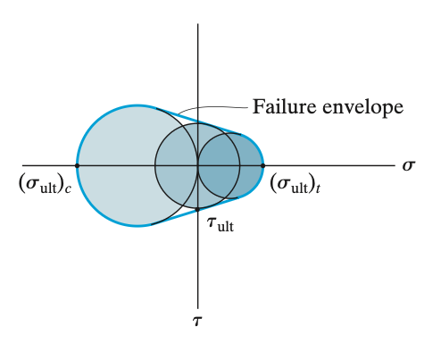

# Theories of Failure  
The aim for engineering design problems is primarily to place an upper limit on the state of stress experienced by the material of the component to be designed such that it does not fail under operation.  
  
The upper limits of stresses a material can handle without any failure are usually terms **strengths of the material**. The strength chosen for any material is dependent on how the failure is defined for it. Failure for ductile materials is usually defined by yielding, whereas for brittle materials it is defined by fracture.  
  
Designing for these stresses is rather simple in case of simple uniaxial stresses, however if the member is subjected to biaxial or triaxial stresses the criteria becomes rather difficult to assign. Hence, many theories for predicting failure of materials have been developed over the years.  
  
The application of these theories usually involves determination of critical points (points of maximum stresses) due the loading of the member, determination of principle stresses based on the state of stress at critical points and testing the principle stresses according to the chosen theory of failure.  
  
The choice of theory of failure is dependent on a lot of factors including the nature of material, state of material (temperature, composition, chemical effects, etc), preperation of material, and level of design safety required.  
  
## Ductile Materials  
  
### Maximum Shear Stress Theory (Tresca Criterion)  
The most common type of yielding in ductile materials is caused by slipping. This can be seen in tension tests of ductile materials as edges of slip planes appear on the surface as luder lines when the material begins to yield.  
  
Slipping is caused by shear stress, hence realising that ductile materials fail by shear Henri Tresca proposed the maximum shear stress theory for ductile materials.  
  
It states that regardless of the loading a ductile material begins to shear when the absolute maximum shear stress equals the shear stress that causes yielding in a simple tension test.  
  
The absolute maximum shear stress can be determined using mohr circle, and mathematically the criterion can be written as -  
  
  
  
  
  
Or in terms of principle stresses -  
  
  
### Maximum Distortion Energy Theory (Von-mises criterion)  
An external load causing a deformation in a material causes it to store energy throughout its volume. This energy per unit volume is known as **strain-energy density. **If the material is subjected to triaxial stresses then each principle stresses contributes to the energy density, and it’s given by  
  
  
  
If the material is linearly elastic, then Hooke’s law can applied to give the expression  
  
  
  
This energy can be considered to be composed of two parts: One part is the energy needed to cause the change in volumes, and the other being the energy causing distortion of the shape. The energy component due to the average principle stress causes the change in volume since it imparts equal strain in all three directions, the rest contributes to distortion and hence is known as distortion energy.  
  
The maximum distortion energy theory states that a material tends to yield when its distortion energy per unit volume exceeds the distortion energy per unit volume of the same material subjected to yielding in a simple tension test.  
  
In case of biaxial stress the von-mises criterion is expressed as -  
  
  
  
Or the general 3D case -  
  
  
  
## Brittle Materials  
  
### Maximum Normal Stress Theory  
Brittle materials fail by fracture with no apparent yielding. In a tension test, the fracture occurs once normal stress reaches the ultimate stress.   
  
Thus, maximum normal stress theory states that when a material is subjected to multiaxial state of stress, the material will fail when a principle stress reaches the ultimate normal stress the material can sustain in a simple tension test, i.e. the material’s ultimate normal strength.  
  
Therefore for a material subjected to plane stress, the maximum normal stress theory can be expressed as -  
  
  
### Mohr’s Failure Criterion  
Some brittle materials exhibit different strengths under tensile and compressive loads. The failure criterion for them is based on Mohr’s circle and is known as Mohr’s Failure Criterion.  
  
To use this criterion, first the ultimate tensile, compressive, and shear strengths of the material are determined by simple axial and torsion tests. Then mohr’s circle diagram is constructed all three states.  
  
  
  
These three circles are contained within a **failure envelope **indicated by the extrapolated curve. If a plane stress state at a point is represented by a circle that has a point of tangency or extends beyond this envelope, then failure is said to occur according to the mohr’s criterion.  
  
These form the theories for when a material is subjected to static loads, in case of varying loads i.e. fatigue failure the theories need to modified and are covered later in section more focused on mechanical design.  
