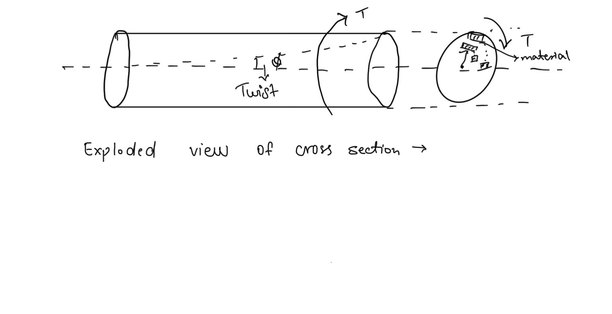
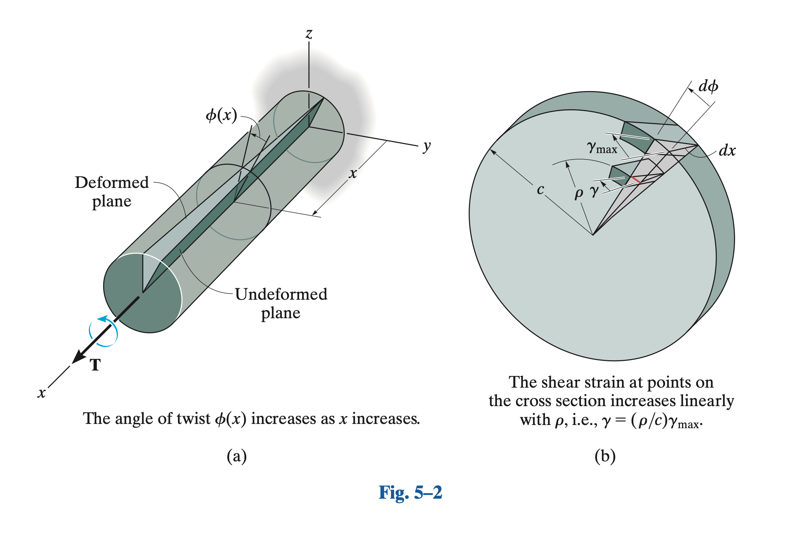
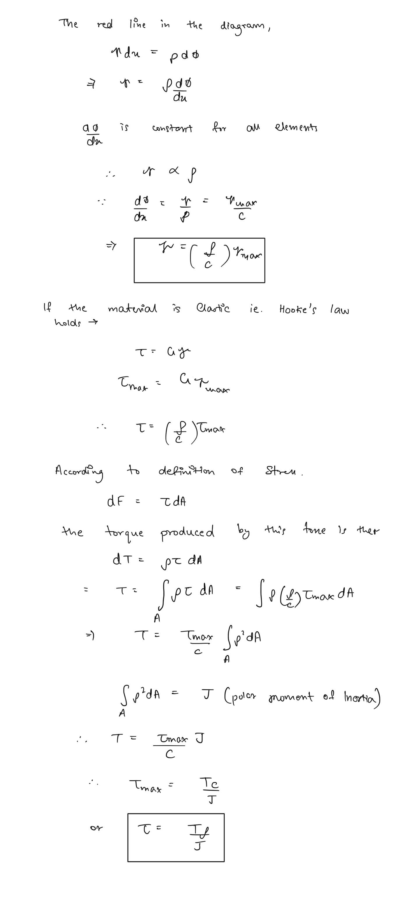
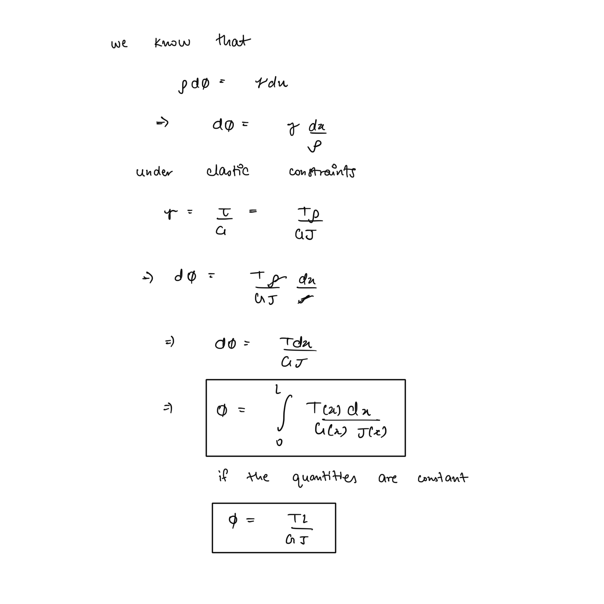
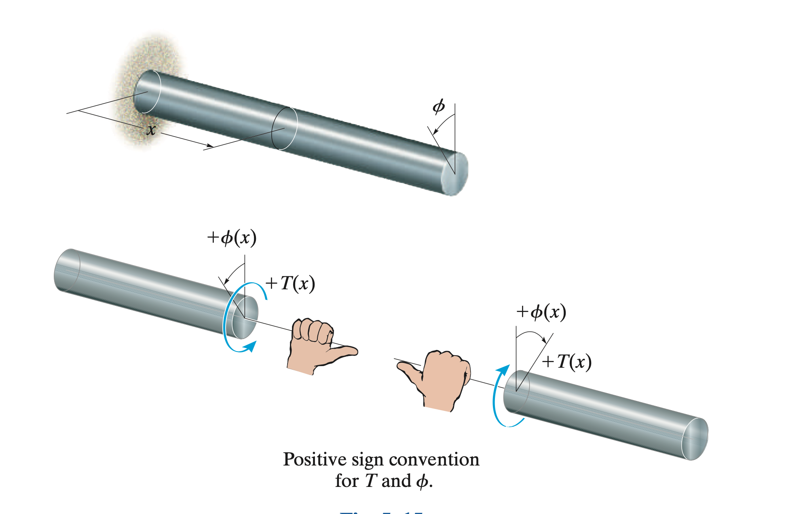
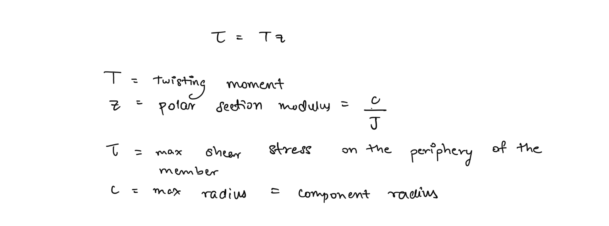
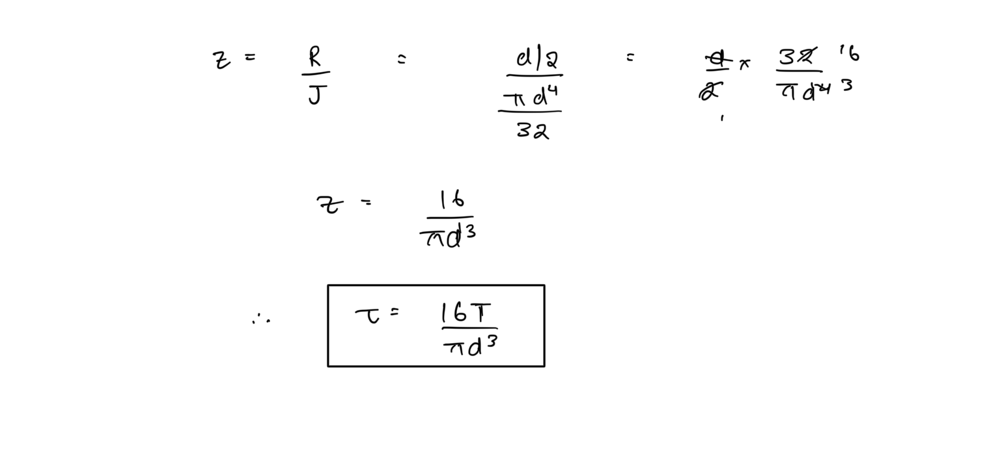

# Torsion  
When a torque load (moment of force) is applied to a static member it experiences a twisting along the axis about which the torque is applied. This phenomenon is known as torsion. The torque is also referred to as a twisting moment in the context of torsion.  
  
Torsion load is really important to be analysed when designing rotating shafts. In real shafts though the torque is intended to cause turning or rotation of the shaft which is analysed under kinematic analysis of shafts, but in accordance to our assumptions of design analysis we assume the entire torque to be a twisting moment on the shaft to achieve a design that safe to bear the load in case of a kinematic failure of the component.  
  
During kinematic analysis though, the torque will be assumed to only behave as a turning moment. This examples shows how are assumptions of analysis stated in the fundamentals section helps us achieve sound mechanical design.  
  
## The Torsion Formula  
When a member is subjected to turning moment it experiences a twist along the axis on which the load is applied. On a material scale, this twist appears as the layers of the material adjacent to each other, radially from the axis, slip along each other i.e. torsion results in a shear stress in the material.  
   
  
  
  
  
This formula is used to calculate the shear stress at any point on the cross section of a member subjected to torsion and is thus known as the **torsion formula**.  
  
## Angle of Twist  
The angle of twist for a member subjected to torsional load is given by -  
  
In a case with multiple torques we can use the principle of superposition and calculate the net angle of twist by doing an algebraic sum of the effect of each torque.  
  
## Sign Convention  
The positive direction is determined by right hand thumb rule with the thumb pointing outward from the shaft.  
  
  
## Polar Section of Modulus  
The torsion equation is sometimes written a simplified form using a quantity known as polar section modulus for design problems. This simplified form makes the equation similar to other stress load relationships.   
  
  
In design problems, the stress of concern is generally the maximum stress for which we design the component for hence the use of this simplified form. For a circular cross sectional member -  
  
