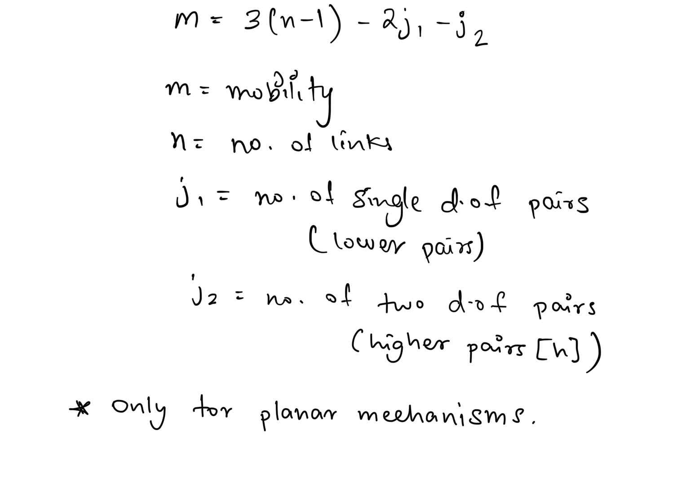
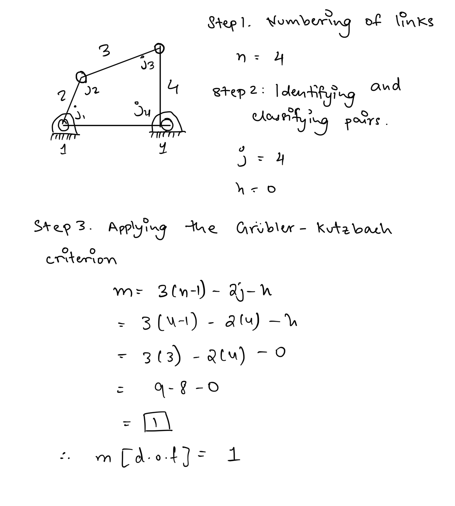
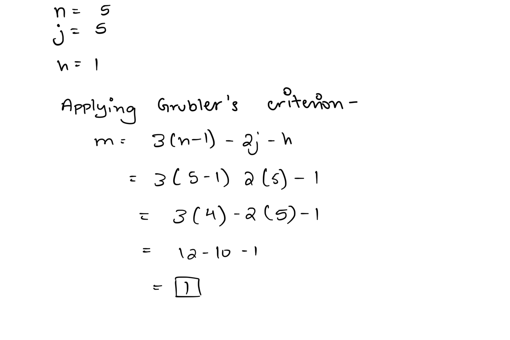
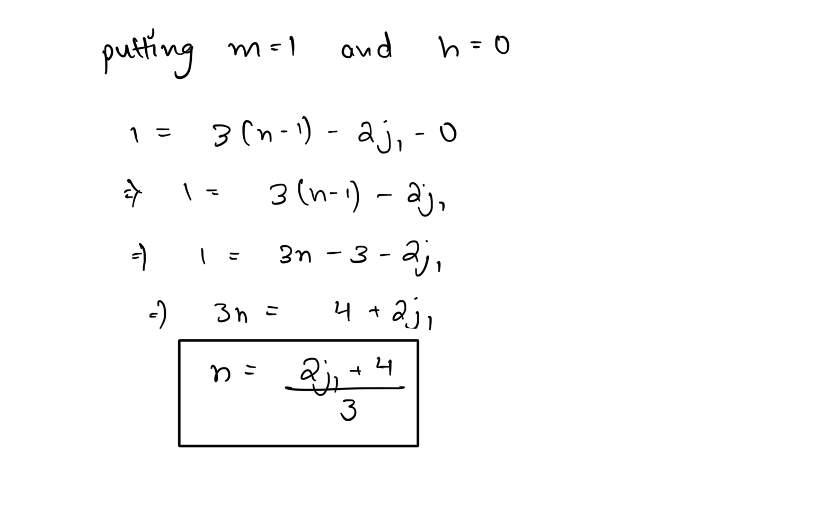
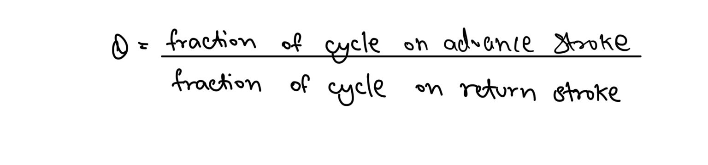
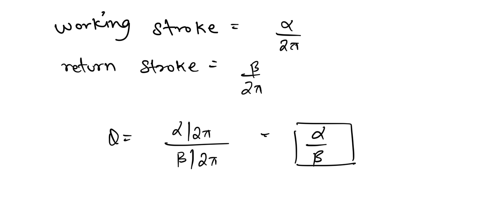

# Introduction & Basics  

## Study of Mechanics and Mechanical Systems   
  
The science of describing and analysing motion is termed **++Mechanics.++**  
  
The study of Mechanics is broadly divided into two categories :-  
  
1. **Kinematics** - concepts of kinematics only deal with describing the motion of any body without the consideration of the underlying cause of the motion.  
2. **Dynamics** - when studying dynamics is when we generally include the study of the underlying driving forces that bring about motion in any body.  
  
**Rigid Body** - A body for which the relative positions of all the points inside it doesn’t change with respect to each other when forces are applied.  
  
For a rigid body, we can analyse the entire structure moving together as a whole and don’t need to deal with motion of individual parts.  
  
Most machines are composed of rigid bodies.  
  
The study of mechanical systems is generally covers two broad domains :-  
1. Analysis - The study of machines behaviour through its motion.  
2. Synthesis - The study of machine design is often termed synthesis. It deals with describing the shape, size, material composition, and arrangements of various parts of any machine. Analysis is a tool heavily used for the process of synthesis.  
  
## Reuleaux’s Definition of Machines & Mechanisms  
  
1. **Machine - **A combination of resistant (rigid) bodies arranged such that by their means, mechanical forces of nature can be compelled to do work accompanied by certain determinate motions.  
2. **Mechanism - **An assembly of resistant (rigid) bodies, connected by movable joints, to form a closed kinematic chain with one fixed link, having the ability to transform motion.  
  
  
It is clear from the definition itself that the study of mechanisms mostly deal with kinematics of the system. A machine is composed of mechanisms once we identify and describe the driving mechanical forces to induce the motion which is then transformed by the mechanisms to obtain work through a desired form of motion. Thus, the role of dynamics of the system comes up during the composition of machines from mechanisms.  
  
> A **structure** is also a combination of rigid bodies, connected by joints, but not for the purpose of doing work or transform motion, only to be rigid and resist all internal mobility.  
  
## Terminologies for Mechanisms  
  
1. **Link** - terms used for any rigid machine part or component of the mechanism.  
2. **Kinematic Pairs **- the joints or connections between the links are called kinematic pairs (or simply, pairs).  
3. **Kinematic Chain** - when many links are joined together by kinematic pairs, the form a kinematic chain.  
4. **Degrees of freedom** - the number of independent variables required to describe the state of the mechanism. For a mechanism, the DOF is also called *mobility*.  
  
A joint can be classified on the basis of how many link elements it connects - ***binary, ternary,*** etc.  
  
A chain that forms a closed loop is called a ***closed kinematic chain***, otherwise ***open***.  
  
A closed consisting of only binary links is called a ***simple closed chain***, otherwise ***complex closed chain*** (hence forms multiple closed loops).  
  
> For a chain to be considered a mechanism it must consist of a fixed link, which acts as the frame of reference for describing the motion of the mechanism.  
  
### Classification of Kinematic Pairs  
  
Kinematic Pairs are separated into two categories:-  
  
1. **Higher Pairs** - line or point contact between the mating surfaces. Like cam and follower joint.  
2. **Lower Pairs** - surface contact between the mating surfaces. Like pin joints.  
  
### Six Types of Lower pairs based on relative motions  
  
The definition of kinematic pairs can be misleading at times hence we have classified lower pairs on the basis of these 6 types of general relative motions allowed by them  
  

| Lower Pair Name | Motion                    | Symbol | DOF |
| --------------- | ------------------------- | ------ | --- |
| Revolute        | Circular or pure rotation | R      | 1   |
| Prismatic       | Linear                    | P      | 1   |
| Screw           | Helical                   | H      | 1   |
| Cylindrical     | Linear and rotation       | C      | 2   |
| Spherical       | 3 Axes of Rotations       | S      | 3   |
| Flat            | Planar                    | F      | 3   |
  
  
## Classification of Mechanisms  
Mechanism are categorised as :-  
  
1. **Planar Mechanisms** - loci of all particles are planar curves all parallel to one plane. All axes of rotation are perpendicular to each other and the plane of the mechanism.  
2. **Spherical Mechanisms** - each moving link has a point that remains stationary as the mechanism moves. Arbitrary points on links travel on concentric spherical surfaces.  
3. **Spatial Mechanisms** - have no constraints on the motion of links.  
  
> Planar mechanisms with all lower pairs are termed *planar linkages*.  
  

Planar mechanisms are the most widely used of the mechanisms, hence our study of analysis will focus on them.  
  
## Mobility  
  
The mobility, or degree of freedom, for any mechanism can be computed using the Grubler-Kutzbach Criterion -  
  
### Solved Example 1 : Four Bar Chain   
###   
###   
### Solved Example 2 : Shigley’s Ex 1.1  
  
  
  
## Grubler’s criterion for planar linkages  
  
A simplified criterion can be used for linkages with mobility 1   
  
## Quick Return Mechanism  
  
Mechanisms that generate rectilinear motion are termed Reciprocating Mechanisms. For example - slider crank mechanism  
  
All reciprocating mechanisms exhibit a forward stroke in which work is done against an opposing force, as well as a return stroke in which the linear section returns back to its original position while performing no work.  
  
The advance-to-return stroke ratio, Q, thus becomes an important quantity.   
  
### Solved Example -  
  
  
  
Any mechanism with Q greater than unity is termed a ***quick return mechanism***, i.e. it spends majority of the cycle in advance or working stroke.  
  
  
  
Fig - Whitworth quick return mechanism.  
  
## Mechanical Advantage  
The mechanical advantage of any mechanism is defined as the ratio of the force or torque exerted by driven link (output) to the force or torque applied on the driver link (input).   
  
