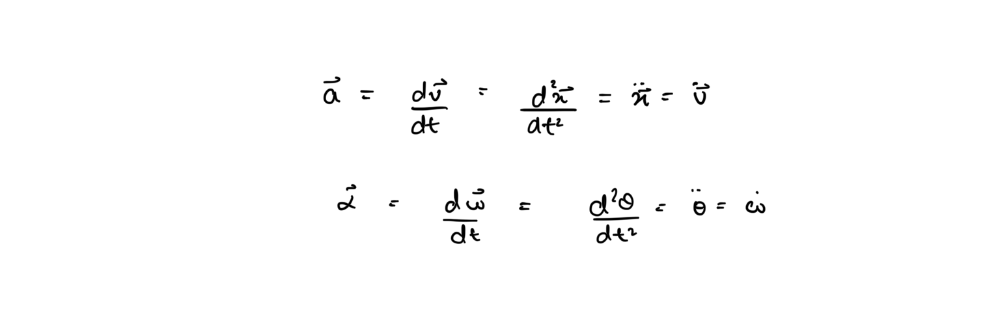
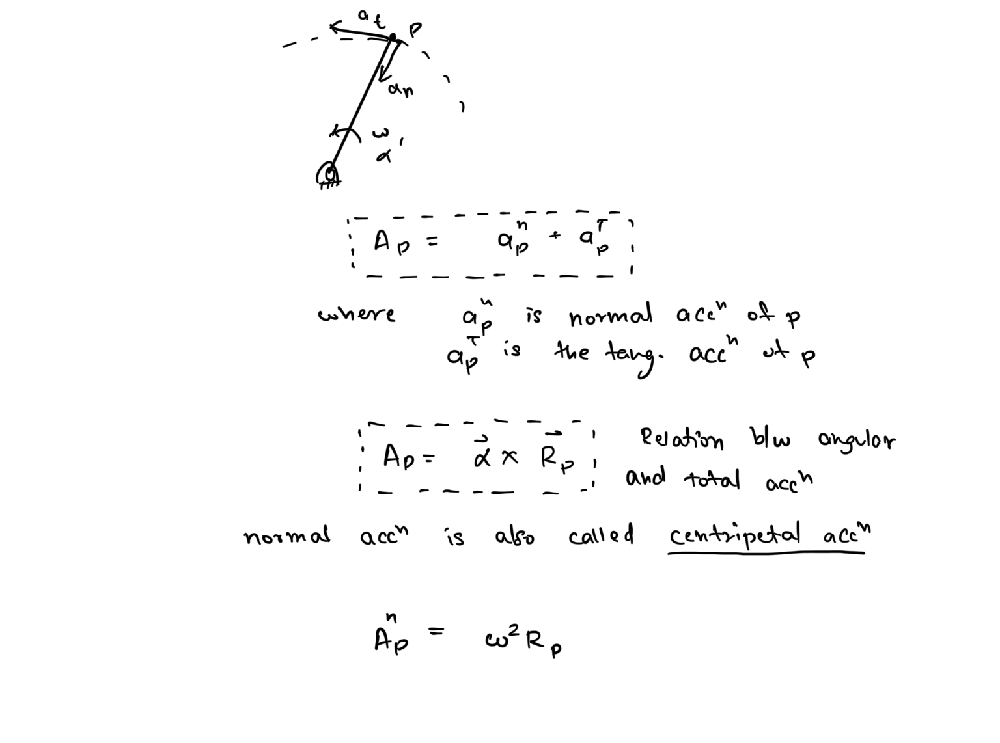
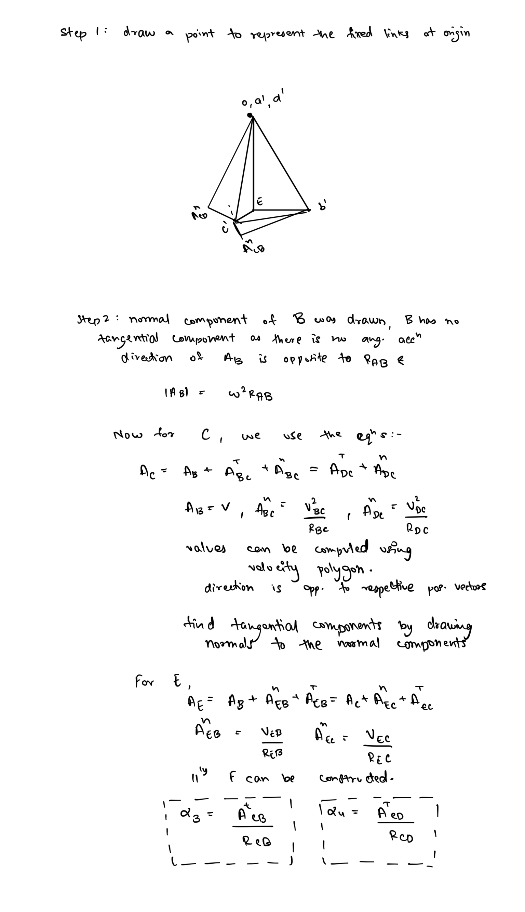

# Kinematic Analysis - Acceleration  
  
## Linear and Angular Acceleration  
  
Acceleration is defined as the rate of change of velocity. Corresponding to translational (linear) velocity it is termed linear acceleration and corresponding to rotational (angular) velocity it is termed angular acceleration.   
  
### Tangential and Normal Acceleration  
  
Generally for motion of mechanisms the acceleration of components consists of two components - normal and tangential acceleration.   
  
## Graphical Analysis: Acceleration Polygon  
Similar to velocity, acceleration of various components of a mechanism can be can be computed graphically by drawing an acceleration polygon diagram with an appropriate scale.  
  
### Illustrative Example 1: Acceleration polygon of a four bar linkage  
The following example is only to illustrate the process and a proper scale is not adhered to.  
  
  
  
  
## Vectorial Analysis  
Similar to the Analysis of velocity, accelerations of a mechanical system can be analyzed using the vector equations and differentiating the velocity relations in both vector notation and complex planar vector notation.  
