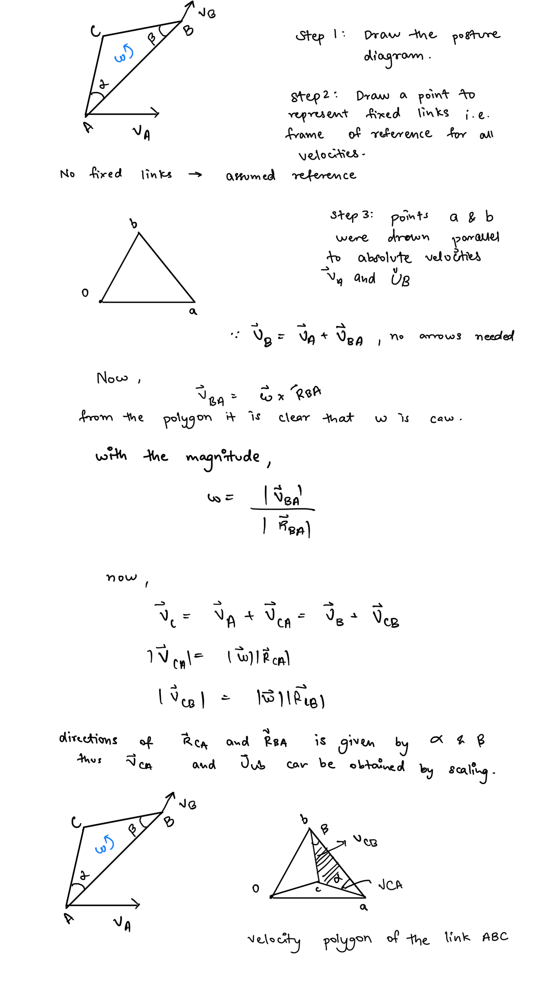
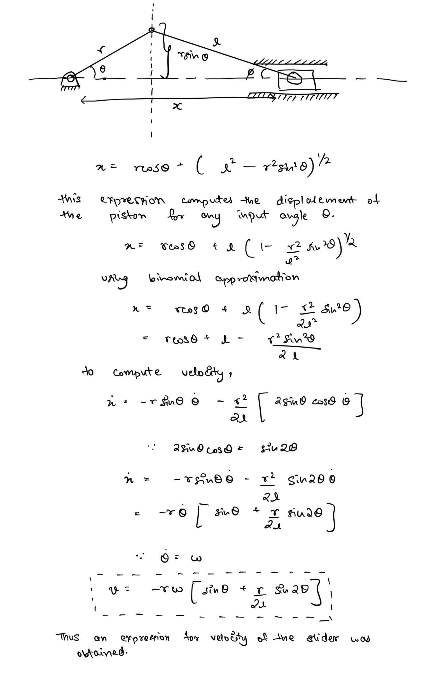
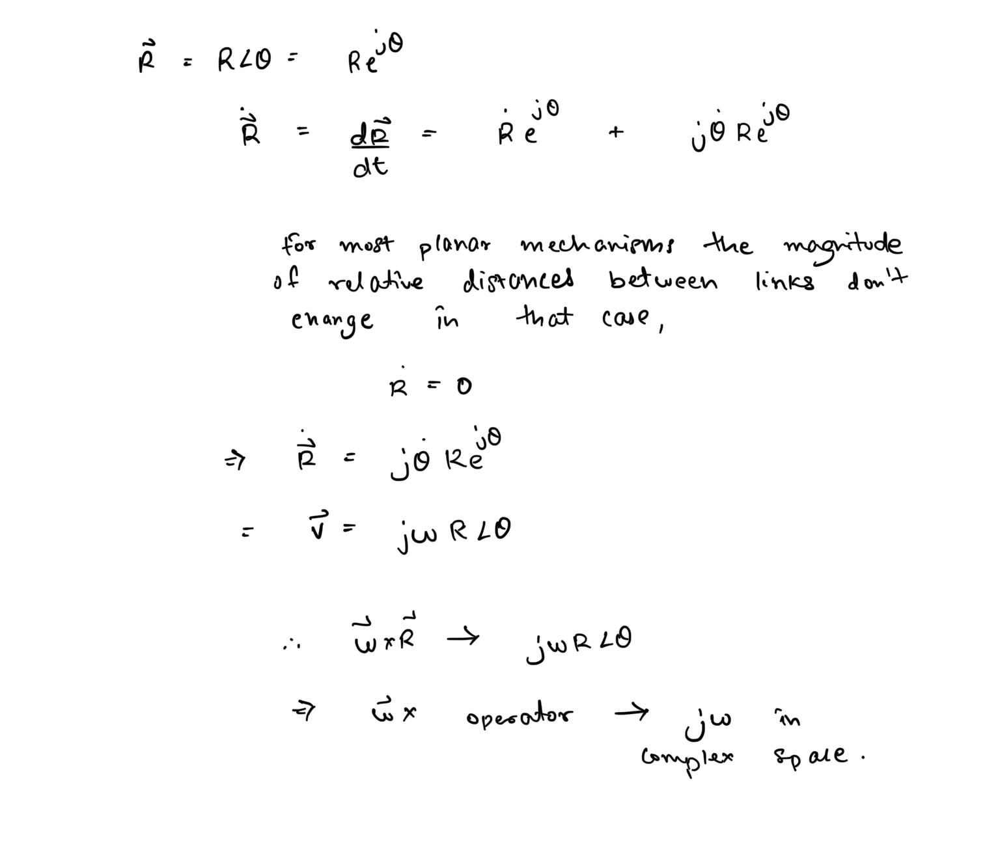
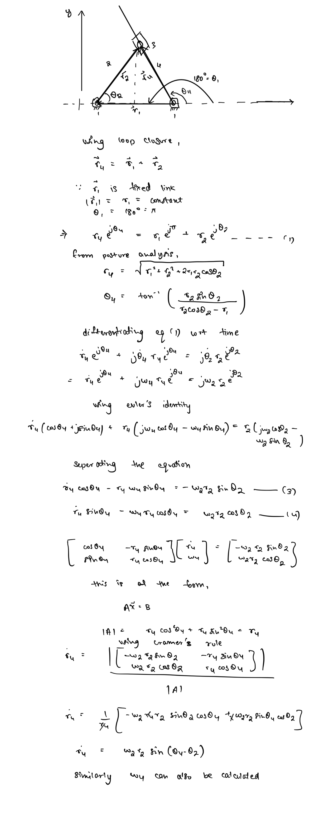
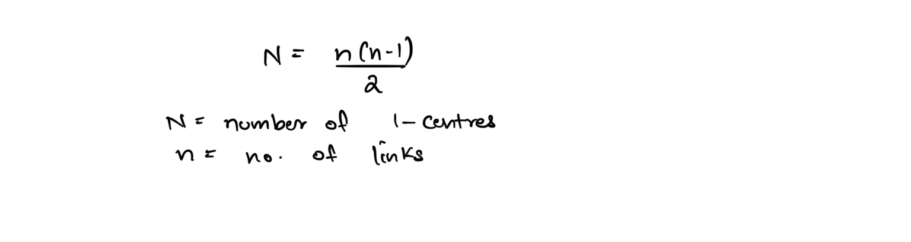
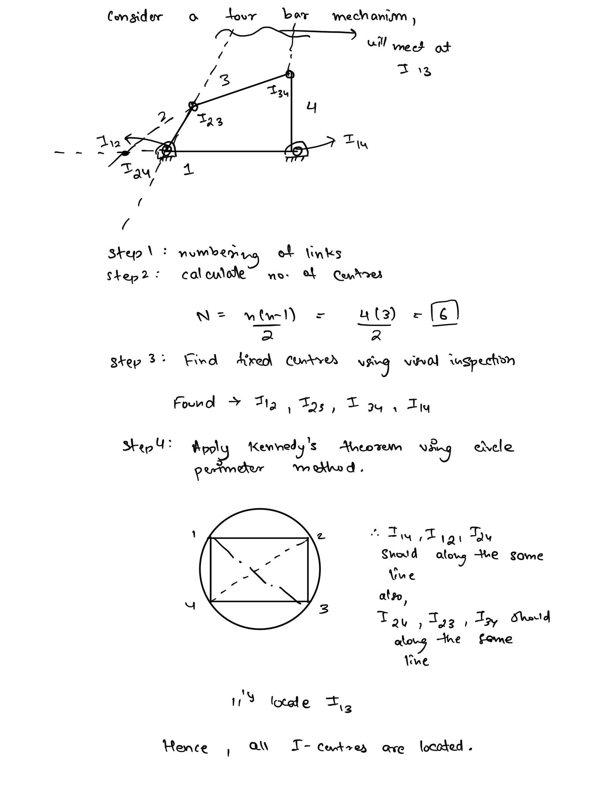
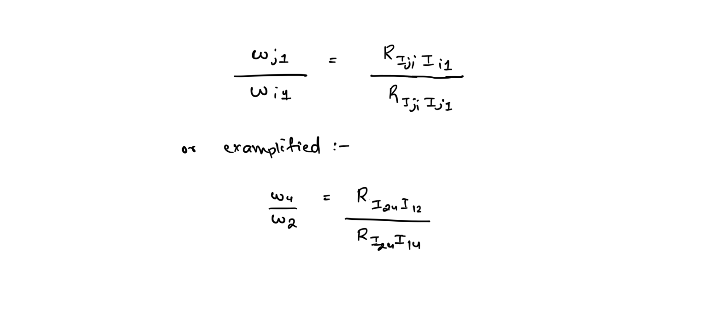

# Kinematic Analysis - Velocity  
  
## Position & Posture  
  
### Position  
we define the **position of a point** as its location relative to some chosen reference, typically the origin of the coordinate system.  
  
Positions are often represented using **vectors**. We can find the **relative position** of any point/particle relative to another by taking the **vector difference**. The **apparent position** of a point, i.e. as seen from a different observer can be computed by taking the **vector sum** of the position of the observer relative to that observer and the position of the observer relative to the second observer.  
  
Since, we are mostly dealing with **planar mechanisms** we can use **complex numbers** to denote planar vectors.  
  
### Posture  
We use the term posture to describe location and orientation of a rigid body or for the configuration of mechanism, with the location and orientations of all links, at a particular instant of time.  
  
## Translation and Rotation  
**Translation** - motion in which there is not relative displacement between any two points of a rigid body, or the absolute displacement of all points is equal.  
  
**Rotation** - motion is which there is some relative displacement between any two points of the rigid body. Note that for a rigid body, the distances between the points will not change thus the displacement is purely due to change of orientation.  
  
## Linear and Angular Velocity  
  
**Velocity** - change in displacement per unit time.  
  
### Linear Velocity   
Velocity associated with translation displacement is termed linear velocity.   
  
### Angular velocity   
Velocity associated with rotational displacement.   
  
**Note** - Almost all motion in mechanisms is a combination of translational and rotational motion.  
  
## Graphical Analysis: Velocity Polygons  
Graphical analysis of velocity by drawing velocity polygons can be a great approach when solution to a single posture is required.  
  
### Worked Example 1: Simple Rigid Link   
###   
Thus the velocity polygon is a scaled and rotated image of the posture image that describes velocities. If drawn properly to scale it can be used to solve problems of velocity analysis.  
  
## Vectorial Analysis  
  
### Algebraic Analysis  
  
Sometimes the graphical approach is not the most convenient method for example when solutions for multiple postures is required, that is when for many mechanisms we can actually carry out analytical vector mathematics to compute state equations.  
  
### Worked Example 2: Analysis of Slider Crank Mechanism   
###   
### Complex Algebraic Analysis  
As stated before for planar vectors, it is sometimes convenient to represent them using complex number notation. Vectorial analysis in this notation is also quite rudimentary.   
  
### Worked Example 3: Inverted Slider crank linkage   
###   
## Instantaneous centres of Velocity  
  
When any body is in motion, at any given instant it appears to be rotating about an imaginary axis in space. In planar motion this axis reduces to a point on the plane and that point is called the instantaneous centre of velocity for the body. Since motion of any body is relative to another in a mechanism I-centres are obtained for each relative frame for each link.  
  
### Number of I-Centres  
  
For any two bodies there is an I-Centre present. Thus for an n-link mechanism there must be I-Centres for each possible combination.   
  
### Kennedy’s Theorem  
If three planar bodies have relative motion among themselves, their I-centres must lie on the same line.  
  
### Worked Example 4: Locating I-Centres   
###   
> For the two bodies in motion, the I-Centre is a pair of points for which the absolute velocities are equal  
  

## Angular-velocity ratio theorem  
The ratio of angular velocities, corresponding to the fixed frame, of two rigid bodies is inversely proportional to the distance of the common I-centre to the respective fixed I-centre   
  
*This same ratio is also the value of the corresponding **kinematic coefficient**, thus I-centres can be very useful in velocity analysis.*  
