# Kinematic Inversions  
  
A kinematic chain must contain at least 1 fixed link to be termed a mechanism.  
  
The absolute motion of the mechanism is described relative to this fixed link, also called a frame.  
  
When different links are chosen as frames, a ***kinematic inversion*** is obtained.  
  
A mechanism with n links, there are n different inversions possible.  
  
## Inversions of 4R Chain  
A mechanism with 4 revolute pairs is termed a 4R mechanism. The simple 4 bar mechanism is a 4R mechanism.  
  
The inversions of the 4R mechanism lead to the following systems -  
1. Crank-Rocker Mechanism in 2 configurations  
2. Double Crank Mechanism   
3. Double Rocker Mechanism  
  
### Crank-Rocker Inversions  
  
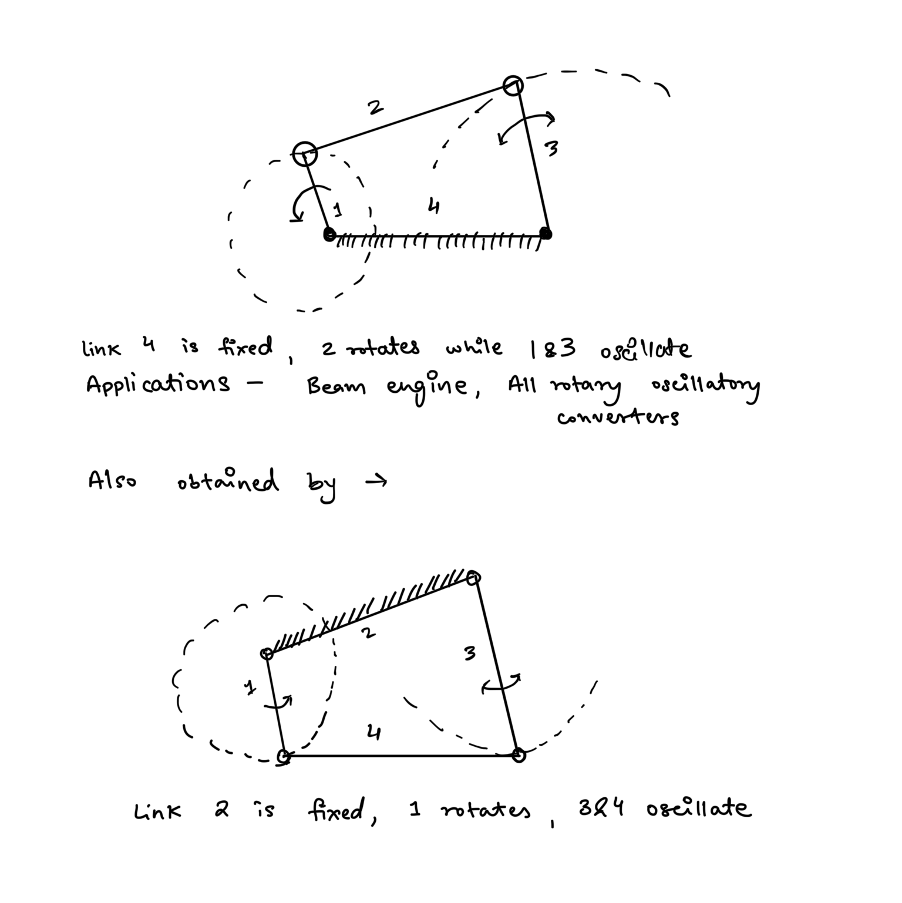  
### Double Crank Inversion  
### 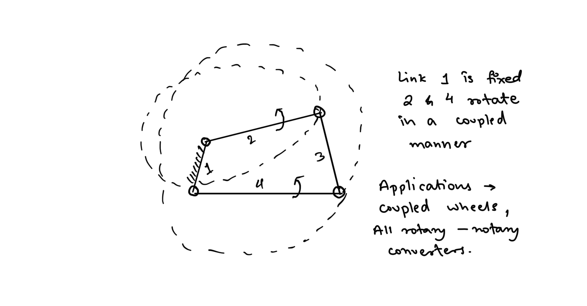  
### Double Rocker Inversion   
### 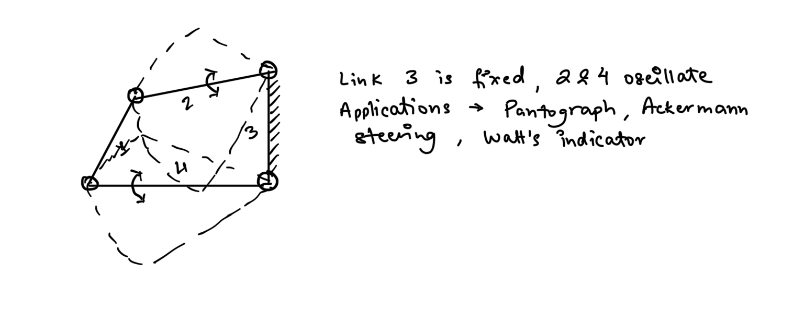  
## Inversions of 3R-P Chain  
Contains 3 Revolute pairs and 1 prismatic pair. The slider crank mechanism is a 3R-P chain.  
  
### Inversion 1: IC Engine Slider crank mechanism   
### 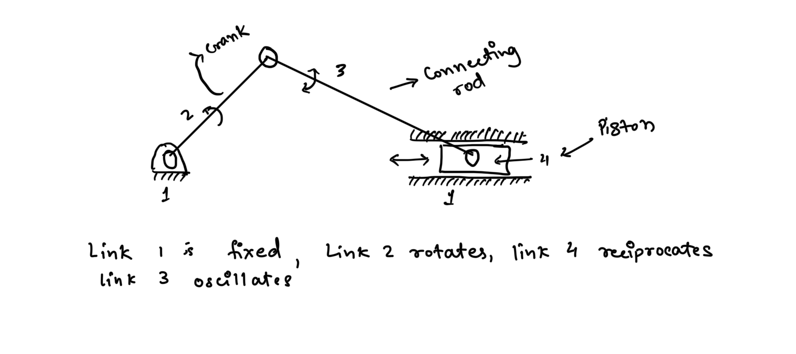  
### Inversions 2: Whitworth Quick Return Mechanism   
### 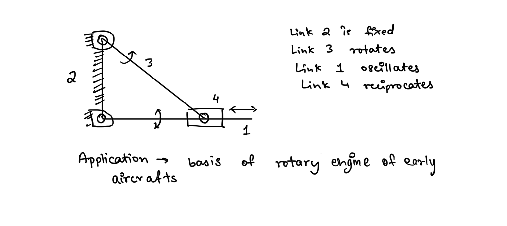  
### Inversion 3: Slotted Lever Quick-Return Mechanism   
### 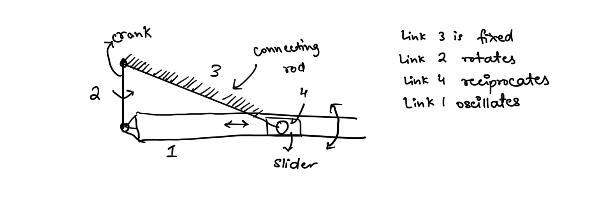  
### Inversion 4: Handpumps   
### 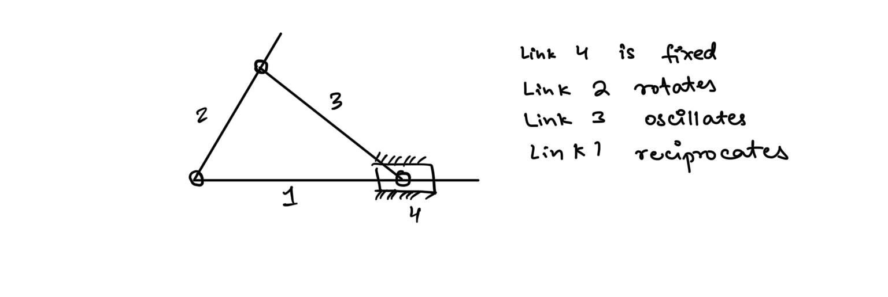  
## Inversion of a 2R-2P Chain -  
### Inversion 1  
## 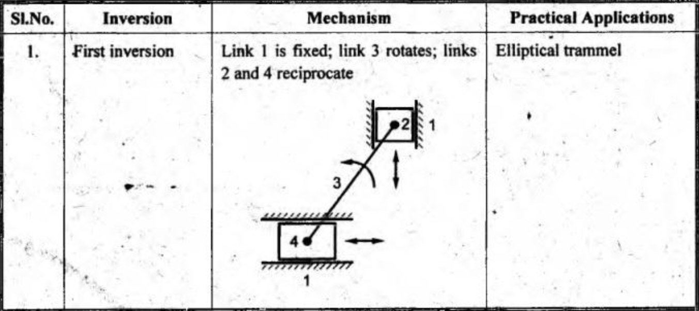  
### Inversion 2  
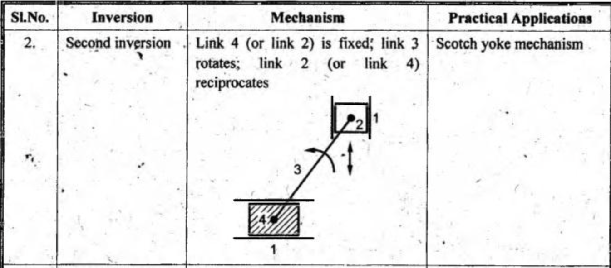  
The sloth yoke mechanism can be obtained by two configurations.  
  
### Inversion 3  
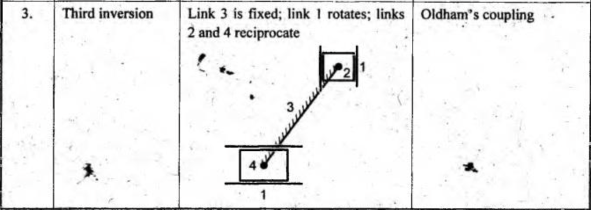  
  
## Grashof’s Law  
Mechanisms are primarily designed to be driven by a motor, thus it is extremely important to ensure that the input crank can make a complete revolution otherwise the mechanisms won’t be useful.  
  
For a four bar linkage there is a very simple test to ensure this,  
  
**Grashof’s Law -** *for a four bar linkage, the sum of the shortest and longest link lengths should not be greater than the sum of the lengths of the remaining two links, if there is to be continuous relative motion between two links.*  
  
Grashof’s law can be summarized by this inequality -  
  
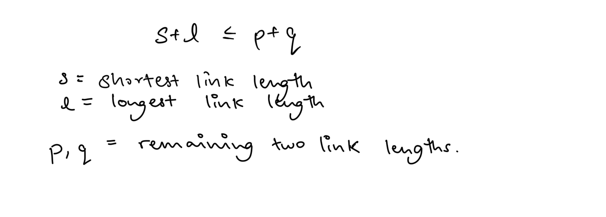  
## Law of Steering  
A steering mechanism, called the **Ackerman Steering Mechanism**, can be constructed using a four-bar chain in double rocker inversion.  
  
For such a steering mechanism the configuration follows the following mathematical relationship -  
  
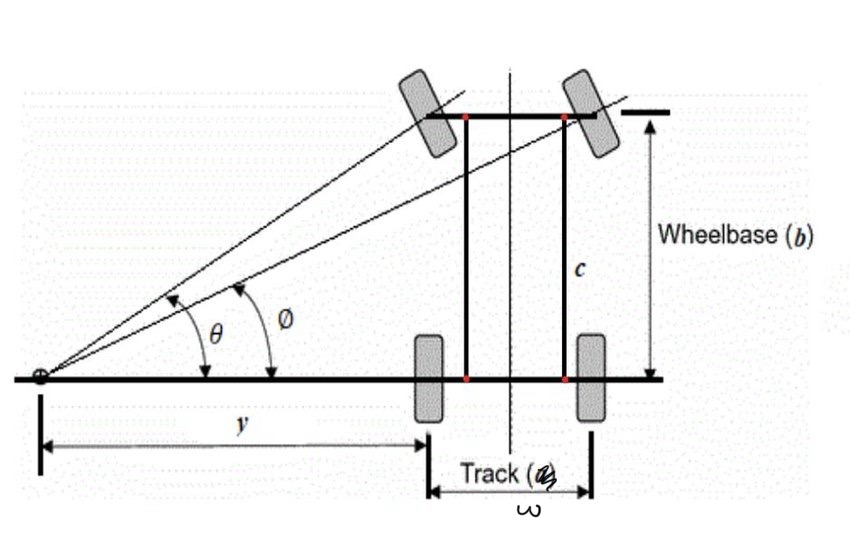  
  
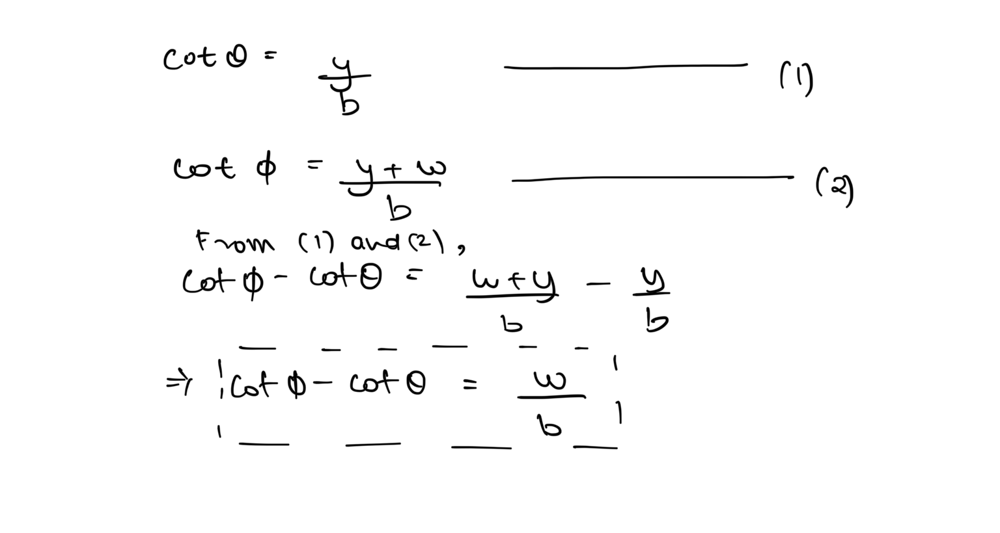  
  
