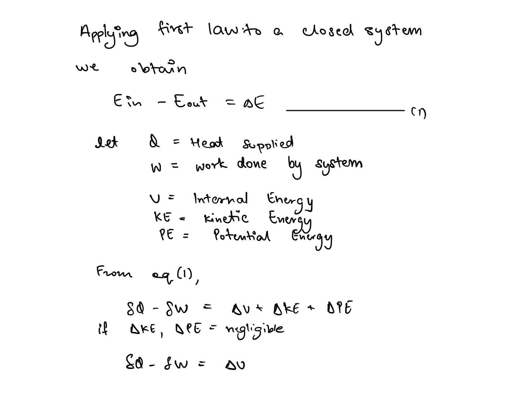
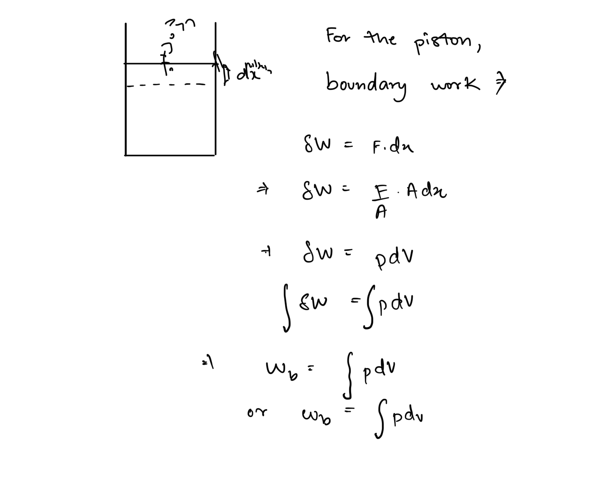
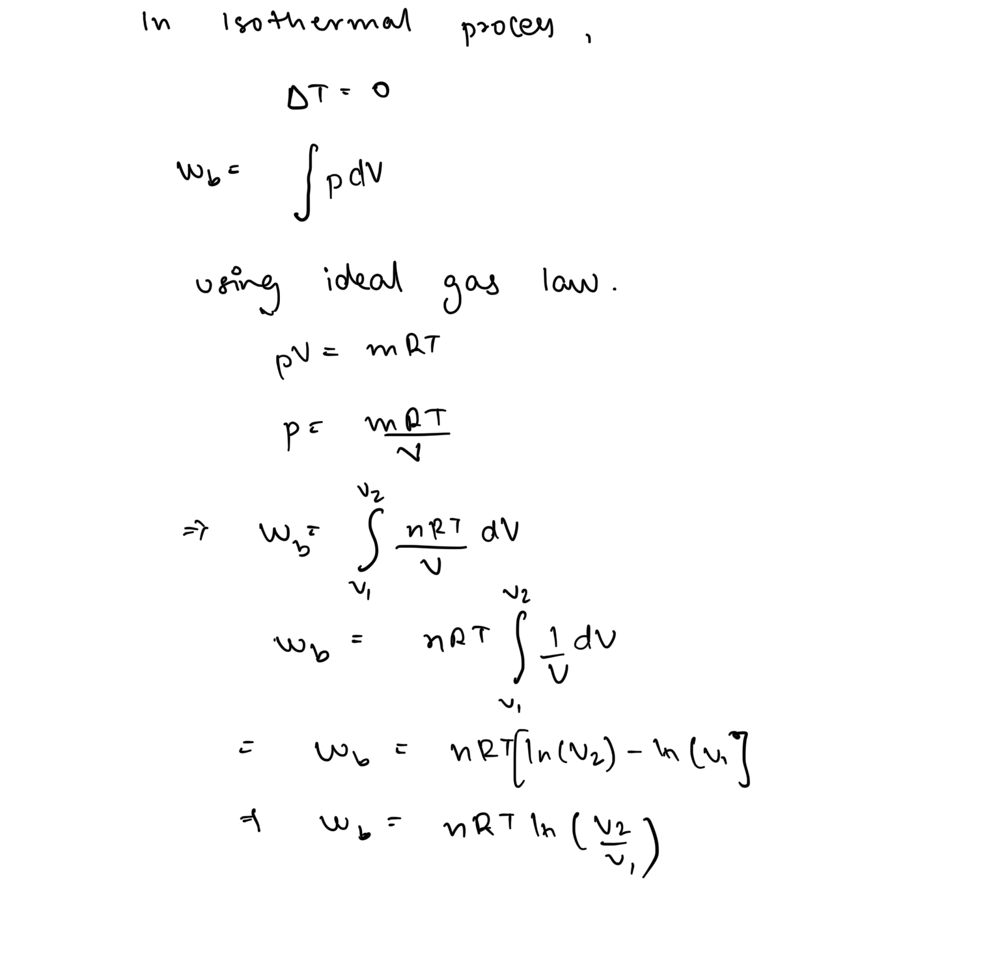
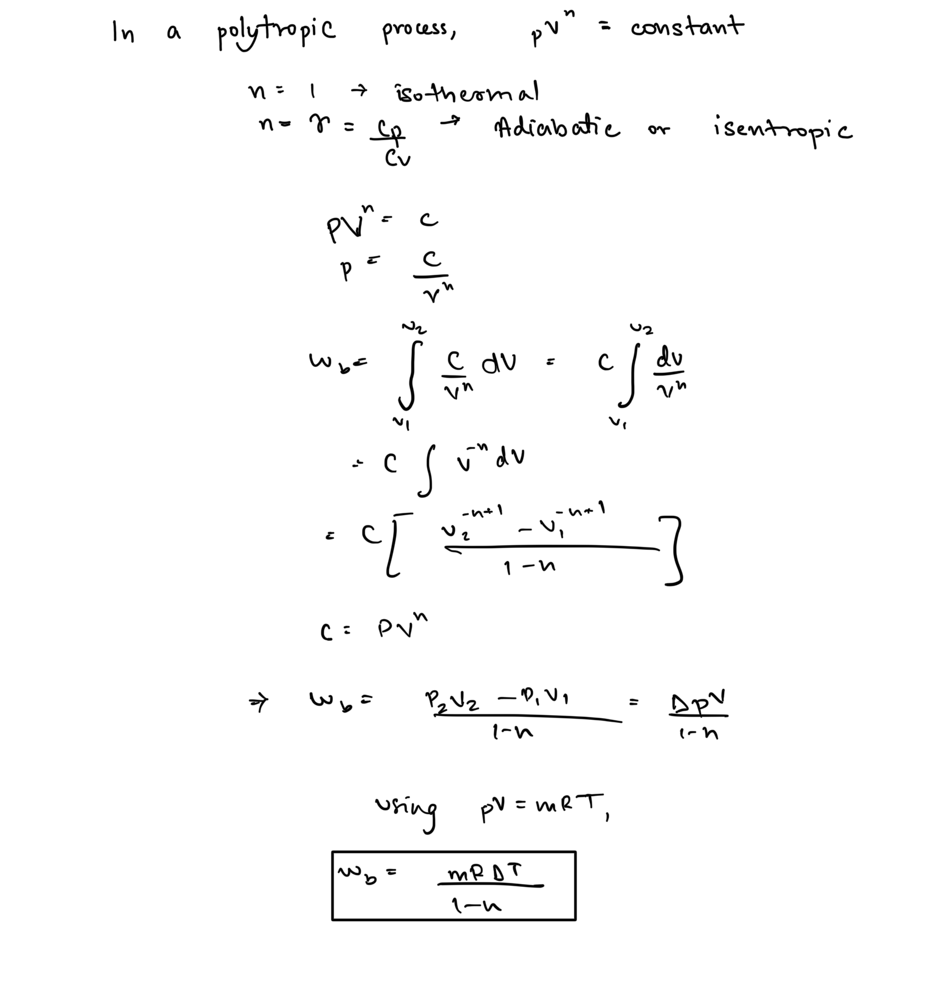
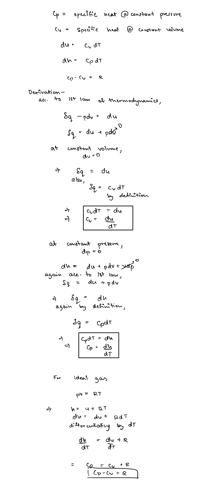

# Analysis of Closed Systems  
  
## First law of thermodynamics  
The first law states that energy can neither be created nor destroyed it can only be converted from one form to another, thus the quantity of energy is always conserved.  
  
### Internal Energy  
Every system or body in the universe has some internal energy associated with it. It is accounted for by microscopic interactions in the system like KE of molecules due to vibration or random motion, energy of chemical bonds, nuclear binding energy etc.  
  
In thermodynamics we group all these microscopic energies into a macroscopic quantity called the **Internal Energy**.  
  
## Closed Systems  
In any closed system, there is only net flow of energy from surroundings and there is no flow of mass, thus for their analysis we only need to deal with energy analysis.  
  
### First Law Application  
First law provides us with energy balance for the system.  
  
  
### Boundary Work  
In a closed system, work is associated with movement of system boundary against or due to an external force.   
  
### Isothermal Process   
###   
### Polytropic Process   
###   
### Isochoric Process  
  
  
### Isobaric Process   
###   
## Enthalpy: A combined Quantity  
In many problems of thermodynamics the quantity PV plays a very important role. It shows up as boundary work as well as other forms of energy like flow energy ok fluids. Thus owing to its importance we have created a combined quantity Enthalpy that encompasses internal energy along with PV energy.   
  
## Specific Heats  
Specific heat refers to the amount of heat energy required to raise the temperature of a substance by 1 unit temperature. It has two variants -  
  
