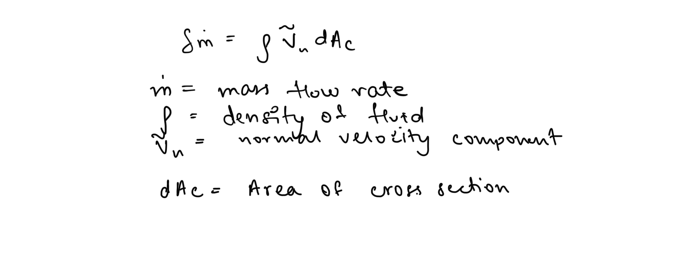
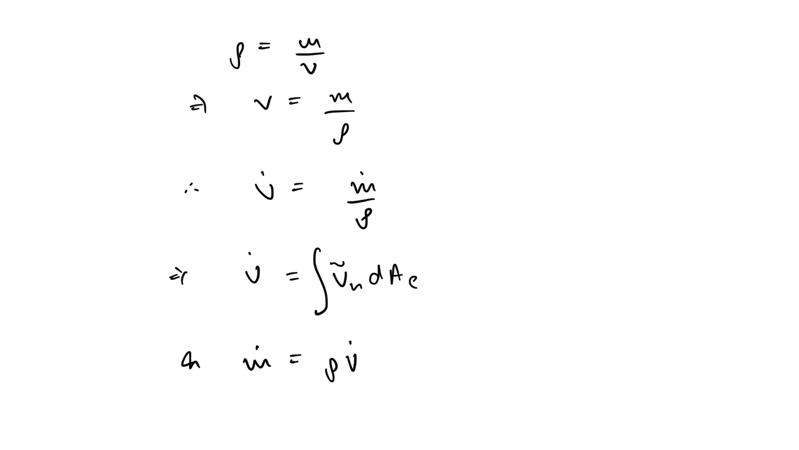
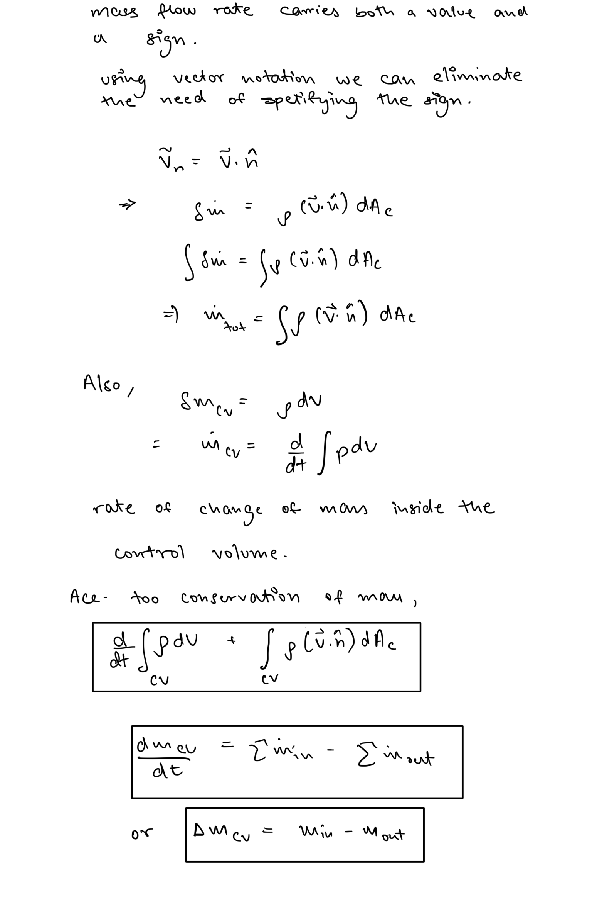
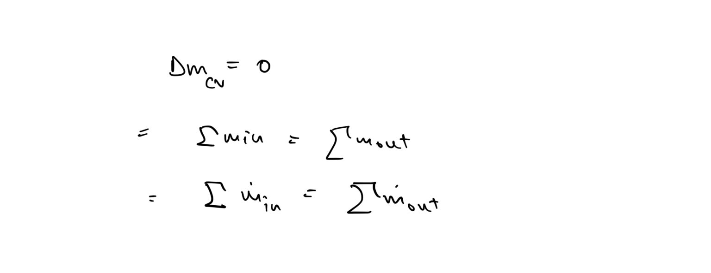
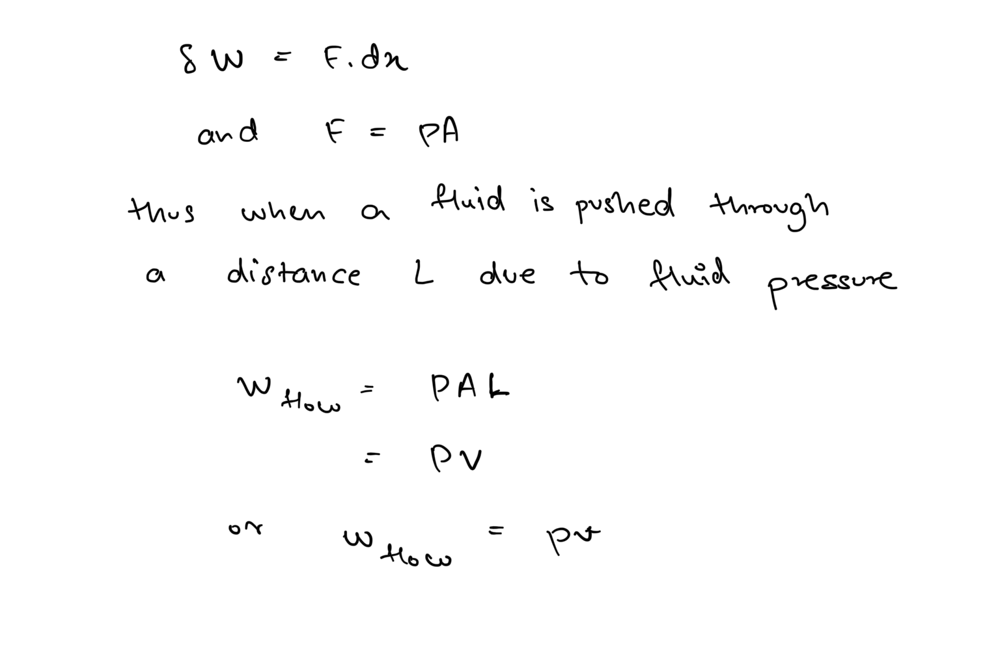
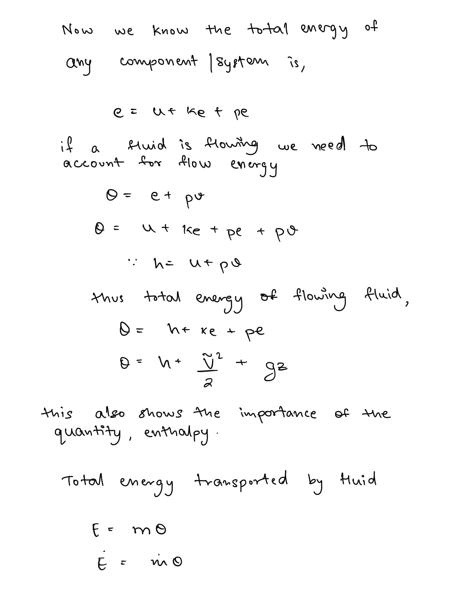
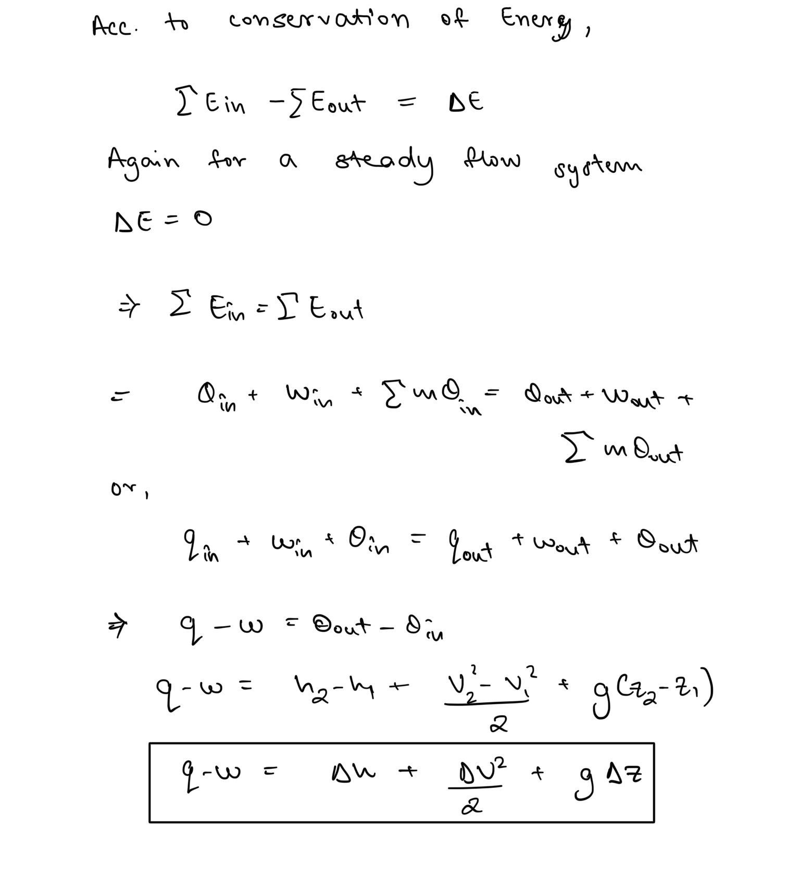

# Analysis of Control Volumes  
Control volumes are systems that allow flow of both energy and mass, thus for these systems conservation of mass and first law both become important for analysis.  
  
For most control volumes though, the total mass of the system remains constant thus conservation of mass helps us track the amount of mass entering and leaving the system.  
  
## Mass and Volume flow rates  
  
### Mass flow rate  
  
The amount of mass flowing through a cross section per unit time is called the mass flow rate.   
  
### Volume flow rates  
Volume of substance flowing through a cross section per unit time is called volume flow rate.   
  
## Conservation of Mass   
##   
## Steady Flow  
Steady flow refers to a condition when the rate of flow doesn’t change with respect to time. Thus the properties of the system might change and different points but they remain same through time.  
  
Thus, in a steady flow process there is no net change of mass inside the control volume.   
  
## Flow work and Total Energy of a flowing fluid   
##   
Since flow work is obtained using properties, it might be more appropriate to refer to it as a property as well thus it more commonly referred to as **flow energy.**   
  
## Steady flow Energy Balance Equation   
##   
