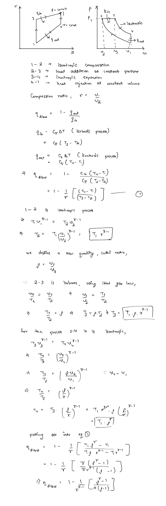

# Diesel Cycle  
The diesel cycle is the air-standard cycle used to model **compression ignition (CI) engines. **CI engines do not have a spark plug and run mostly with air instead of air-fuel mixture throughout the cycle. They have very high compression ratios. High enough to reach self-ignition temperature of fuel on compression. Fuel is injected into the compressed and hot air in these engines, which ignites instantly causing expansion and the power stroke.  
  
The rest of the cycle is similar to the Otto cycle, only the heat-addition process is now constant pressure instead of constant volume.  
  
## Thermodynamic Analysis of Diesel Cycle  
  
Hence the efficiency of the diesel engine is dependent on 3 factors - the specific heat ratio, the compression ratio and the cutoff ratio.  
  
The efficiency increases with increasing either the specific heat ratio or the compression ratio similar to the Otto cycle, but decreases with increase in the cutoff ratio. Hence for highly efficient diesel engines the heat addition process must be quick as to not cause significant increase in volume.  
