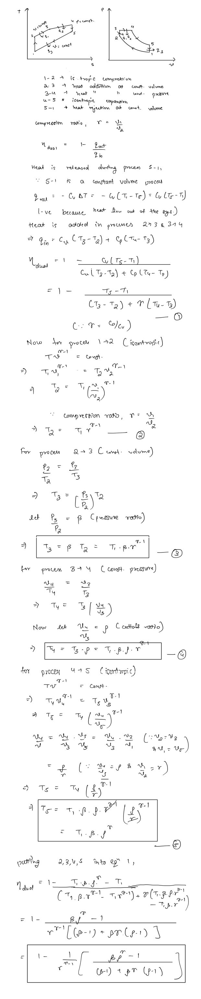

# Dual Cycle  
In modern high speed engines, a combination of the Otto and diesel cycles is used called **the dual cycle **or **the mixed cycle. **The fuel is injected into the combustion chamber much sooner than the basic diesel engine, during the compression stroke itself, this causes the fuel to ignite leading to a combustion process that is almost constant volume.  
  
Fuel injection continues till the end of the compression stroke until the piston reaches the top dead center, and combustion of the fuel keeps the pressure high well into the expansion stroke. This generated a higher output power stroke.  
  
The heat addition process can be modelled as to carry-out in two parts — one at constant volume and then at constant pressure  
  
## Thermodynamic Analysis of the Dual Cycle  
  
  
The efficiency of the dual combustion cycle is thus dependent on 4 factors - the compression ratio, the specific heat ratio, the pressure ratio, the cutoff ratio.  
  
The efficiency increases with increase in either the compression ratio, specific heat ratio, or the pressure ratio. The efficiency decrease with increase in the cutoff ratio. Engines based on the dual combustion cycle generally run on high compression ratios and provide higher power and speed compared to diesel engines. They are also CI based only.  
##   
