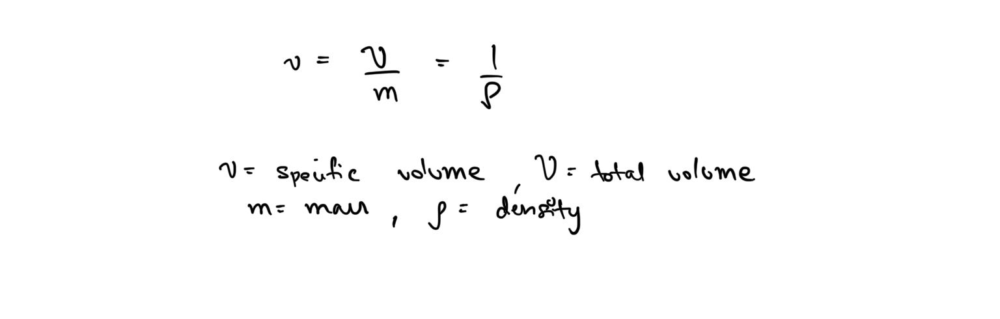
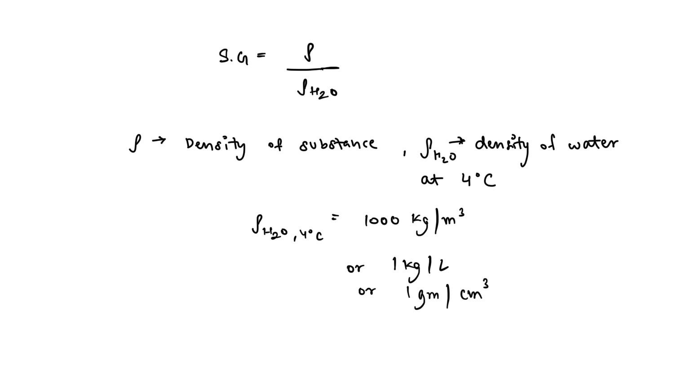
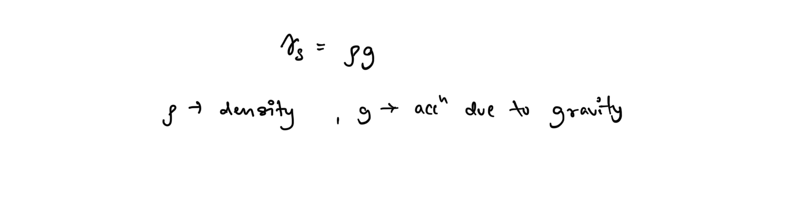

# Fundamentals of Thermodynamics  
##   
## Introduction  
**Thermodynamics** is derived from the Greek word therme (heat). It began as the study of heat energy and systems related to it.  
  
In the modern definition, thermodynamics is described as the **study of energy**.  
  
The concepts of thermodynamics are summarised in three laws -  
  
***Zero-eth Law of thermodynamics*** - If a system B is in thermal equilibrium with a system C which is in thermal equilibrium with another system A, then B is in thermal equilibrium with A.  
  
While this seems like a simple and redundant statement, it cannot be derived from any other law of thermodynamics and was often just assumed in all of its development, thus it is required to be stated explicitly for completeness of the theory.  
  
***First law of thermodynamics***, deals with the principle of conservation of energy and thus is used to quantify energy.  
  
***Second law of thermodynamics***, talks about the presence of a quality of energy alongside the quantity and helps predict the actual possibility of any process occurring. It also describes the direction of all processes in the universe.  
  
## System and Surroundings   
The region of universe we are interested in analysing is termed **the system**, rest everything is grouped under the term **surrounding**.  
  
### Control Mass  
A system can be classified as open or closed. A **closed system** allows the transfer of energy but no transfer of mass, this is called a **control mass**.  
  
A special case of a control mass is an **isolated system**, which allows flow of neither energy nor mass.  
  
A control mass is generally defined by physical boundaries, which might be movable or not.  
  
### Control Volume  
An **open system**, that allows flow of both mass and energy, is termed a **control volume**. It is described generally to imaginary boundary surfaces in space.  
  
## Properties of a System  
Any characteristic of a system is a called its property.   
  
Properties can either be extensive, i.e depend on the extent/amount/mass of the system. For example - total mass, total volume etc.  
  
Or properties can be intensive, i.e. ones that don’t depend on the amount. For example - specific volume, pressure etc.  
  
### Specific Volume  
  
  
### Specific Gravity or Relative Density   
###   
### Specific weight  
Weight of one unit volume of a substance   
  
## Equilibrium  
Refers to a state of balance when there are no unbalanced potentials (or driving forces) present in the system. There are many types of equilibrium and a system is called to be in **thermodynamic equilibrium** once it has attained all relevant forms of equilibrium.  
  
## Processes  
Any change that a system goes through from one equilibrium state to another is termed a **process**.  
A **path** is the series of states that a system passes through during a process.  
  
If the process is slow enough the system remains infinitely close to an equilibrium state at all times, such a process is called a **quasi-static process**. Work producing devices deliver the most work when the follow a path close to the quasi-static one.  
  
A system is said to have undergone a **cycle** if the initial and final states of a process are the same.  
  
## Point and Path Functions  
Quantities that depend only on the state of system, i.e. points of a state diagram like PV diagram, and not on the path taken are called **Point Functions**.  
  
Point functions essentially act as the properties of the system and thus are representative of the system’s state.  
  
They are represented by exact differentials  
  
  
**Path functions **on the other hand are quantities whose value depends on the path followed during the process. They are represented by inexact differentials.   
  
In thermodynamics, we are essentially concerned with relationships between these quantities.  
  
## Energy and Mass Conservation  
Energy and mass are two fundamental properties of any system. Mass of a system can be only be effected by mass transfer. Energy of a system can be affected by flow of Heat or Work, which are the two major types of energy transfer we are concerned with in thermodynamics.  
  
**Heat** - Energy flow due to temperature difference between two bodies.  
**Work** - Energy associated with force applied over a distance.  
  
Mass also another form of energy only as per the Einstein relation. Apart from these there might also be other energies associated with a process like kinetic energy, potential energies, flow energy is generally how we account for mass flow. These might be negligible in some cases and might need to be accounted for in some. Nonetheless the principles of conservation of mass and energy shall always apply to any process.  
  
The first law of thermodynamics is essentially the principle of conservation of energy. A naive formulation of the two can be -  
  
