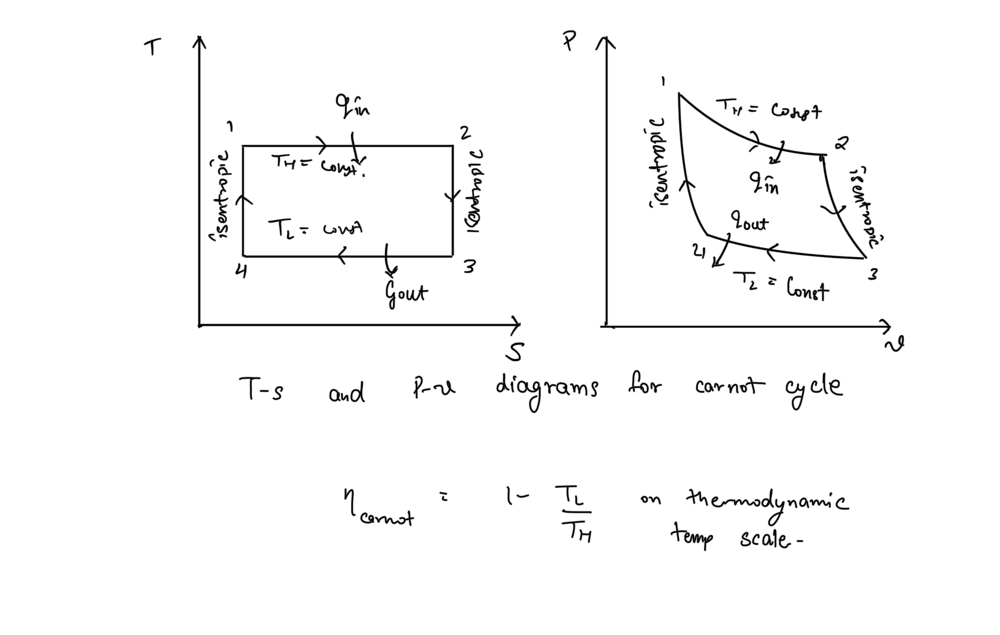
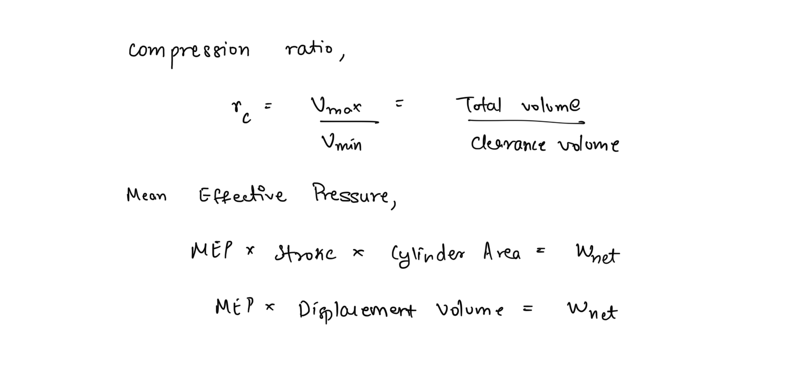

# Gas Power Cycles  
Two important applications of thermodynamics is **power generation** and **refrigeration**. Both are usually accomplished using systems that operate on a thermodynamic cycles.  
  
Devices that produce net power output are often called **engines** and operate on power cycles. Devices that consume net power are called refrigerators, air conditioners, or heat pumps, and operate on refrigeration cycles.  
  
Power cycles in which the working fluid is in gaseous phase throughout the cycle are termed **Gas Power Cycles**. Thermodynamic cycles can also be classified as **open cycle** or **closed cycle**.  
  
### Open cycle  
The working fluid is renewed at the end of the cycle instead of being recirculated.  
  
### Closed cycle  
The working fluid returns to its initial state at the end of the cycle, and is recirculated.  
  
Engines can be classified as internal combustion engines or external combustion engines, depending on how the heat is supplied to the working fluid. Steam power plants are a type of external combustion engine since heat is supplied from an external source like a furnace.  
  
## Ideal Cycles  
Most thermodynamic devices operate on cycles that are too complex to analyse due to presence of effects like friction and internal irreversibilities. Thus, in order to carry-out analysis, we model thermodynamic processes using cycles that resemble the actual cycle closely but are made up of totally internally reversible processes, these are called **ideal cycles.**  
  
## Carnot Cycle  
Carnot cycle is the most fundamental theoretical thermodynamic cycle. It offers the highest possible efficiency of a thermodynamic engine operating between two temperatures. Ideal cycles are internally reversible but Carnot cycle is externally reversible as well, thus there is no cycle more efficient than Carnot cycle.   
  
Since it is really slow and complex to obtain isothermal heat addition and rejection, Carnot cycles can’t be executed practically. Hence, the Carnot cycle is only used as a benchmark to evaluate practical cycles.  
  
## Air Standard Assumptions  
In internal combustion engines, while the working fluid changes in composition from air-fuel mixture to combustion products, the working fluid closely resembles air at all times due air being predominantly nitrogen which is unreactive.  
  
The actual gas power cycles are rather complex due to being open cycles where the working fluid with combustion products being exhausted out of the system. To reduce the complexity for analysis, we make the following assumptions, called air-standard approximations -  
1. The working fluid is air, which circulates continuously in the loop, and always behaves as an ideal gas.  
2. All the processes of that make up the cycle are internally reversible.  
3. All combustion processes are replaced by a heat-addition process from an external source.  
4. All exhaust processes are replaced by heat-rejection processes to an external sink, and restore the working fluid to its initial state.  
  
## Reciprocating Engines  
A reciprocating engine is basically a piston-cylinder device, often attached to a crank. These are the most commonly used mechanical systems used to execute gas power cycles. In reciprocating engines, the piston moves between two volumes within the cylinder. The following term’s associated with the reciprocating engines are often used in analysis.  
  
1. **Top Dead Center (TDC) - **the position of the piston when it forms the smallest volume in the cylinder.  
2. **Bottom Dead Center (BDC) - **the position of the piston when it forms the largest volume in the cylinder.  
3. **Stroke - **total length travelled by the piston.  
4. **Bore - **diameter of the cylinder.  
5. **Clearance Volume - **The smallest volume, formed by the piston when at TDC.  
6. **Displacement Volume - **The volume moved by the piston between TDC and BDC.  
7. **Mean Effective Pressure - **Fictitious pressure that if acted upon the piston will produce the same work as the engine.  
8. **Compression Ratio - **ratio of maximum volume and minimum volume.  
  
  
