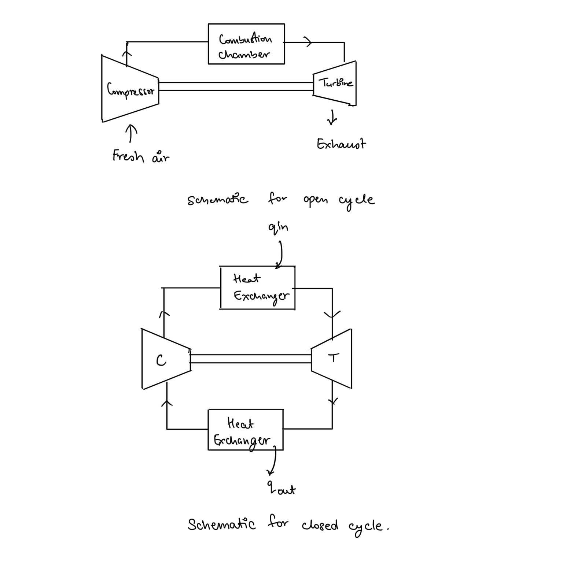
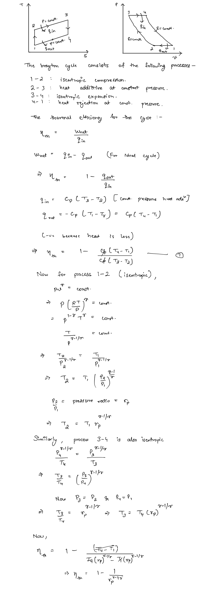

# Gas Turbine Cycle (Brayton Cycle)  
The brayton cycle is the air-standard cycle used in run gas turbine power plants. Gas turbines usually operate in an open cycle, drawing in fresh atmospheric air and exhausting combustion products in every iteration of the cycle, though they can be modeled as a closed cycle system using the air-standard assumptions.   
  
## Thermodynamic Analysis of Brayton Cycle   
##   
Thus the efficiency of the gas turbine cycle is a function of the pressure ratio and the specific heat ratio. Therefore, to increase the efficiency of the cycle, pressure ratio must be increased which also causes increase in temperatures. This can limit the performance of the power plant due to metallurgical constraints of the materials used in plant equipment, thus often additional modifications are applied to the cycle to obtain higher performance. The following modifications are commonly used in gas power plants -  
1. Intercooling  
2. Reheating  
3. Regeneration  
