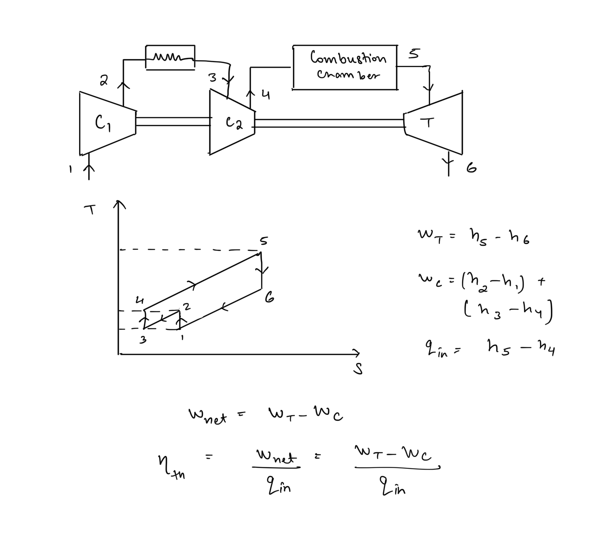
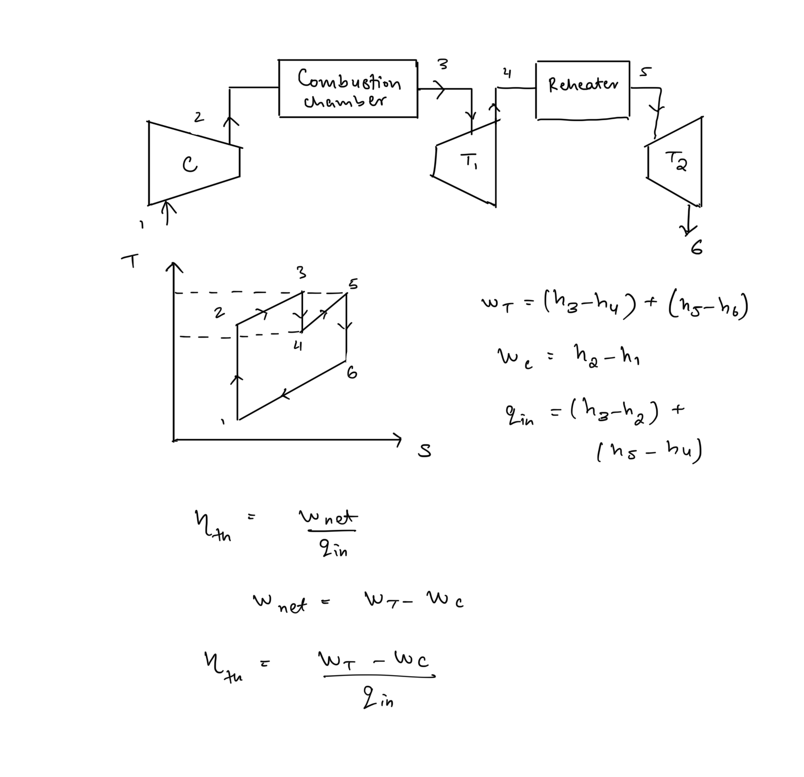

# Intercooling & Reheating in Brayton Cycle  
  
## Intercooling   
It is used to decrease the compressor work in the cycle by cooling the gas in between of two stages of compression.  
#   
## Reheating  
Reheaters are added between successive stages of turbines to heat the gas during turbine expansion in order to increase the turbine work.   
  
Reheating and Intercooling help increase the net work output of the cycle but they also increase the heat input, hence they generally hamper efficiency. Thus, reheating and intercooling are used in conjunction with regeneration to achieve higher work output a  
