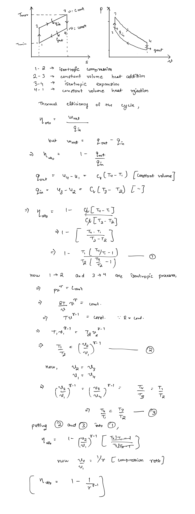
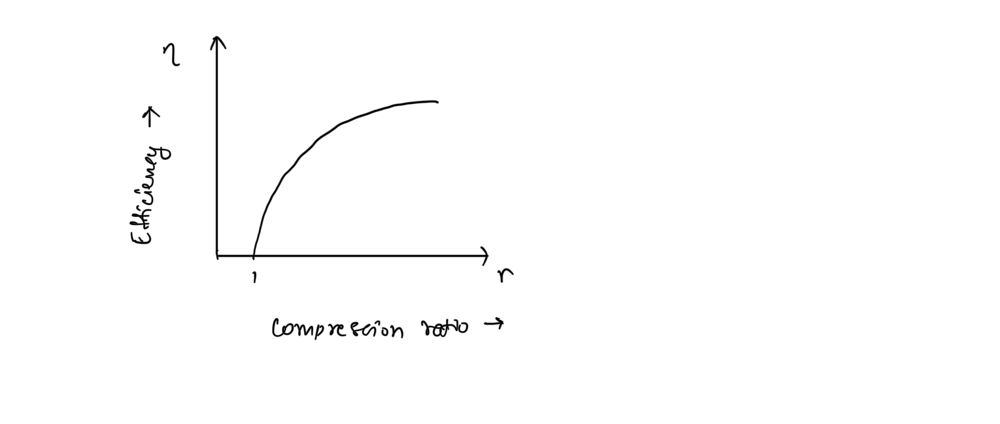

# Otto Cycle  
The Otto cycle is the air-standard cycle, used to model **spark-ignition (SI) engines. **In SI Engines, an external spark from a spark plug is used to ignite the fuel in the air-fuel mixture supplied by a carburetor.  
  
Standard SI Engines work as follows -  
1. **Suction Stoke -** The piston moves from TDC to BDC, with the inlet valve open, creating a pressure loss inside the cylinder. The pressure-loss pulls the air-fuel mixture inside the cylinder.  
2. **Compression Stroke - **Then with the inlet and exhaust closed, the piston moves from BDC to TDC, compressing the air-fuel mixture to a temperature lower than the self-ignition temperature of the fuel.  
3. **Power Stroke - **At TDC, the spark plug fires and ignites the fuel. Combustion caused the fuel to expand and pushes the piston towards BDC. This is the process that produces power.  
4. **Exhaust Stroke - **The piston then moves back to BDC increasing the pressure. The exhaust is open, and the combustion products are expelled out. The cycle repeats.  
  
In a typical four-stroke engine this cycle is executed in two revolutions of the engine crank. Two-stroke engines are an advancement over the four-stroke as all the processes are executed with the power stroke and the compression stoke, and in a single crank revolution.  
  
Two-stroke engines provide higher weight-to-power ratios but also are fuel inefficient and environmentally harmful since the emissions contain partially burnt fuel. Also there is blow-over of fresh fuel with combustion products. Hence, they are only used in applications, where size constraints are of major concern.  
  
The suction and exhaust stroke are not generally depicted in the air-standard Otto cycle, since the work consumed by suction is exactly countered by exhaust resulting in no net work addition hence they can be neglected for the purposes of thermodynamic analysis.  
  
## Thermodynamic Analysis of Otto Cycle  
  
  
  
Hence thermal efficiency of the Otto cycle is a function of the compression ratio and the gas constant. The efficiency increases with increasing either of the two. For air as the working fluid the efficiency follows the following trend.   
  
## Engine Knock  
The efficiency of SI engines is dependent on the compression ratio, but the compression ration for the Otto cycle is generally limited to values between 8 and 12. Raising the compression ratio above that, adds the risk of cylinder temperatures getting high enough to cause self-ignition of the fuel in the air-fuel mixture before completion of the compression stroke and the firing of the spark plug.  
  
This premature ignition of fuel is called **autoignition **or **engine knock** and it is completely intolerable as it hampers performance and can cause engine damage.  
