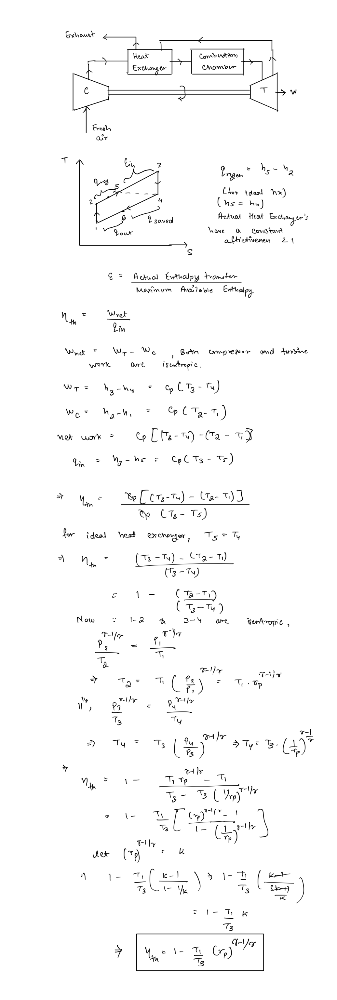

# Regeneration in Brayton Cycle   
#   
Regeneration is the only modification that actually increases the efficiency of the power cycle. Thus it is used in conjunction with modifications like reheating and intercooling which increase the work output but hamper efficiency. The combination helps achieve higher performance in power plants.  
