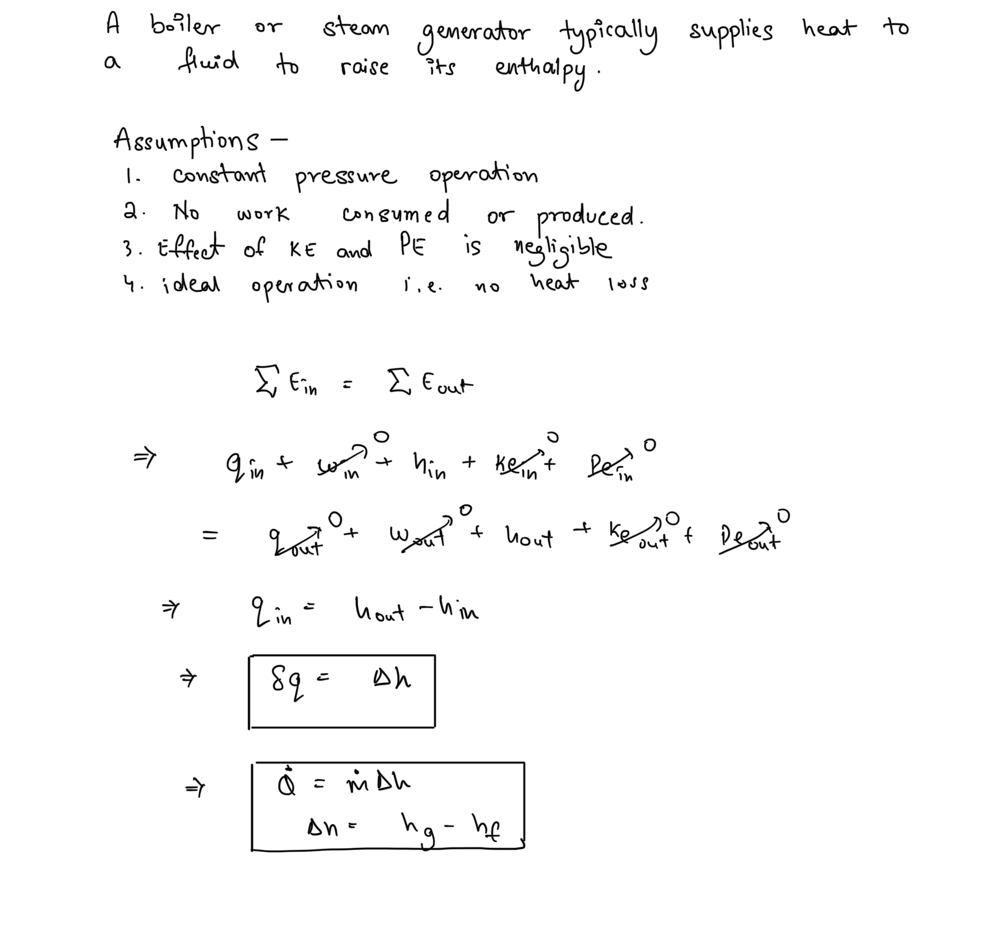
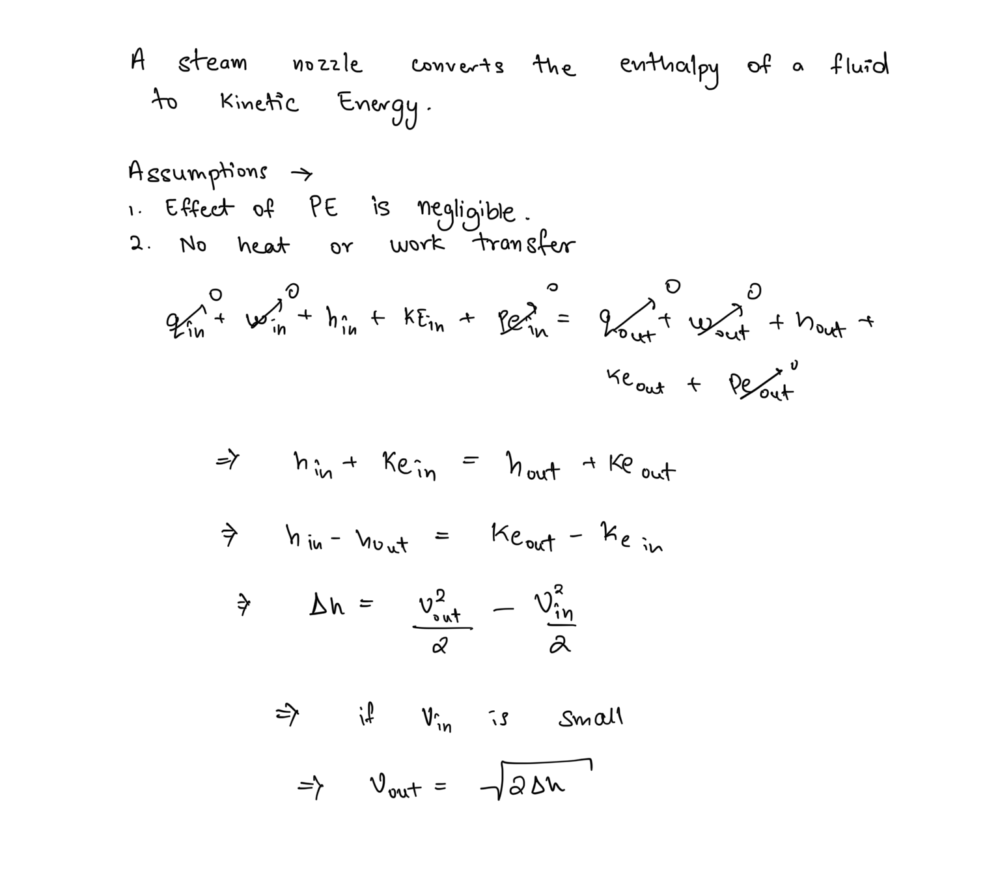
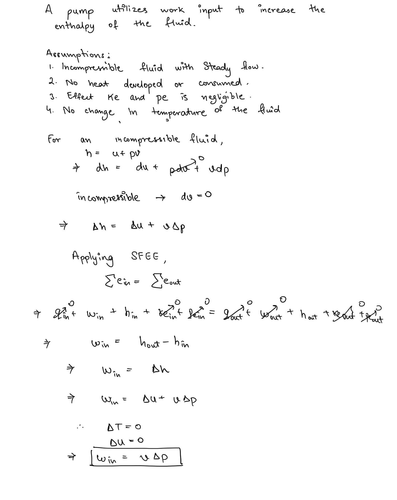
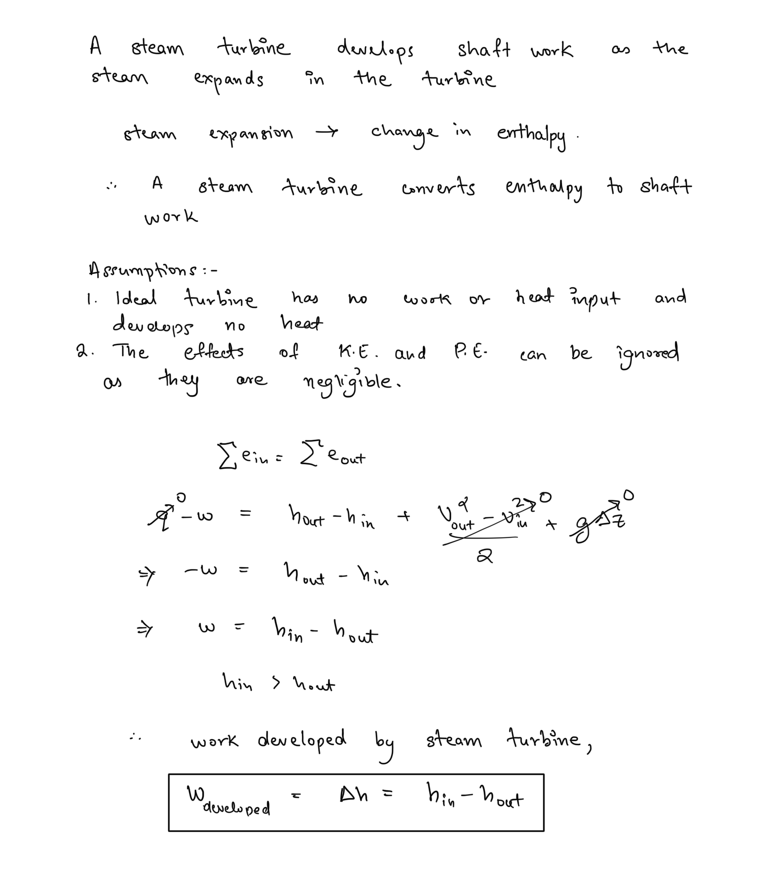

# SFEE Analysis of Thermodynamic Devices  
Apply the steady flow energy equation to the following thermodynamic devices.  
1. Boiler  
2. Nozzle  
3. Centrifugal Pump  
4. Steam Turbine  
  
## Boilers  
  
  
## Steam Nozzle   
##   
## Centrifugal Pump  
  
  
  
## Steam Turbine   
##   
