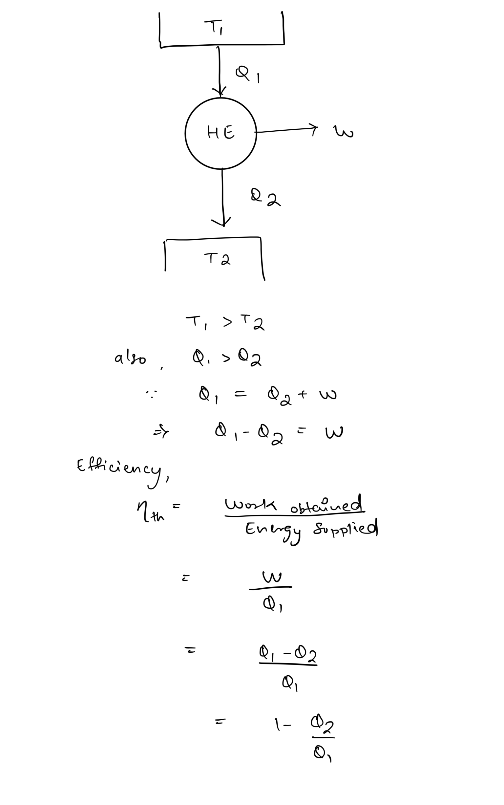
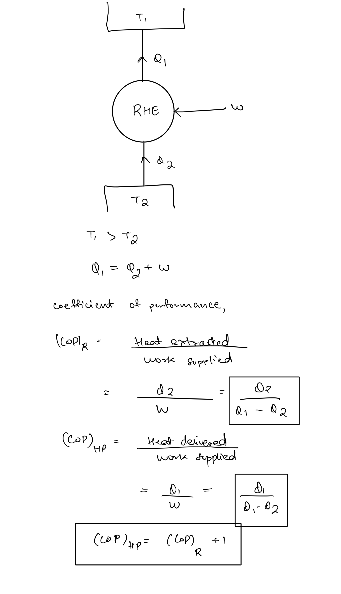
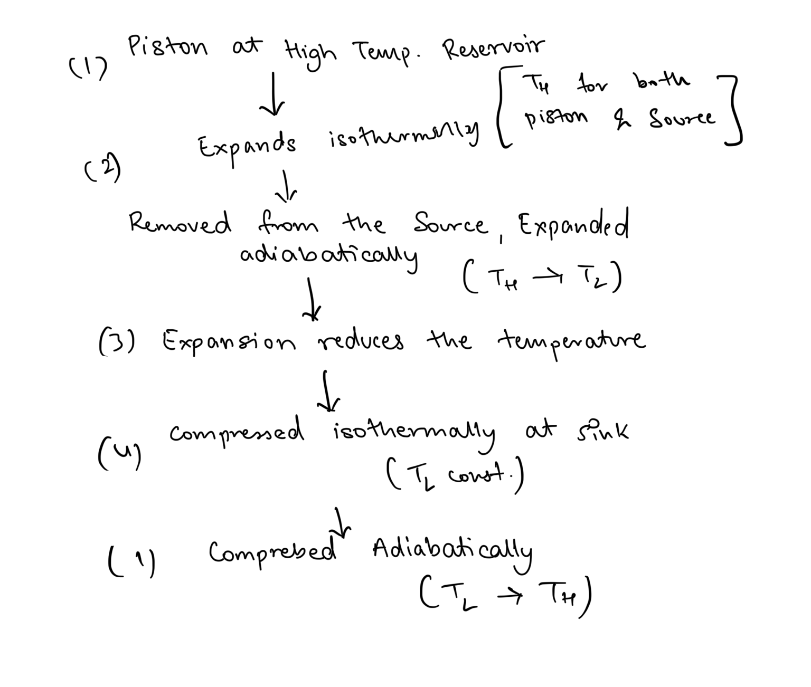
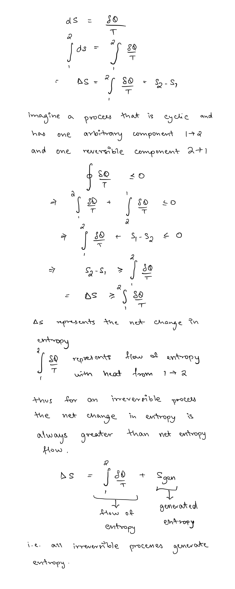
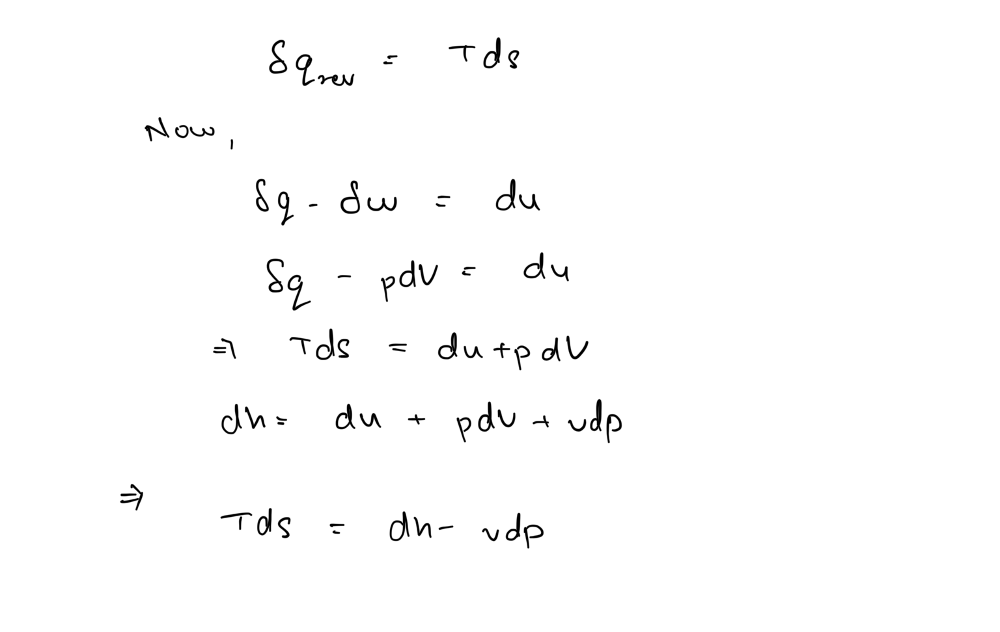
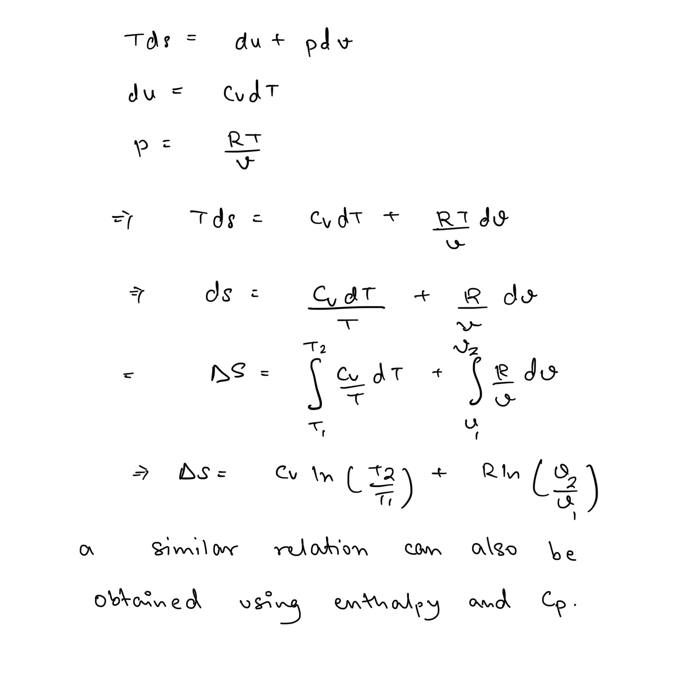
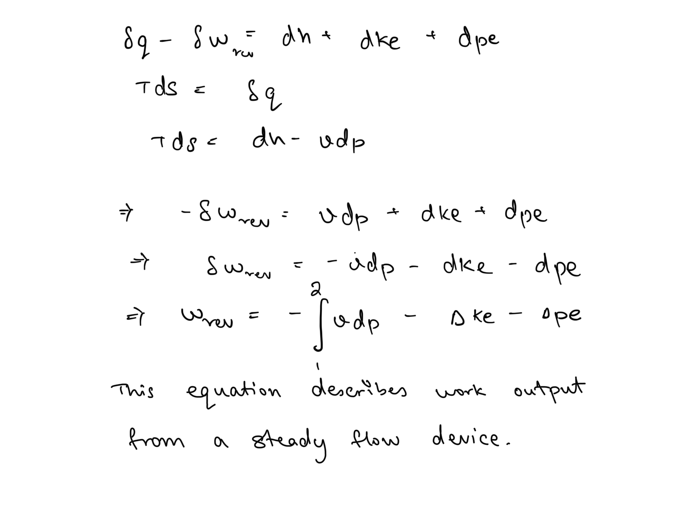
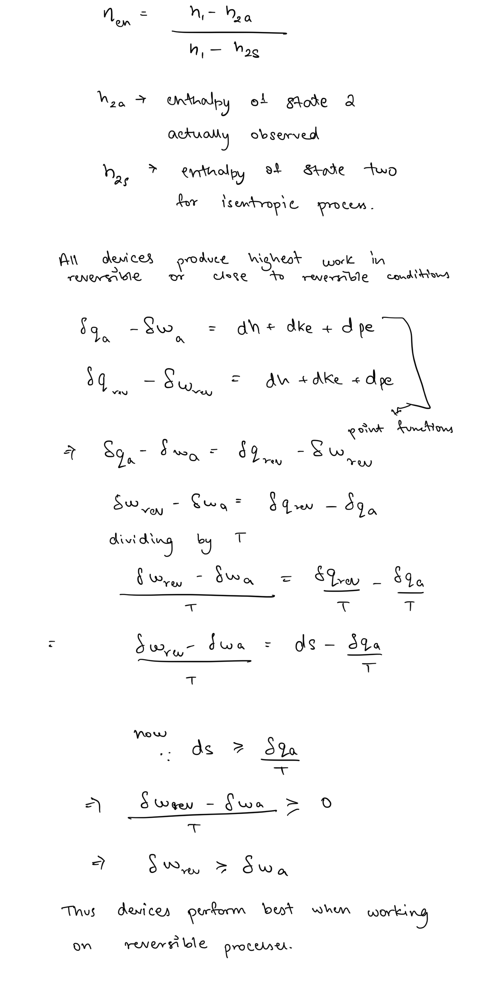

# Second Law of Thermodynamics  
  
According to the first law of thermodynamics, the net amount of energy is always conserved. Thus it can help us predict the effects of a process but it doesn’t talk about the extent of the process at all. If we only follow the first law, then energy would be able to flow in any direction, in any amount, to any extent yet it is observed that processes generally happen in a certain direction only and only to a limit.  
  
A hot cup of tea always cools down in the room, never heats up, and doesn’t cool down beyond the room temperature. Thus the first law in itself if inaccurate in describing processes completely. It is evident that we need to analyse, energy from a quantitative as well as qualitative perspective.  
  
The second law of thermodynamics, helps to precisely analyse the quality of energy and any process must follow both the first and second law at all times.  
  
## Heat and Work Devices  
### Heat Engines  
Heat engines are devices that produce work from heat. An idealised heat engine draws heat from a high temperature source, converts it to some amount of work, then dumps the remaining heat into a heat sink.   
  
The second law of thermodynamics is described using two equivalent statements that describe limitations of obtaining work from heat as observed even in idealised processes. One such statement is -  
  
### Kelvin-Planck Statement   
It is impossible for any work producing thermal device, that works on a cycle, to convert all of the received heat from a reservoir to net work.  
  
Thus, no heat engine can work without a sink.  
  
### Refrigerators and Heat Pumps  
  
Refrigerators and heat pumps both a reversed form of an heat engine. They both extract heat from lower temperature and supply it to higher temperature while consuming work.  
  
The difference is for refrigerators, the objective is extraction of heat from colder body, while for heat pumps the objective is to supply heat to the hotter body.  
##    
##   
### Clausius Statement  
It is impossible to construct a machine that operates on a cycle and produces no other effect than transfer of heat from lower temperature to higher temperature.  
  
## Carnot Principles  
Carnot devised an idealised reversible heat engine cycle, called the carnot cycle. The Carnot cycle can be summarised as follows -   
  
The cycle can be reversed to achieve refrigeration or heat pumping.  
  
1. Any irreversible heat engine will always be less efficient than a reversible heat engine working at same temperature differences.  
2. The efficiencies of all reversible heat engines, working between the same temperatures would always be equal.  
  
## Clausius Inequality  
Thermodynamic laws feature many inequalities when describing the limits or extents over processes or systems. One such fundamental inequality is Clausius inequality-  
  
The equality holds for internally reversible processes, while the inequality holds for irreversible processes.  
  
Clausius noted that the quantity under the integral follows the same relation as properties of a system which are point functions. Thus he had invented a new quantity, termed Entropy -  
  
## Entropy Relations   
##   
### Entropy change in gases   
###   
## Steady flow work  
###   
## Entropic Efficiency   
##   
Work producing devices produce the most work when in isentropic (ideal) conditions. Hence the entropic efficiency is determined by the ratio of actual work to isentropic work.  
  
While, work consuming device consume the least work when in isentropic conditions. Hence the efficiency for them is determined by the ratio of isentropic work consumed to actual work consumed.  
  
This is an important distinction to be kept in mind while analysing such systems.  
  
The trick to determine a device as work producing or consuming is to check whether it lowers the Enthalpy of the working fluid or increases it.  
  
## Quality of energy  
Entropy acts as direct measure of quality of energy. Low entropy refers to a higher quality energy while high entropy refers to a lower quality of energy. Thus it can also be used to quantify irreversibility of processes.  
