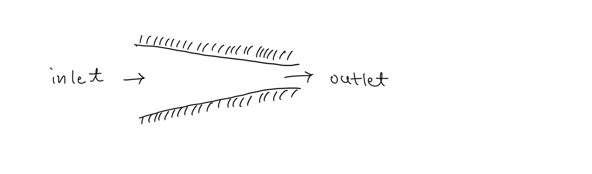
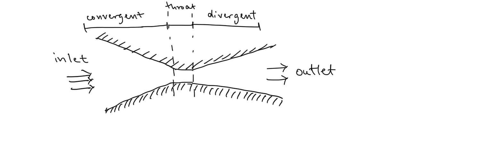
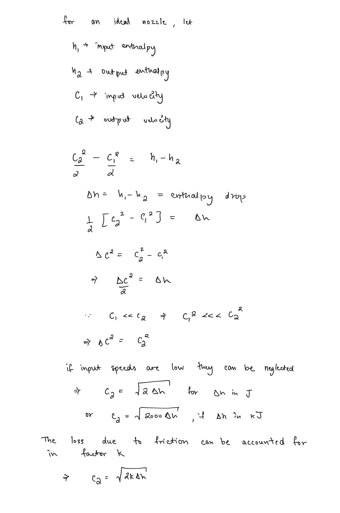
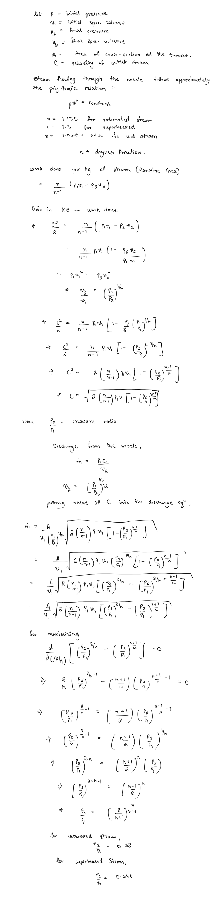
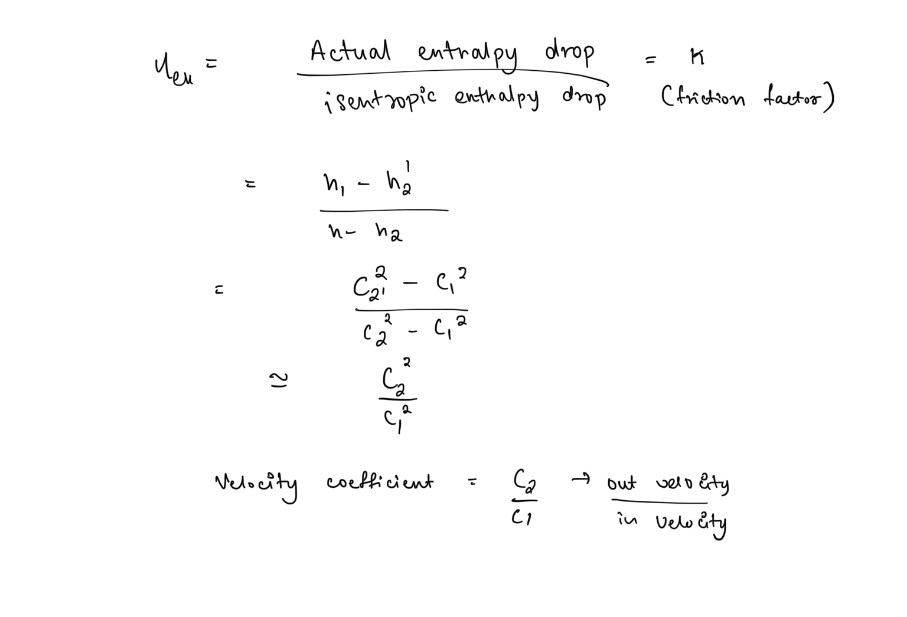

# Steam Nozzles  
Nozzles are thermodynamic devices that convert steam enthalpy into kinetic energy. This is achieved by expansion of steam inside the nozzle due to geometry of the structure.  
  
## Types of Nozzles  
### Convergent Nozzle  
These are essentially tubes with a convergent cross-section, with the larger face being the inlet and smaller face being the outlet.   
  
These are typically simple to construct and can be used when outlet velocity requirements are not too high.  
  
### Convergent-Divergent Nozzles  
These have a converging cross section followed by a narrow region called the **throat** which leads to a divergent cross section. They have an added complexity of construction but provide higher efficiencies and outlet velocities.   
  
## Analysis of Nozzles  
### Velocity of Steam   
###   
### Discharge through the Nozzle   
###   
## Nozzle Efficiency  
Nozzle efficiency is determined by isentropic efficiency.   
  
