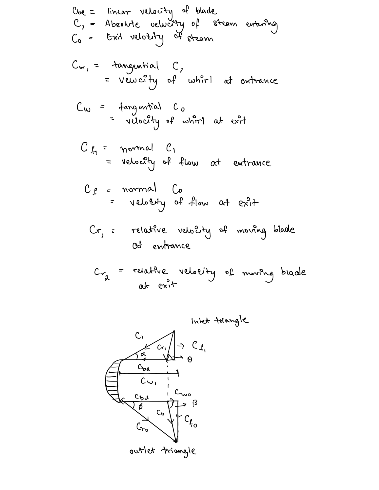
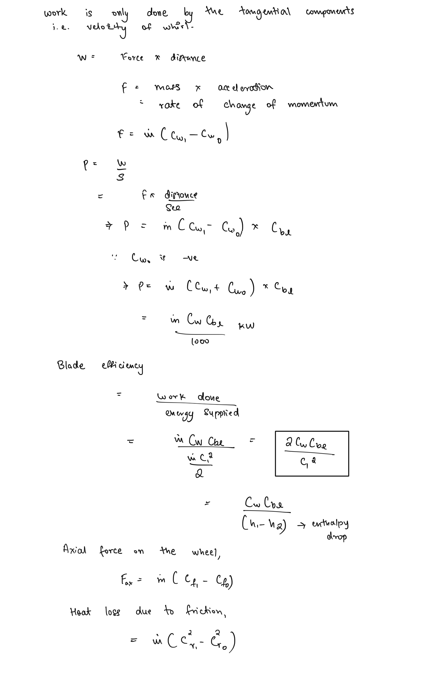
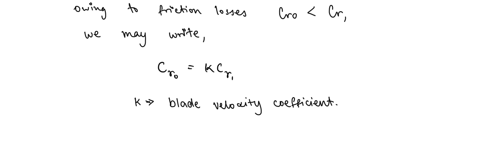
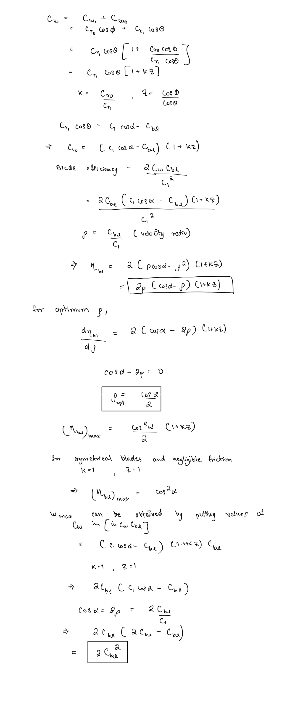
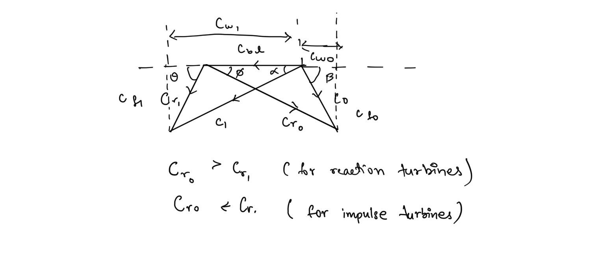
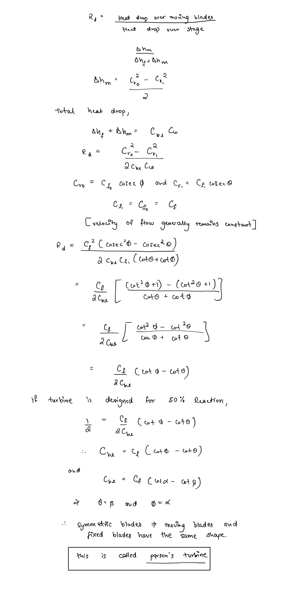

# Steam Turbines  
  
Steam turbine is a thermodynamic device, used as the primary-mover, in which the enthalpy of the steam is converted into kinetic energy and then into mechanical work by rotation of the turbine shaft.  
  
## Classification of Turbines  
  
The most important classification of steam turbines is on the basis of action of the turbine, as :-  
  
1. **Impulse Turbine** - The steam is expanded during entry through a nozzle at the inlet to increase its kinetic energy which then is used to move the blades through impulse action.  
2. **Reaction Turbine **- Steam is passed through successive fixed blade and moving blade stages. Steam expands along the fixed blades causing increase in kinetic energy which is then imparted to moving blades causing motion.  
3. **Combined Reaction and Impulse Turbines - **combination of successive reaction and impulse turbines.  
  
## Compounding in Impulse Turbines  
  
If in a simple impulse turbine, steam is expanded directly from boiler pressure to condenser pressure, the velocity of the steam becomes tremendously high reaching limits of practicality.  
  
To eliminate this issue several methods are utilised that involve addition of stages in impulse turbines with rotors keyed to the same shaft. This is known as **compounding**.  
  
### Velocity Compounding  
  
Steam is expanded through a stationary nozzle from the boiler or inlet pressure to condenser pressure. So the pressure in the nozzle drops, the kinetic energy of the steam increases due to increase in velocity. A portion of this available energy is absorbed by a row of moving blades.  
The steam (whose velocity has decreased while moving over the moving blades) then flows through the second row of blades which are fixed. The function of these fixed blades is to re-direct the steam flow without altering its velocity to the following next row moving blades where again work is done on them and steam leaves the turbine with a low velocity.  
  
### Pressure Compounding  
  
The steam at boiler pressure enters the first set of nozzles and expands partially. The kinetic energy of the steam thus obtained is absorbed by the moving blades (stage 1). The steam then expands partially in the second set of nozzles where its pressure again falls and the velocity increases ; the kinetic energy so obtained is absorbed by the second ring of moving blades (stage 2). This is repeated in stage 3 and steam finally leaves the turbine at low velocity and pressure.   
  
### Pressure velocity compounding  
  
This method of compounding is the combination of two previously discussed method.  
  
## Velocity Analysis  
### Moving Blade Velocity Diagram  
  
  
  
### Work done on blade   
###   
###   
### Blade Velocity Coefficient   
###   
###   
### Optimum Velocity Ratio and Maximum Efficiency   
###   
###   
### Reaction Turbines   
###   
###   
The effect of the continuous expansion of steam during the flow over the blades of the turbine is increase in relative velocity of the exit steam.  
  
### Degree of Reaction  
  
The degree of reaction of reaction turbine stage is defined as the ratio of heat drop over the moving blades to the total heat drop in the stage   
  
