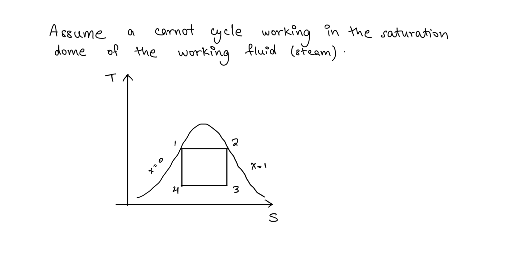
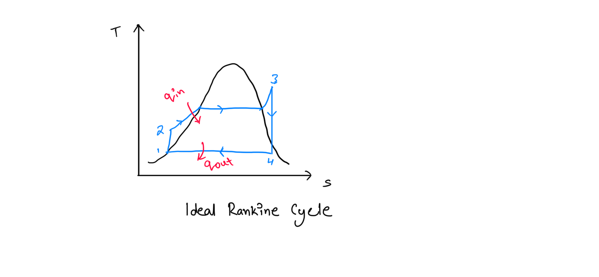
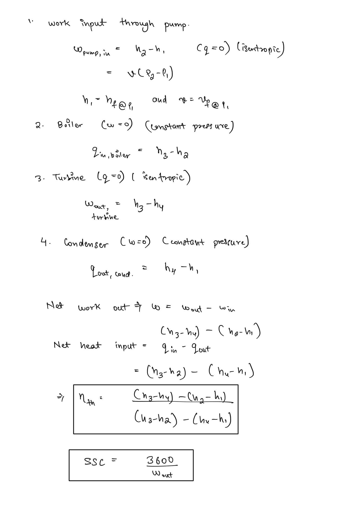
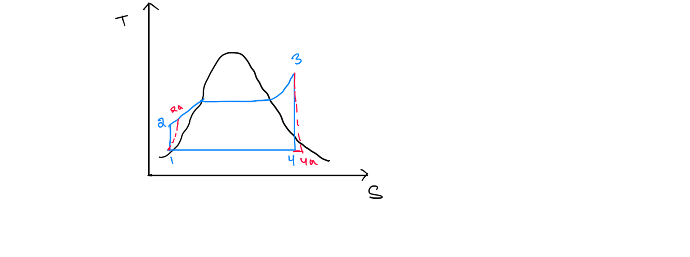
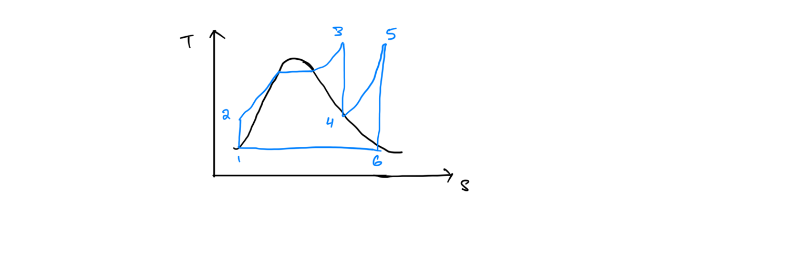
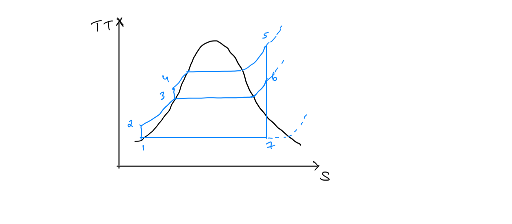

# Vapour Power Cycle  
Vapour power cycles are thermodynamic process cycles designed to efficiently extract energy and/or work from two-phase systems involving a phase change.  
  
## Carnot Vapour Cycle  
The Carnot cycle is most efficient cycle operating between two temperatures. Thus it is natural to assume Carnot cycle to be ideal for vapour power cycles. Yet several impracticalities are associated with the Carnot vapour cycle, which can be seen from the following analysis -  
  
The processes involved are -  
1. Isothermal heating of the fluid from saturated liquid state to saturated vapour state (1-2). This is not particularly difficult to achieve as setting a constant operating pressure automatically fixes the temperature at saturation temperature.  
2. Process 2-3 involves isentropic expansion of the steam. While isentropic expansion is not particularly difficult to achieve through carefully designed steam turbines, it can be observed that the quality of steam drops significantly during the process. Water droplets are the major source of erosion in turbine blades, hence a low quality of steam is not desirable and cannot be tolerated in operation of a power plant.  
3. Process 3-4 involves isothermal condensation, which again can be achieved by fixing pressure of the vessel, the process of condensation cannot be precisely controlled to achieve the exact quality of fluid at state 4.  
4. Process 4-1 involves isentropic compression of the liquid-vapour mixtures and it is not practical to design compressors that can handle two phases.  
  
Thus the Carnot cycle cannot be approximated in real devices and is not a realistic model for vapour power cycles.  
  
## The Ideal Rankine Cycle  
Most of the impracticalities associated with the Carnot cycle can be eliminated by superheating the steam and the condensing it completely in the condenser. The cycle that results is the ideal cycle for vapour power plants and is called the **Rankine Cycle.**  
  
  
1-2 Water enters the pump at stage 1 and is compressed isentropically to state 2. The temperature rises due to slight decrease in specific volume of the water.  
  
2-3 Water enters the boiler at state 2 and leaves as superheated steam at state 3. Involves constant pressure heating of the water.  
  
3-4 Superheated steam expands in turbines to achieve state 4 with a manageable reduction in the quality of the steam.  
  
4-1 Constant pressure heating rejection in the condenser.  
  
## Thermodynamic Analysis of Rankine Cycle  
  
Each component of the Rankine cycle can be analysed using steady flow energy equation. Effects of Kinetic Energy and Potential Energy can be neglected since the changes in them are negligible compared to heat, work and enthalpy components. Thus expressions for each component can be developed in reference to T-s chart above.  
  
  
## Deviation from Ideal Cycle  
  
Due to internal irreversibilities in pumps and turbines they operate at conditions deviated from isentropic ones. Hence we observe this modified cycle -  
  
  
The values for actual enthalpy changes can be determined using entropic efficiencies  
  
## Reheat Cycle   
##   
Mean temperature of heat addition is increased in the boiler. The issue of reduced steam quality at turbine exit is solved by reheating partially expanded steam using reheaters. Efficiency increases due to increase in mean temperature of heat addition.  
  
## Regenerative Cycle  
Feedwater is heated from partially expanded steam extracted from intermediate turbines and fed to a heat exchanger called feed water heater or regenerator   
  
